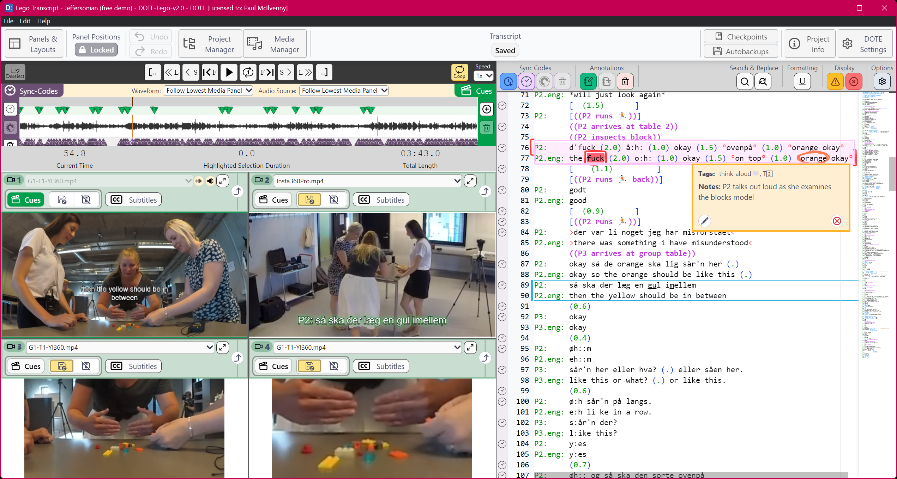

## What is _DOTE_?

_DOTE_ is a new type of transcription software developed by the [_BigSoftVideo_ team](https://github.com/BigSoftVideo) at [Aalborg University](https://www.bigvideo.aau.dk).
It is tailored for transcribing social conduct, conversation and multimodal interaction for research purposes.
It has been designed to support two specific standards of transcription for qualitative research, which are commonly used in conversation analysis, for example.
_DOTE_ has some of the features commonly found in other software -- such as [video playback](play.md), a [timeline and a visual waveform](timeline.md), [synced playback](sync-code.md) -- but these features are streamlined and easier to use in _DOTE_.
Moreover, it has enhanced features that do _not_ exist in any legacy software so far, including [transcript parsing](errors.md), [smart auto-completion](transcript.md#autocomplete), [transcript heuristics](jefferson.md#realign), [multi-video window playback](media-manager.md) (with subtitles), [360 video support](media-manager.md), [video-cues](cues.md), [export to publishable document](export.md) (and subtitles) and [version control](versioncontrol.md).
Version 1.0 was released in 2022 and the completely revised version 2.0 was released in 2026.
There are many more features and enhancements planned for the future, many of which tie in with [DOTEbase](https://bigsoftvideo.github.io/DOTEbase/help.html), our complementary software package to support qualitative analysis of audio-visual data and transcripts.

### What does _DOTE_ stand for?

_DOTE_ stands for _Distributed Open Transcription Environment_:

   - _DOTE_ is the first of a new breed of _Integrated Transcription Environment_ (ITE) that enhances the craft of manual transcription of qualitative video data for research purposes.
   - _DOTE_ provides an _environment_ to support smart transcription, much like an _Integrated Development Environment_ does for software coding.
   - _DOTE_ is _open_ in the sense that the transcript is always accessible as a plain text file and all the meta-data and formatting is transparent and non-proprietary.
   - _DOTE_ has easy-to-use, robust, single-user version control and autobackup recovery.

### Is _DOTE_ for you?

If you want a fully featured, easy-to-use, cross-platform desktop transcription editor that supports contemporary audiovisual media as well as the craft and complete workflow from creating and revising a script-based transcript through to exporting a publishable transcript in a recognised style (using Jeffersonian or Mondadaian conventions), then _DOTE_ is for you.

_However_, if you wish to inhabit and analyse your 360 video data in a more immersive virtual environment in which transcripts as such play a minor role, then try the [_AVA360VR_ software package](https://github.com/BigSoftVideo/AVA360VR), our immersive tool for annotating, visualising and analysing 360-degree videos in Virtual Reality.
For instance, try _VolCapping_, in which you can annotate your data and share your proto-analyses with others in 3D.
Note that _DOTE_ transcript projects are also straightforwardly compatible with, and importable in, _AVA360VR_.

If you prefer software that primarily supports [CAQDAS](https://en.wikipedia.org/wiki/Computer-assisted_qualitative_data_analysis_software) and statistical analytics, then _DOTE_ is _not_ for you, but try our complementary [_DOTEbase_](https://bigsoftvideo.github.io/DOTEbase) package.
If you would like to create a score-based transcript with fine-timing across subtier categories, then _DOTE_ is _not_ for you.
Try [_ELAN_](https://archive.mpi.nl/tla/elan), instead.
If you would like to create a graphic comic transcript, then try [_Comic Life_](https://plasq.com).
And if you want an AI to do automatic transcription _for_ you, then look elsewhere, or try the Whisper speech recognition solution that can export the result in a _DOTE_ readable format [importable into _DOTE_](importWhisper.md).

### How do I try _DOTE_?

You can [download](https://www.dote.aau.dk/downloads) a free version of _DOTE_ and [install](install.md) it.

- It is restricted by the number of lines per transcript, and the premium features are locked.
- If there are updates, you will find the [latest release on the Webshop](https://www.dote.aau.dk/downloads), and a list of new features and bug fixes on the [release page](https://github.com/BigSoftVideo/DOTE/releases) on our public GitHub repository.
- DOTE has native support for Windows 11, as well as for macOS, including the Apple Silicon with M-series.

To unlock the premium features, you will need to purchase one of the [PRO Editions](pro.md) from our webshop.

### What is _DOTEbase_?

_DOTE_ is integrated with _DOTEbase_, our new software toolkit to suppport qualitative research with audio-visual data and transcripts.
To use _DOTEbase_ a PRO or PRO COMMUNITY Edition licence is required.
There is no free edition, but some simple features of _DOTEbase_ are available in _DOTE_'s free edition.
Find out more about [all the tools available in _DOTEbase_](https://bigsoftvideo.github.io/DOTEbase), as well as [_DOTE_'s integration](dotebase.md) with _DOTEbase_.

### How do I get help?

There is a lot to get familiar with, but we assure you that it will be worth it.
Please read carefully the [help page](help.md) and our [online help guide](https://bigsoftvideo.github.io/DOTE), which provides instructions to get you started with the basic transcription tasks using _DOTE_.
There are plenty of [video tutorials](tutorials.md) available on YouTube as well.

Thanks and have fun, [_Dote Team_](contributing.md)
