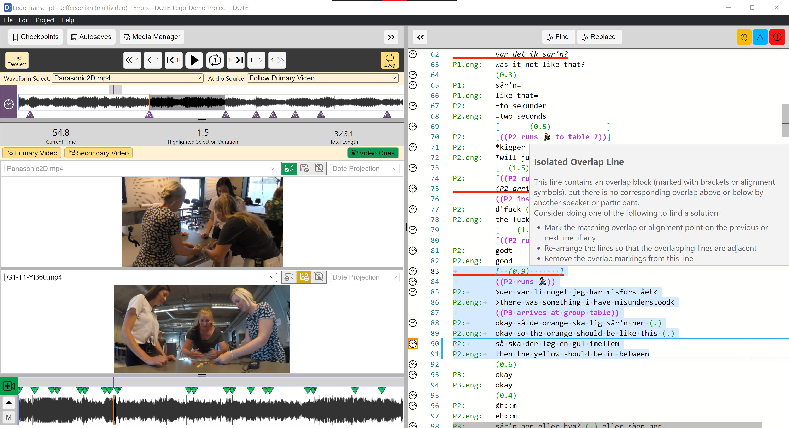

## What is _DOTE_?

_DOTE_ is a new type of transcription software developed by the _BigSoftVideo_ team at Aalborg University.
It has been designed to support two specific standards of transcription commonly used in conversation analysis.
It has some of the features commonly found in other software -- such as video playback, a timeline and a visual waveform, synced playback -- but these features are streamlined and easier to use in _DOTE_.
Moreover, _DOTE_ has enhanced features that do not exist in any legacy software so far, such as transcript parsing, smart auto-completion, transcript heuristics, 360 video support, video-cues, export to publishable document (and subtitles) and version control.
We have many more features and enhancements planned for the future.
Our motto is _make transcription fun again_! 😜

### What does _DOTE_ stand for?

_DOTE_ stands for _Distributed Open Transcription Environment_.
This release supports a single-user; it does not _yet_ provide _internal_ support for multi-user that would allow _distributed_ collaboration on a transcript project.
This release has easy-to-use, robust, single-user version control and autosave recovery, and ultimately, there will be full support for easy-to-use, multi-user _distributed version control_ via GitHub.
_DOTE_ is _open_ in the sense that the transcript is always accessible as a plain text file and all the formatting is transparent and non-proprietary.
_DOTE_ provides an _environment_ to support smart transcription, much like an _Integrated Development Environment_ does for software coding.
_DOTE_ is the first of a new breed of _Integrated Transcription Environment_ (ITE) that enhances the craft of manual transcription of qualitative video data for research purposes.
It has native support for Windows 10 and 11, as well as for macOS including the new Apple Silicon with M-series.

### Is _DOTE_ for you?

If you wish to inhabit and analyse your 360 video data in a more immersive virtual environment in which transcripts as such play a minor role, then try the [_AVA360VR_ software package](https://github.com/BigSoftVideo/AVA360VR), our immersive tool for annotating, visualising and analysing 360-degree videos in Virtual Reality.
For instance, try _VolCapping_, in which you can annotate your data and share your proto-analyses with others in 3D.
Note that _DOTE_ transcript projects are also straightforwardly compatible with, and importable in, _AVA360VR_.

If you prefer software that primarily supports [CAQDAS](https://en.wikipedia.org/wiki/Computer-assisted_qualitative_data_analysis_software) and statistical analytics, then _DOTE_ is _not_ for you.
If you would like to create a score-based transcript with fine-timing across subtier categories, then _DOTE_ is _not_ for you.
Try [_ELAN_](https://archive.mpi.nl/tla/elan), instead.
If you would like to create a graphic comic transcript, then try [_Comic Life_](https://plasq.com).
And if you want an AI to do automatic transcription _for_ you, then look elsewhere.

_However_, if you want a fully featured, easy-to-use, cross-platform desktop transcription editor that supports contemporary audiovisual media as well as the craft and complete workflow from creating and revising a script-based transcript through to exporting a publishable transcript in a recognised style (using Jeffersonian or Mondadaian conventions), then _DOTE_ is for you.

### How do I get help?

There is a lot to get familiar with, but we hope it is worth it.
You will find a list of new features and bug fixes on the [release page](https://github.com/BigSoftVideo/DOTE/releases).
Please read carefully the [help guide](help.md), which provides instructions to get you started with the basic transcription tasks using this version of _DOTE_.

Thanks and have fun, [_Dote Team_](contributing.md)
