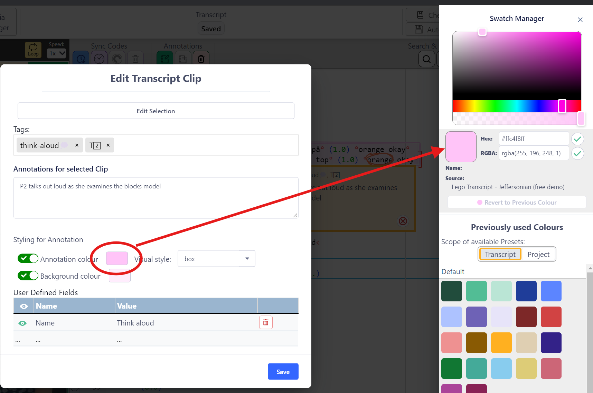
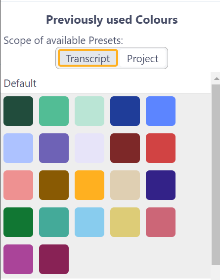
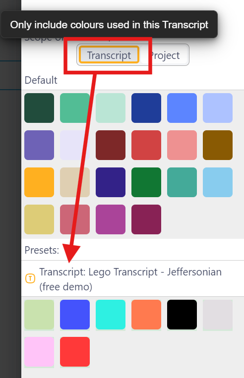
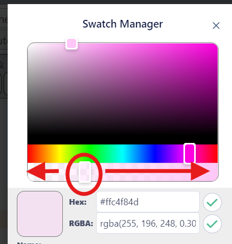

## Colour Swatch Manager

The Colour Swatch Manager manages the Colours that are available in _DOTE_ in regard to T-Clips.

Watch the [video tutorial](https://www.youtube.com/watch?v=JByMzZQQT7E) on YouTube.

To open the Colour Swatch Manager, click on the colour swatch when [editing a T-Clip](transcript-clip.md).
A panel opens up on the right side.

A colour can be selected by clicking on the colour wheel, entering a value or clicking on a swatch.
The primary swatch will change colour to the value selected.

If you wish to return to the previous colour before experimenting with swatches in the Manager, then click the `Revert to Previous Colour button` when applicable.

The Colour Swatch Manager has two sections:
1. The top shows the colour wheel, HEX/RGB numbers.
2. The bottom lists the Default Colours and the Swatch Presets, as well as any user-defined Colours/Presets in the Project or Transcript.

### Default Colours

Users can use a full range of colours to label their [Clips](clips.md).
The colours can be chosen from a colour wheel or entered using its HEX or RGB value and clicking the save button (tick).
For some functions, a transparency value (RGBA) can be selected to avoid one T-Clip occluding another in the Transcript.

The user can also select from a Default set of Colours listed as Swatches that are always available when using _DOTEbase_.

### Using Preset Colours

An alternative is for the user to use named Colours as Presets.
These can only be created in _DOTEbase_ using the [Colour Swatch Manager](https://bigsoftvideo.github.io/DOTEbase/colour-manager.html).

The currently active Colours, including Default, user-specified and saved Presets, can be viewed by scope.
Only those available in the local Transcript or Project are shown.

An indication of the scope of any set of swatches is indicated by an icon, eg. `P` for Project and `T` for Transcript-Clip.

### RGBA and transparency

For some types of clips and/or visual styles, you will need to assign colours that have some transparency, otherwise other clips that overlap with or are within the boundaries of the clip will not be visible.

You can add transparency by adjusting the horizontal slider just underneath the colour wheel.
When you have the right amount of transparency, click the tick button to save the new RGBA colour and/or Preset.

### Colour Presets shared between _DOTE_ and _DOTEspace_

_DOTEbase_ has a more sophisticated [Colour Swatch Manager](https://bigsoftvideo.github.io/DOTEbase/colour-manager.html) than available in _DOTE_.

- Colours assigned in _DOTE_ are exportable and importable in _DOTEbase_.
- Presets, however, cannot be created in _DOTE_.
- Presets can be assigned in _DOTEbase_ and are usable but not editable in _DOTE_.
