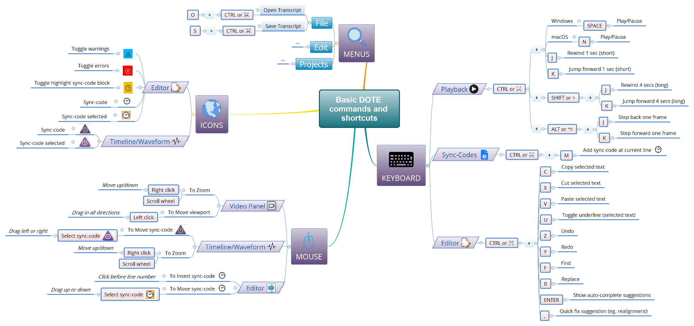

## Commands and keyboard shortcuts

Below are two graphical guides to the many commands and shortcuts for _DOTE_.
The first is a simple guide to the basic commands and shortcuts you need to get by.
The second is a comprehensive guide to all the commands and shortcuts.
You can use your browser to view them or download them.
There may be divergences in how different operating systems (macOS versus Windows) or laptops deal with the mouse, function keys and keyboard shortcuts.
For example, for Windows users, the modifier keys are <kbd>CTRL</kbd> and <kbd>ALT</kbd>.
However, for macOS users, the equivalent modifier keys are <kbd>⌘</kbd> and <kbd>⌥</kbd>, but <kbd>CONTROL</kbd> is not used.

For all users:
- Function keys may require an extra keypress (eg. <kbd>FN</kbd>) on your laptop.
- Scrolling on a touchpad using two fingers may be an alternative to a mouse scroll wheel.
- Some shortcuts can be reassigned by the user for all projects.
    - Choose `File ➔ Settings` to open [Settings](settings.md), then reassign by clicking on the key shortcut for the specific action and pressing the new shortcut key combination.
    - eg. <kbd>CTRL</kbd>+<kbd>J</kbd> or <kbd>⌘</kbd>+<kbd>J</kbd> can be changed to another key combination.

For macOS users:
- For reference, here is a [guide to using <kbd>Right Click</kbd> on macOS](https://www.macworld.co.uk/how-to/mac/right-click-3610351/).
- Here is a [guide to the Emoji Picker on macOS](https://www.imore.com/how-to-use-emoji-on-your-mac).

Let us know on GitHub if something is not working for you.

### Graphical guide for basic set 

### Graphical guide for complete set

Higher quality PDFs of the [simple set](images/commands/guide1.pdf) and the [comprehensive set](imagescommands/guide2.pdf) can be downloaded.
