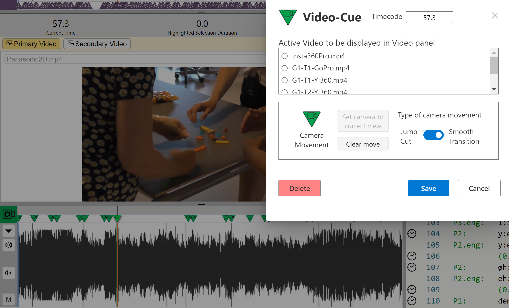
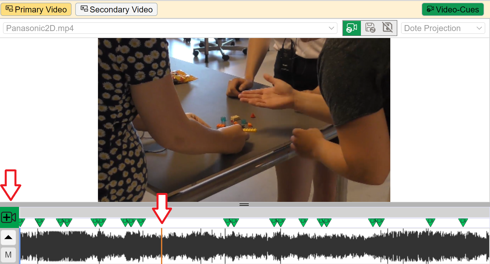
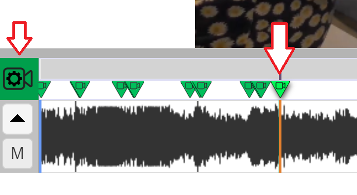

## Video-cues

A _video-cue_ is a cue to transition to a specific view of the current 360 or 2D video at a specific timecode in the video media file.
The idea is to bring a _cinematic experience_ to working with transcripts, such as zoom, pan and jump cut.
This is also called _recamming_, ie. using a virtual camera to show a different view of the original footage.
Cool! 🍦

Note that video-cues are independent of [sync-codes](sync-code.md).
Sync-codes index specific lines in the transcript (in the Editor panel) to specific timecodes in the media timeline.
In contrast, video-cues index specific views of the current media source(s) to specific timecodes in the media timeline.
Video-cues have no connection to the Editor, and they are managed on their own timeline.

### Adding video-cues

1. Open the [video-cue timeline](media.md#media) for the specific video source that is to be cued in the [Primary video panel](video.md).
1. Play the video and pause at the point to be video-cued.
1. Adjust the view in the [Primary video panel](video.md).
1. Enter a video-cue by clicking on the `ADD VIDEO-CUE` button on the left side of the media timeline.
    - Assign the video-cue to the relevant video media source.
    - In video-cue options, select a _jump cut_ (immediate transition between two views) or a _smooth transition_ (a smooth pan between two views) for the video-cue.
    A smooth transition will track linearly from one view to another over a one second duration.
    This adds a cinematic feel to playing your videos in _DOTE_. Woah! 🎦
    - At any time you can replace the current view for a specific video-cue by selecting the video-cue, altering the view on the [Primary Video panel](video.md) to your liking, and clicking the `Change View` button.
1. You can drag the video-cue in the timeline to a new time between adjacent video-cues.
    - The video-cue may need to tweaked in order to get the effect desired, eg. a smooth tracking pan/zoom that follows the action.

### Editing a video-cue

There are two ways to edit a video-cue:

1. Select the desired video-cue on the media timeline, then press the `MODIFY VIDEO-CUE` button.

- Using this method means that the viewport should be changed after selecting the video-cue but before pressing the `MODIFY VIDEO-CUE` button, otherwise one cannot change the video-cue to match the selected viewport.

2. Or just right click on the video-cue in the relevant timeline.
This can be useful when playing the video in the relevant video-cue, changing the viewport (no matter what the timecode), and then right clicking on the relevant video-cue.
The video-cue can then be updated with the current viewport in the [Primary Video panel](video.md).

#### What can be edited?

- If a viewport in the Primary video panel has been changed, then the `Set camera to current view` button will be active (otherwise it will be greyed out).
Clicking it will change the viewport for the selected video for the current video-cue.
- Video-cues can be deleted.
    - Select the video-cue, open the video-cue panel, and choose `Delete`.
- The [Primary and Secondary Video panels](video.md) can be independently locked to the bookmarked video-cue.
    - On each video view, click on the video-cue lock button.
    - The primary video panel is locked to follow video-cues by default; the secondary video panel is set to save viewport by default.

Please note that edits to video-cues are not tracked by the UI in _DOTE_.
For instance, if you move a video-cue to another position on the timeline, then you cannot undo those actions with the standard shortcuts.
Moreover, video-cues are _not_ tracked by [Checkpoints and Autosaves](versioncontrol.md), so if you revert to an earlier Checkpoint or Autosave, then the video-cues will _not_ be restored to their earlier state.
