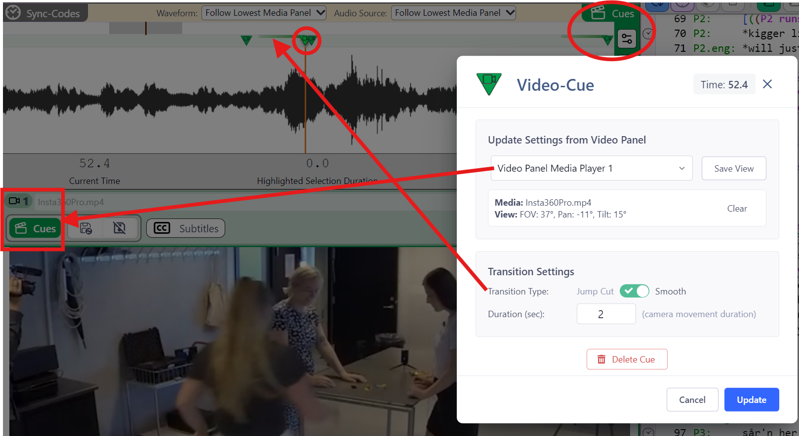
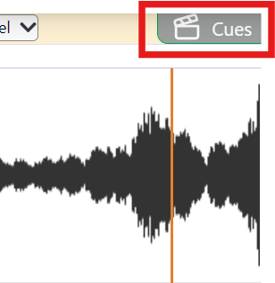
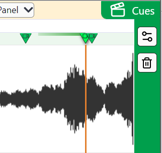
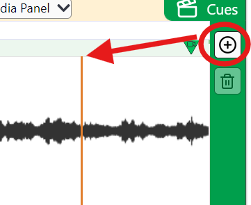
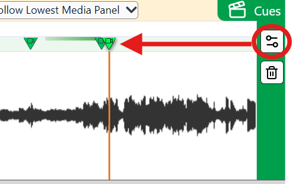
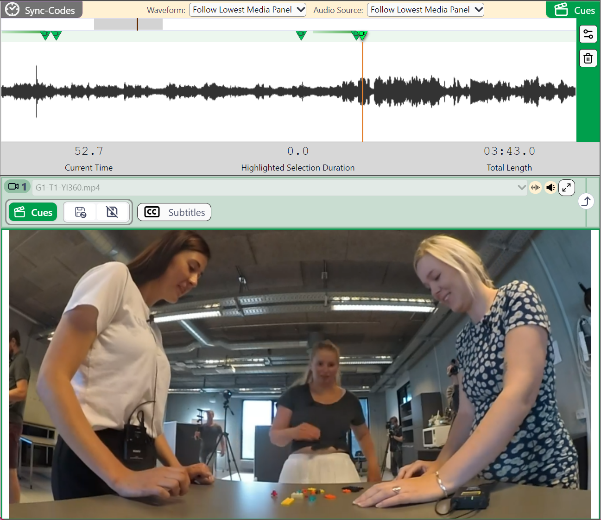
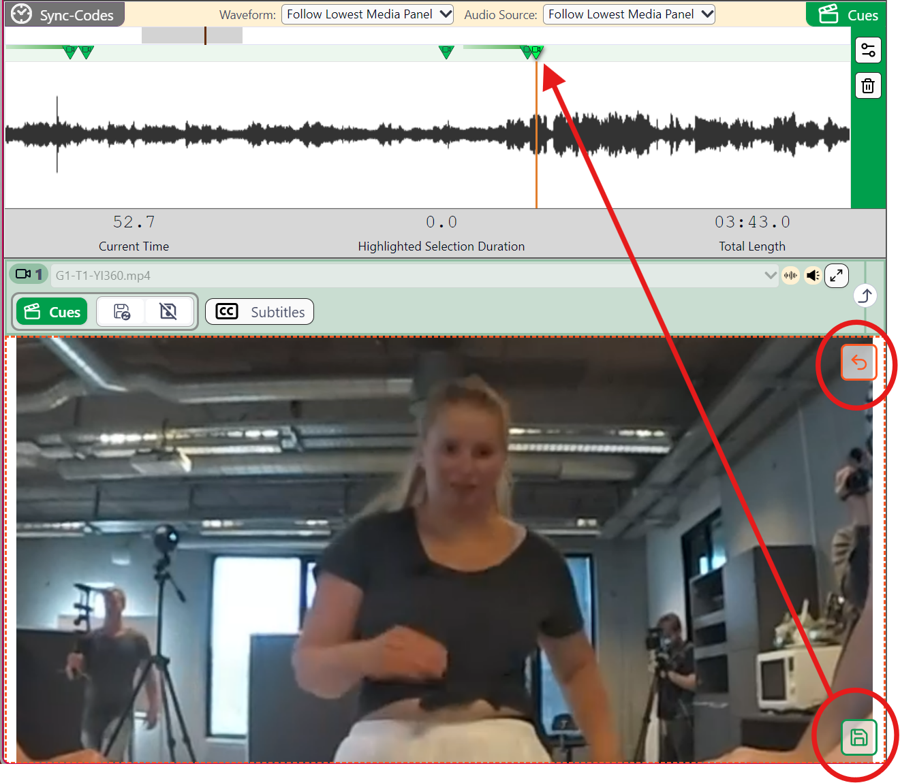
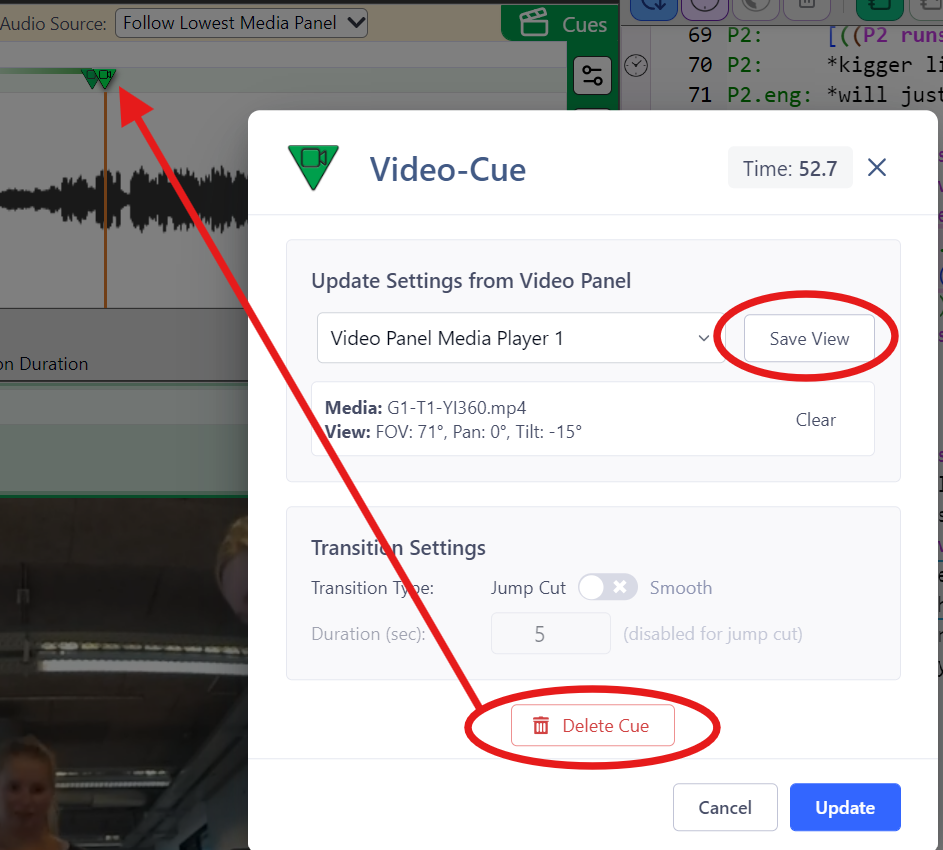

## Video-cues

Watch the [basic](https://www.youtube.com/watch?v=g3OEV6xrsTI) and [advanced](https://www.youtube.com/watch?v=zvCNKN2V5dQ) video tutorials on YouTube.

A _Video-cue_ is a cue to transition to a specific view of the current 360 or 2D video at a specific timecode in the video media file.
The idea is to bring a _cinematic experience_ to working with transcripts, such as zoom, pan and jump cut.
This is also called _recamming_, ie. using a virtual camera to show a different view of the original footage.
Cool! 🍦

Note that Video-cues are independent of [sync-codes](sync-code.md).
Sync-codes index specific lines in the transcript (in the Editor panel) to specific timecodes in a [Timeline panel](Timeline.md).
In contrast, Video-cues index specific views of the current media source(s) to specific timecodes in a Timeline panel.
Video-cues have no connection to the [Transcript Editor](transcript.md), and they are managed on a different layer on a Timeline panel.

Watch the [video tutorial](https://www.youtube.com/watch?v=vCE8AY_HmiU) on YouTube.

### Viewing Video-cues 

The Video-cues can be viewed in a Timeline panel.
Toggle the display of Video-cues at the top right of the [Timeline](timeline.md).
Clicking the clapboard icon will show/hide the Video-cues.

The Video-cues are signalled by the green 🟢 colour and the clapboard icon 🎬 on the right side of a Timeline.
If there are any Video-cues already inserted, then they will appear as inverted green triangles along the top of a Timeline panel.

### Adding Video-cues 

1. Make sure that the Video-cue display is open on a [Timeline panel](#view-cue).
2. Select a specific video source in a [Media Player panel](media-panel.md) that shows the video and view that you wish to cue.
3. Turn on the [follow Video-cues](media-panel.md#video-tips) button in the same Media Player panel.
4. Play the video and pause at the point to be Video-cued.
5. Adjust the viewport in the same [Media Player panel](media-panel.md).
6. Create a new Video-cue by clicking on the `ADD VIDEO-CUE` button on the right side of the Timeline panel.
    - Assign the Video-cue to the relevant video media source.
    - In Video-cue options, select a _jump cut_ (immediate transition between two views) or a _smooth transition_ (a smooth pan between two views) for the Video-cue.
    - For the smooth transition, you can select the transition duration (default 2 seconds) and it when created it will appear as green tail line that gets stronger as it approaches the apex of the full transition.
    The length of the tail is proportional to the duration specified.
    A smooth transition will track linearly from one view to another over the user-specified duration.
    This is only really appropriate for transitions within the same video, such as moving from a medium shot to a close-up or panning across the scene of a 360-degree video to show different participants or ongoing actions.
    This adds a cinematic feel to playing your videos in _DOTE_. Woah! 🎦
    - At any time you can replace the current view for a specific Video-cue by selecting the Video-cue, altering the view on the [Media Player panel](media-panel.md) to your liking, and clicking the `Change View` button that appears in the Media Player panel.
7. You can drag the Video-cue in the timeline to a new time between adjacent Video-cues.
    - The Video-cue may need to tweaked in order to get the effect desired, eg. a smooth tracking pan/zoom that follows the action.
    Sometimes it takes a few iterations to get the desired effect.

If at any time you try to create, edit or move a Video-cue when the [follow Video-cues](media-panel.md#video-tips) button is not selected, then _DOTE_ will warn you that Video-cues will not be tracked in the Media Player panels unless you toggle them on in one or both Media Player panels.

### Editing a Video-cue 

There are three ways to edit a Video-cue:

1. Select the desired Video-cue on the media timeline, then press the `MODIFY VIDEO-CUE` button.

- Using this method means that the viewport should be changed after selecting the Video-cue but before pressing the `MODIFY VIDEO-CUE` button, otherwise one cannot change the Video-cue to match the selected viewport.

2. Or just right click on the Video-cue in the relevant timeline.
This can be useful when playing the video in the relevant Video-cue, changing the viewport (no matter what the timecode), and then right clicking on the relevant Video-cue.
The Video-cue can then be updated with the current viewport in the [Primary Media Player panel](media-panel.md).

3. Alternatively, you can adjust the zoom/pan of the video directly in that Media Player panel and two icons will appear:
    - `Cancel` button (at the top right)
    - `Apply` button (at the bottom right) to apply the currently displayed video plus viewport to current selected Video-cue

Above, the Video-cue is selected.
Below, the viewport in Media Player panel 1 is zoomed in, and the buttons automatically appear over overlaid on the video frame.
If the `Apply` button is clicked, then the new source and/or viewport will be saved to the selected Video-cue.

#### What can be edited?

- If a viewport in the Primary Media Player panel has been changed, then the `Set camera to current view` button will be active (otherwise it will be greyed out).
Clicking it will change the viewport for the selected video for the current Video-cue.

- Video-cues can be deleted.
    - Select the Video-cue, open the Video-cue panel, and choose `Delete`.
- [Media Player panels](media-panel.md) can be independently locked to the bookmarked Video-cue.
    - On each Media Player panel, click on the Video-cue lock button as desired.

Please note that edits to Video-cues are tracked by the UI in _DOTE_.
For instance, if you move a Video-cue to another position on the timeline, then you can undo those actions with the [Undo/Redo](undo.md) function.
Moreover, Video-cues are tracked by [Checkpoints and Autobackups](versioncontrol.md), so if you revert to an earlier Checkpoint or Autobackup, then the Video-cues will be restored to their earlier state.

TODO: check with @alex that that tracking is enabled now.
