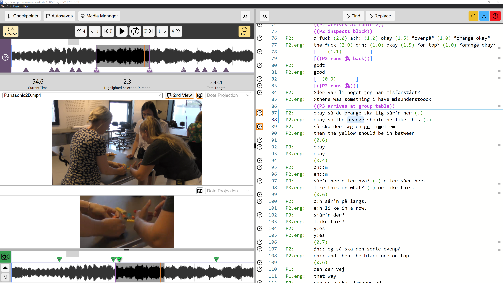
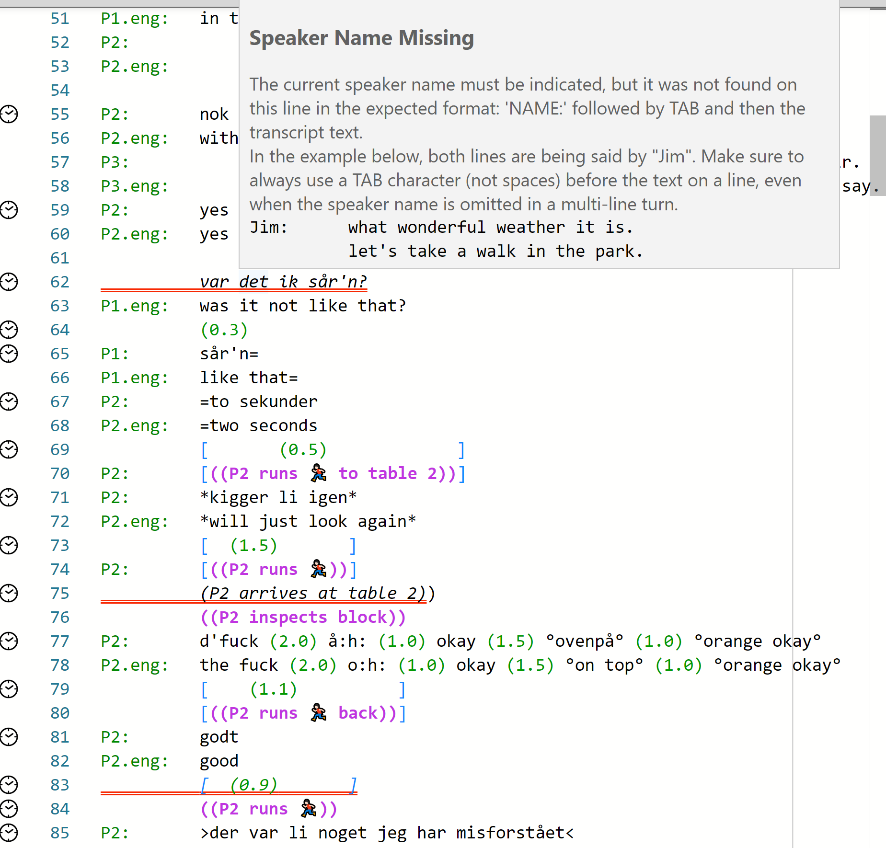

## Demo project

If this is your first time, we would like you to try out _DOTE_ using our demo LEGO project.
The demo project is freely available under a [Creative Commons Attribution Non Commercial Share Alike 4.0 (CC BY-NC-SA) International license](https://creativecommons.org/licenses/by-nc-sa/4.0/legalcode) license.
The [original data](https://doi.org/10.5278/ojs.quivirr.v1.2020.a0003) is published online.
We make no claim that the demo transcripts are authoritative or complete; they are simple illustrative of some of the core functionality of _DOTE_.

### Here are some instructions to import the Demo Project

1. [Download the latest Lego Demo Project](https://dote.sfx.aau.dk/downloads) file and store it somewhere on your computer. [Earlier releases](https://github.com/BigSoftVideo/DOTE/releases) of the Demo project can be found on our GitHub repository.
2. Open _DOTE_ and select `File ➔ Import Project from File`.
3. Locate the Project file that you downloaded (with the extension `.doteProject`) on your file system and click `Open`.
4. Select a destination directory/folder by clicking `Select Directory`.
For example, a folder in your `Documents` called `My DOTE Projects`.
1. Enter a name for your imported Demo Project or select the default name.
1. After you have imported the Project, you can open one of the Demo Transcripts in that Project using `Open Transcript` or `File ➔ Open Transcript` or <kbd>CTRL</kbd>+<kbd>O</kbd> [or <kbd>⌘</kbd>+<kbd>O</kbd> on macOS].
Locate and select the `Lego Transcript Jeffersonian` or the `Lego Transcript Mondadaian` subfolder in the Project folder that you created in an earlier step.
1. The [DOTE project](projects.md) should open and you will see the waveform, video and prepared Transcript.

NOTE: Do _not_ store the Demo Project in the same folder tree as the DOTE application itself.
Please see the [_Where to store your DOTE projects?_](projects.md#storing) help section for more information on solving issues when using remote folders (Windows) and volumes (macOS) for storing projects.

### What is contained in the Lego Demo Project?

The Lego Demo Project contains the following media and Transcripts:

- Six synchronised media sources (see [Media Manager](media.md)), including 2D video, 360-degree video and wireless mic audio.
- Seven alternative transcripts:
    - Transcripts that work with the _free_ Edition of _DOTE_. This is because there are restrictions on the number (2) of media sources that can be activated per Transcript. Thus, playback following video-cues is limited to just two active videos.
    - Transcripts that only work with the _Pro_ Edition of _DOTE_. All media sources can be activated, and there is no limit to selecting media sources and switching between active videos using video-cues.
    - Transcripts that have discoverable errors.
    - A Transcript following an alternative version of the Mondadaian conventions.

### How to try the Demo

In the Demo Project, there are several examples of Transcripts of the same event made following [two different conventions](conventions.md).

1. [Open each Transcript](projects.md#open-transcript).
1. You can [play through the video](video.md) and check the two partial [Transcripts](transcript.md) that have already been made according to Jeffersonian and Mondadaian [conventions](conventions.md).
1. The Transcripts already have some [sync-codes](sync-code.md) and [video-cues](cues.md) that should work automatically when you play the video or click on the sync-code either in the appropriate [timeline](timeline.md) or the editor panel (sync-codes).
Test them to see the result.
1. Try some of the _DOTE_ functionality yourself:
    - Try the [playback controls](play.md) and [looping](timeline.md#loop).
    - Edit the [transcript](transcript.md), type some text and transcription symbols.
    - Add speakers and see how _DOTE_ autocompletes.
    - Add [sync-codes](sync-code.md) and [video-cues](cues.md).
    - Peek at [checkpoints and autobackups](versioncontrol.md).
    This is useful for the transcripts included in the Demo that have known errors.
    Note: You need to install `Git` first (see [Installation instructions](versioncontrol.md#setup)).
    - Create your own checkpoint after making some changes.
2. If you make changes, remember to save the Transcript regularly `File ➔ Save Transcript` or <kbd>CTRL</kbd>+<kbd>S</kbd> [or <kbd>⌘</kbd>+<kbd>S</kbd> on macOS].

#### Spot the errors!

As a bonus, some of the Transcript versions included in the Demo contain deliberate errors.
It is a fun game to spot the errors (_DOTE_ will help you) and correct them.

- [Open each Transcript with errors](projects.md#open-transcript) and find/correct the errors.
The errors in the Mondadaian version are harder to find, since they may not all appear in the [Editor](transcript.md).
- The task can be made harder (eg. without help from DOTE) by [toggling off errors and warnings](errors.md)!
- If you have set up Checkpoints, then you can peek at each [Checkpoint](versioncontrol.md) (cheat sheet) to see a description of the error and a comparison with the original to show the changes that made the error.
- This game is fun to play with the family during seasonal holidays! 🥳
