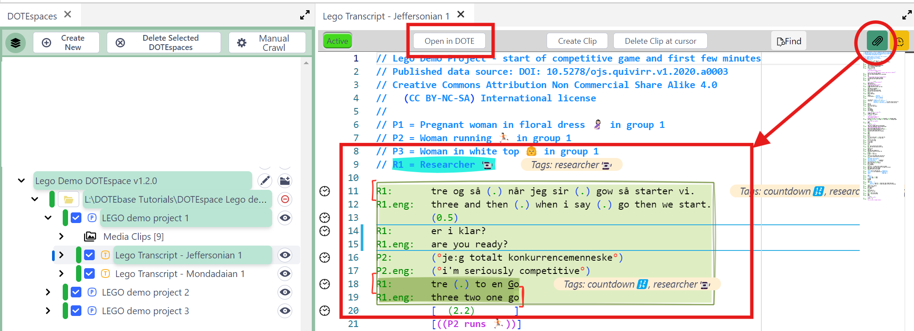

## Integration with _DOTEbase_

[_DOTEbase_](https://bigsoftvideo.github.io/DOTEbase/) is our complementary software package that is designed to support qualitative analysis of large audio-visual data sets.
We built it because we wanted a software tools to help researchers to analyse larger corpora of data, either before they have been transcribed or after.
It piggybacks on sets of transcripts created using _DOTE_ that are stored on the same computer or are accessible via an external drive or remote file system.

To use _DOTEbase_, you will need to purchase a license for _DOTE_ from our webshop.
We strongly recommend you use DOTE v2.0+, but you can use _DOTEbase_ even with the older version of  _DOTE_ v1.1.4.

See the [help guide](https://bigsoftvideo.github.io/DOTEbase/install.html) for how to install and use _DOTEbase_.

To integrate with _DOTEbase_, _DOTE_ v2.0 supports:

1. [Creating, viewing and deleting Transcript Clips](transcript-clip.md) in the [Transcript Editor](transcript.md) panel.
2. Support for [importing](import.md) and [exporting](export.md) Transcripts and Projects with Transcript Clips.
3. Support for tracking changes to Transcript Clips in [Checkpoints and Autobackups](versioncontrol.md).
4. Creation and editing of the same Transcript Clip in either _DOTE_ or _DOTEbase_.
5. Open _DOTE_ transcripts directly from _DOTEbase_.

For further information, see [Transcript Clips](transcript-clip.md), [Tags](tags.md) and [Colour Swatch Manager](colour-manager.md).
