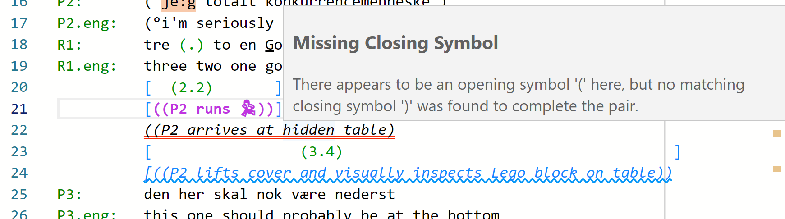
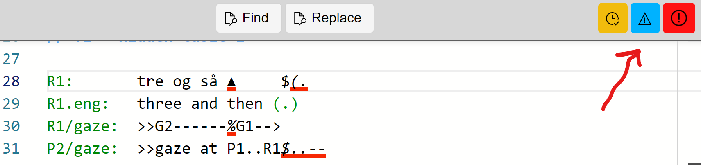

## Errors and Warnings

DOTE will report errors and warnings as best it can according to its expected transcription style set and logic.
There are different categories of problems that_DOTE_helps you address:

- If _DOTE_ determines that there is a _critical error_ in the transcript, then the problem (and the scope of the trouble) will be indicated by a _double red underline_.
- If _DOTE_ determines that there is a problem, but it is not so serious, then a warning (and the scope of the trouble) will be indicated by a _wavy blue underline_.

In both cases, if you hover over the marked highlight with the mouse cursor, then a warning or error box will pop up.
_DOTE_ tries to give as much information as it can to help you resolve the problem.

You can toggle warnings or errors on and off using the buttons at the top right of the Editor panel.

It may not be correct, or to your liking, every time.
This is because _DOTE_ is built to follow particular [normative formats and styles](conventions.md) (very close to that expected in conversation analysis) in order to make life easier.
It may be that _DOTE_ is too aggressive given your own style of formatting and layout.
You can always toggle on and off the display of errors and warnings.

Note that _DOTE_ still uses its own normative style and formatting to be able to give smart guidance and to [export the transcript](export.md) as a text document in `RTF` or `SRT` format.
If you want line numbers on EVERY line, for instance, then it doesn't matter that there are errors.
However, if you would like a special line numbering sensitive to the nature of what is represented on that line, then _DOTE_ expects its style to be followed.
Furthermore, if you would like to export your transcript as subtitles to play along with a video clip, then _DOTE_ also expects its style to be followed.
The simple reason for this is that chaos would be the result if we attempted to support all personal, nonstandard styles.
_DOTE_ cannot be that smart.
The result would be exported files that are full of line numbering errors and misplaced subtitles.
When exporting to `RTF` or `SRT`, then _DOTE_ will provide simple help to so you can isolate which lines are causing the problem and fix them as you see fit.
