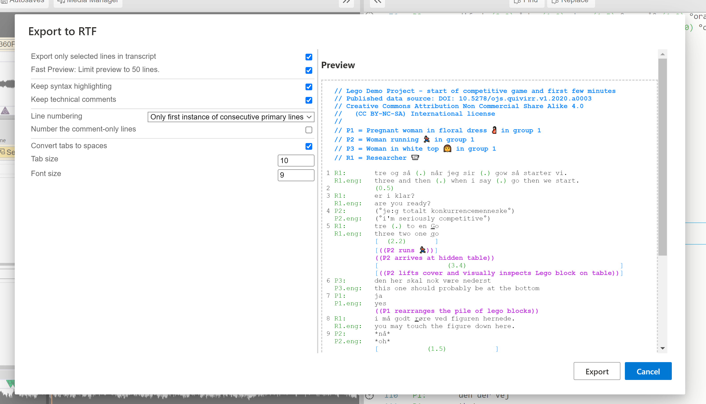
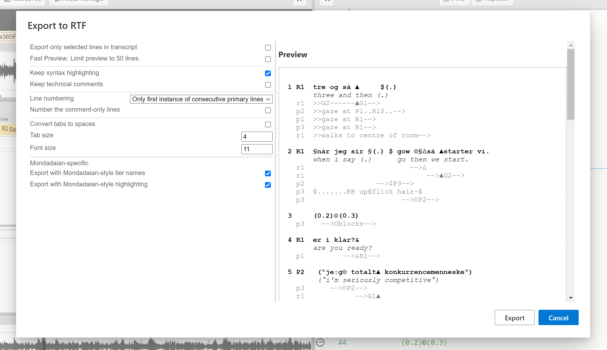

## Export the _DOTE_ transcript

From  _DOTE_, you can export your transcript to different formats readable by other software. Wow! 🤘🏻

In this release, we support `Export to RTF`, since all word processors on different platforms can read lightly formatted RTF files. We also support `Export to SRT` because most desktop media players can play simple subtitles from such a file and overlay them on the video.

Changes to `Export to RTF` default options will persist across _DOTE_ sessions, but changes to `Export to SRT` options will not (because they are dependent on the specifc transcript translation subtiers).

### How to export to RTF <a id='rtf'></a>

1. Select `File ➔ Export To RTF` from the menu.
1. Choose your options from the check boxes, drop-down list and variables.
1. Select `EXPORT`.
1. Select a location and filename for the RTF export.
1. After a short pause, _DOTE_ will return to display the transcript.
1. You can find the RTF file in the folder you selected.

On the right is a preview panel that shows all the lines of the current transcript (or selected lines only) and updates according to your choices made in the left panel.

[](images/export/exportRTF-Jeffersonian.png)

If there are serious errors in the transcript that _DOTE_ has trouble with, then this will be indicated on a line-by-line basis. The transcript can still be exported to RTF, but there may be lines that are not correctly formatted because of the errors.

### Notes on options

#### Only selected lines

If you had selected a specific range of lines in the [Editor](transcript.md) before opening the Export to RTF panel, then you can choose to export only those continuous lines.
If not, then all lines will be exported.

#### Restrict to 50 lines

Because it can take time to parse the transcript and prepare the preview with very lone transcripts, then you can restrict the number of lines displayed in the preview window regardless of whether all or only selected lines has been chosen.
All lines, or only those selected, will still be exported to disk.

#### Syntax highlighting

_DOTE_ adds syntax highlighting in the editor panel.
You can export this highlighting or just plain text.

#### Keep technical comments

If you have used technical comments `//`, eg. for metadata or just to add a comment in the transcript, then you can export them intact or remove them completely.

eg. there are two cases of technical comments below.

```
// Metadata

J:	and then she said     // reported speech
```

#### Line numbering <a id='lines'></a>

If you have followed _DOTE_'s format and layout conventions, then there are several choices of line numbering.

- `None`: No line numbers are added
- `All`: Every line is given a number starting at 1
- `Only main lines`: Only a speaker tier or a timing tier are given line numbers
- `Only first of main lines`: Only the first instance of a speaker tier is given a line number if the same speaker continues on the next tier

#### Number the metadata lines

If `All` is selected, then one can choose to number the metadata lines as well, or not.

#### Number the comment only lines

If `Only main lines` or `Only first of main lines` is selected, then one can choose to number the comment _only_ lines `((...))`, or not.

eg. the second line is comment only below.

```
P:	look at that
	((points))
	over there
```

#### Convert tabs to spaces

By default, _DOTE_ will export the TAB after the speaker-id + named subtier type.
This is useful for adjusting the formatting later in a word processor.

- You can choose to replace the TAB with an equivalent number of spaces instead.
This is not reversible later in a word processor, but might help formatting and layout when working with a publisher.

#### Tab size and Font size

The default font in the exported RTF is `Courier New`.
This cannot be changed in _DOTE_, but of course it can be in a word processor.
The monospaced font `Consolas` is recommended in WORD for readability and a tighter character spacing.

- You can adjust the font size and the TAB size (eg. the width in characters from the initial character on each line to the transcript text) to your liking.

#### Prettified Transcript

There are two choices to prettify the exported transcript:

- Remove subtier names (eg. translation and gloss subtier types).
- Format primary tiers and subtiers in a neighbourhood using bold and italic.

### Mondadaian style and layout <a id='mondada-rtf'></a>

If you have set your transcript to Mondadaian conventions in [Transcript Options](settings.md#options), then you will be able to select the following options:

- Use standard Mondadaian style formatting, eg. line numbers, tiers and subtiers in bold, grey or italic.
When this is selected, syntax highlighting is not available.
- Use standard Mondadaian style layout of names and tiers.

Remember to select `Only main lines` or `Only first of main lines` for line numbering.

[](images/export/exportRTF-Mondadaian.png)

### Notes on editing the RTF export in a word processor <a id='editing-rtf'></a>

The RTF file that is exported by _DOTE_ should be readable and editable in any word processor, such as Microsoft WORD or Open Office.
The layout and vertical alignment should be preserved in the export from _DOTE_ to RTF.

Here are some guides about how to alter the appearance of the transcript in Microsoft WORD:
- Change page layout.
    - From `Layout/Orientation`.
- How to change the first `TAB` stop position?
    - You can set the TAB size for the speaker column when exporting to RTF.
    If you need to change it later in WORD, then:
    - Select ALL text `CTRL+A`. And `View/Toggle Ruler` and grab `TAB` mark and slide.
    - Or select ALL text `CTRL+A`. And `Paragraph/Tabs` and `Clear All` and change `Default Tab Stop` to required width.
    - Note: changing the font size in WORD does not change the `TAB` size.
    - Note: if you choose "convert tabs to spaces" in when exporting to RTF, then you cannot change the `TAB` stop in WORD.
- Change font typeface, eg. `CONSOLAS` is a pleasant monospaced font that is narrower than `COURIER NEW`, which is the default for _DOTE_.
    - Select ALL text `CTRL+A`. And select new (monospaced) Font name from drop down list on the menu bar.
- How to turn off spell check and grammar check in the whole document?
    - eg. from `Options/Proofing` tick the two boxes to turn off both for this document.
- How to add automatic line numbers later using WORD if line numbers have not been exported by _DOTE_?
    - Add Layout/Section break/Continuous at start and end of transcript. And `Layout/Line numbers`. Select `Restart each section`.
    - How to change position of line numbers? Select `Layout/Line numbers/Line numbering options/Line numbers`.
    - How to change font and font size of line numbers? This is tricky in WORD. Set Default Font or use Manage Styles to find Line Number and change appearance.
- Warning: too long lines in WORD
    - One thing to watch for when using WORD is the way in which WORD automatically adjusts character spacing for lines that are nearly too long to fit between the page margins, even when the font is monospaced (eg. `COURIER NEW`).
    Instead of word wrapping, WORD will adjust character spacing to make the line fit.
    This means that some of the line will not be monospaced and therefore vertical alignments will be disrupted.
    It will do this until the line is really too long and then it will force word wrapping and return to default character spacing.
    This is not the fault of _DOTE_.
    It is the consequence of WORD trying to be too helpful.
    The solution is to break the line earlier or reduce the font size or decrease the left/right margins.

### How to export to subtitles (`SRT`) <a id='srt'></a>

It is also possible to export the basic speaker turns to subtitles that are timed to the original video clip, with all the timing, subtiers, alignment symbols and overlap brackets removed.

Select `Export to SRT`, choose your options, and give a filename and location for the exported `SRT` file.

[](images/export/exportSRT.png)

On the right is a preview panel that shows all the lines of the current transcript as an `SRT` file.
It updates according to your choices made in the left panel.

If there are serious errors in the transcript that _DOTE_ has trouble with, then this will be indicated on a line-by-line basis.
The Preview panel will be blank, and the transcript _cannot_ be exported to subtitles until the errors are fixed.

Options available:

- Select language (if `.translation` subtiers are specified in [Transcript Options](settings.md#options))
    - Include original language
    - Include original language if translation line is missing
- Include speaker name in subtitle
- Include pauses
- Various combinations of main speaker tier language and/or translation subtier language

Most media players on the desktop will play a video with the `SRT` file.
VLC or [PotPlayer](https://potplayer.daum.net/) (Windows only) are recommended.
If the filename of the `SRT` file is the same as the video file in the same folder, then video playback with subtitles will be automatic.

When exporting to SRT it is best that you focus on [sync-codes](sync-code.md) on the [HEAD line of a neighbourhood](tiers.md), eg. the primary speaker line or a pause line or a timing interval line.
If you do have sync-codes also on overlapping speaker lines or subtier lines (Mondadaian), then _DOTE_ will ignore them and just use the subtitle timing intervals between the sync-codes on HEAD lines across neighbourhoods.

If you wish to edit and fine-tune your exported subtitles, then we recommend the open source [Subtitle Edit](https://nikse.dk/SubtitleEdit/).
