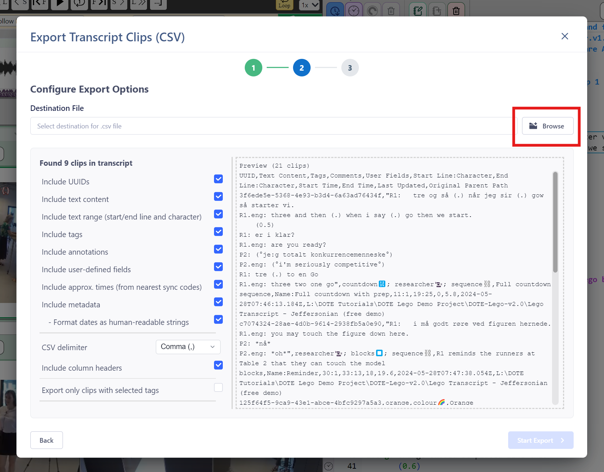

## Export transcript clips to CSV file 

This export function is specifically for exporting just the Transcript Clips in the current Transcript to a universal comma-separated values (CSV) format that can be read and parsed by other software tools.

### Exporting to CSV

1. Select `File ➔ Export` from the menu.
2. Click on the relevant `Continue` button for "Transcript Clips (CSV)".
1. Specify the "Destination File" location for the exported file (`.csv`).
The default filename suggested will be the same as the name of the Transcript in `DOTE`.
3. For all Transcript clips found in the current Transcript, choose your options from the check boxes.
    - Format CSV to be human readable - otherwise it is only machine readable as a long string of characters.
    - Include UUIDs - these are unique identifiers used in _DOTE_ and _DOTEbase_.
    - Include Transcript text - that is the text that is selected to be annotated by each clip.
    - Include approximate times (from sync-codes) - only possible in sync-codes are present.
    - Include tags - include or exclude all tags used in Transcript Clips.
    - Include annotations (in the Transcript Clip).
        - Include user-defined fields - these are special fields designated by the user.
    - Include metadata.
        - Format dates as human readable
    - CSV delimiter - the default is comma(,).
    - Include column headers - the type of data structures can be added as columns in a table format.
    - Export only clips with selected tags (default off).
        - If this is selected, then a list of all tags used in Clips in the current Transcript are listed for selection.
4. When ready, select `Start Export`.
5. You can find the CSV file in the folder you selected.

If someone has written a import parser for the CSV data structure that _DOTE_ exports, then you can import it into another software package.
