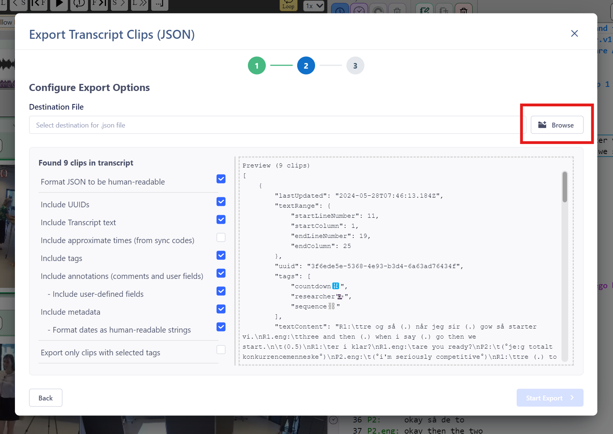

## How to export transcript clips to JSON  

This export function is specifically for exporting just the Transcript Clips in the current Transcript to a common data format (JSON) that can be read and parsed by other software tools.

### Exporting to JSON

1. Select `File ➔ Export` from the menu or click the `Export` button on the ribbon bar.
1. Click on the relevant `Continue` button for "Transcript Clips (JSON)".
1. Specify the "Destination File" location for the exported file (`.json`).
The default filename suggested will be the same as the name of the Transcript in `DOTE`.
2. For all Transcript clips found in the current Transcript, choose your options from the check boxes.
    - Format JSON to be human readable.
    - Include UUIDs - these are unique identifiers used in _DOTE_ and _DOTEbase_.
    - Include Transcript text - that is the text that is selected to be annotated.
    - Include approximate times (from sync-codes) - only possible in sync-codes are present.
    - Include tags.
    - Include annotations (in the Transcript Clip).
        - Include user-defined fields - these are special fields designated by the user.
    - Include metadata.
        - Format dates as human readable.
    - Export only clips with selected tags (default off).
        - If this is selected, then a list of all tags used in Clips in the current Transcript are listed for selection.
3. When ready, select `Start Export`.
4. You can find the JSON file in the folder you selected.

If someone has written a import parser for the JSON data structure that _DOTE_ exports, then you can import it into another software package.
