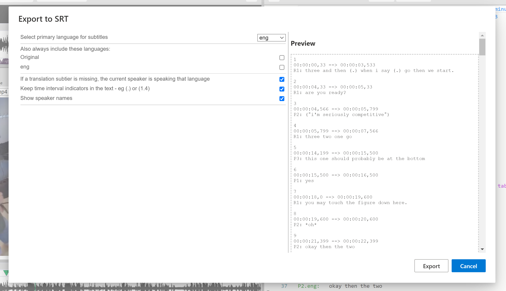
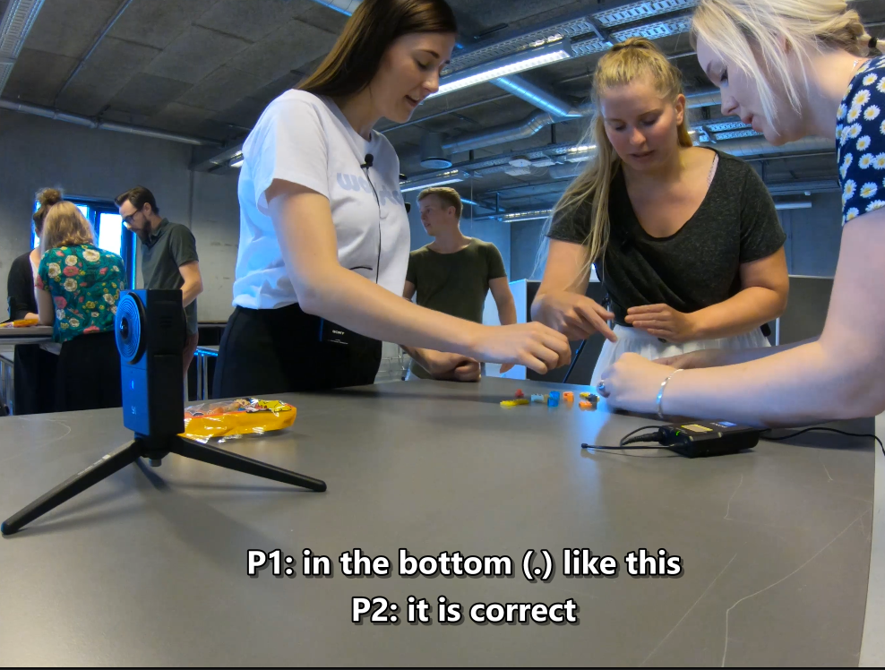

## How to export to subtitles (`SRT`) 

Watch the [basic](https://www.youtube.com/watch?v=1X3Es1fftPA) and [advanced](https://www.youtube.com/watch?v=IusIOK8TLIM) video tutorials on YouTube.

It is also possible to export the basic speaker turns to subtitles that are timed to the original video clip, with all the timing, subtiers, alignment symbols and overlap brackets removed. The only condition for this to work correctly is that you have already manually added [sync-codes](sync-code.md) on the HEAD lines of every [neighbourhood](glossary.md#neighbourhood), otherwise _DOTE_ has no idea which lines should appear when as the video plays.

In _DOTE_ v2.0 it is now possible to load exported subtitle files into a Media Player panel.
This means one can playback videos with different [live subtitles](subtitles.md) according to need.

### How to export

1. Select `File ➔ Export` from the menu.
2. Click on the relevant `Continue` button for "SRT Subtitle".
1. Specify the "Destination File" location for the exported file (`.srt`).
The default filename suggested will be the same as the name of the Transcript in `DOTE`.
1. Choose your options from the check boxes, drop-down list and variables.
2. Select `EXPORT`.
3. You can find the SRT file in the folder you selected.

On the right is a preview panel that shows all the lines of the current transcript as an `SRT` file.
It updates according to your choices made in the left panel.

If there are serious errors (those that interfere with parsing the transcript) in the transcript that _DOTE_ has trouble with, then this will be indicated on a line-by-line basis.
The Preview panel will be blank, and the transcript _cannot_ be exported to subtitles until the errors are fixed.

### Options available

- Select language (if `.translation` subtiers are specified in [Transcript Options](settings.md#options))
    - Include original language
    - Include original language if translation line is missing
- Include speaker name in subtitle
- Include pauses
- Various combinations of main speaker tier language and/or translation subtier language

Most media players on the desktop will play a video with the `SRT` file.
VLC or [PotPlayer](https://potplayer.daum.net/) (Windows only) are recommended.
If the filename of the `SRT` file is the same as the video file in the same folder, then video playback with subtitles will be automatic.

When exporting to SRT it is best that you focus on [sync-codes](sync-code.md) on the [HEAD line of a neighbourhood](tiers.md), eg. the primary speaker line or a pause line or a timing interval line.
If you do have sync-codes also on overlapping speaker lines or subtier lines (Mondadaian), then _DOTE_ will ignore them and just use the subtitle timing intervals between the sync-codes on HEAD lines across neighbourhoods.
_DOTE_ uses an algorithm to select the speech to be displayed, how much to display, and how to treat overlapping speech.

If you wish to edit and fine-tune your exported subtitles, then we recommend the open source [Subtitle Edit](https://nikse.dk/SubtitleEdit/).
