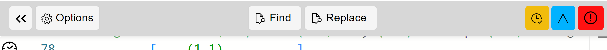
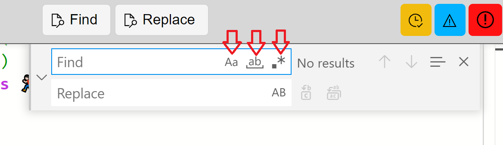
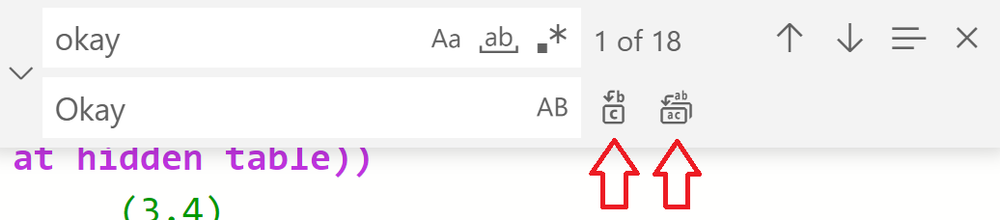
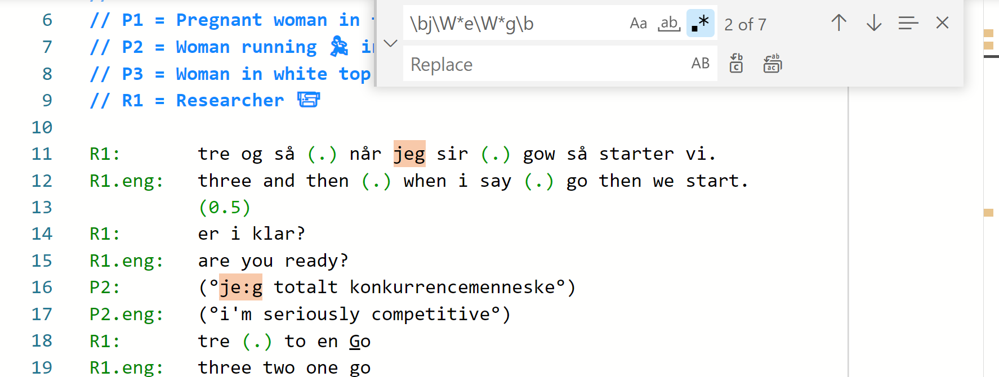

## Using find (and replace) in the editor panel

There is a powerful find and replace tool in the transcript editor.

### How to find an expression? 

1. Select the `Find` button or type <kbd>CTRL</kbd>+<kbd>F</kbd> [<kbd>⌘</kbd>+<kbd>F</kbd> on macOS]
1. A dialog box opens up in the top right of the editor panel.
1. You can type the expression to find.
1. If you had selected some text already, then it appears automatically in the `FIND` box.
1. You can search for the next/previous match with the <kbd>↑</kbd> <kbd>↓</kbd> keys or <kbd>ENTER</kbd>.

- Notes:
    - You can toggle match case (`Aa`) or match word (`ab`).
    - You can also toggle the powerful regular expressions (`.*`). See [below](#regex).

### How to replace the found items with a new expression? 

1. Select the `Replace` button or type <kbd>CTRL</kbd>+<kbd>R</kbd> [or <kbd>⌘</kbd>+R on macOS]
1. Or if the FIND dialogue box is open, then select the expand `>`.
1. Type the expression that will replace each match in the REPLACE box.
1. Replace `CASE-BY-CASE` or `ALL`.

- Notes:
    - You can toggle preserve case (`AB`) to keep the case of the original in the replacement.

### How to search for regular expressions? 

Sometimes there are occasions when you need to search for a particular combination of characters with wild cards or hidden elements such as `TAB`s.
DOTE can do this using regular expressions.
Sweet!🔎

1. If you open the `Find` dialog box, and set it up for regular expressions by toggling `.*`.
1. Type your regular expression using the correct syntax.
See these RegEx guides ([Learn RegEx](https://www.sitepoint.com/learn-regex/) and [Quick Start](https://www.regular-expressions.info/quickstart.html)) and this [test site](https://regex101.com) where you can experiment.
There are apps for your mobile phone (eg. `RegexH` and `RegEx GUI`) and [YouTube video tutorials](https://www.youtube.com/results?search_query=guide+regex).
1. You may also need to toggle case and whole word in the `Find` dialog box.

For all the examples below, it is crucial that you turn on regular expressions by toggling `.*`.

#### Find all capitalisations

Capital letters are used to mark loudness in Jeffersonian conventions.
Some transcribers use them for proper nouns as well.
This can be confusing.
If you wish to find all cases of capitalisation to check usage, then:

- FIND: `[A-Z]` and turn on `Match Case` will do the trick.

#### Find a word and all its variants

It is useful to be able to find all variants of a word with other characters inside the word, such as `:` or a pitch rise/fall. To do so, then use regex in the Find dialog box.

- FIND: `L1\W*L2\W*...\W*Ln`, with the expression `\W*` between each letter in the word (`W` is capitalised)
- L1 is first letter, L2 is the second letter... and Ln last letter
- eg. FIND: `h\W*e\W*l\W*l\W*o` will find "hello" and all its variants which contain transcription symbols, eg. "he:llo" or "he::llo" or "he↓llo"
- You can play with `match case` or `match word` to narrow down your search

If you wish to make sure to only find whole words, then:

- Turn on whole word in the `Find` dialog box.
- Or add `\b` to the start and end of your search string, eg. `\bh\W*i\W*m\b` will find only variants of the whole word "him".

If you wish to be even more clever, then you can also search for all variants of a word, even if there are internal brackets in the word, eg. `he:(hh)llo`:

- As above, insert the following long string between each letter of the word (with no spaces)
- `((\W|(\(\w*\)))*)`
- eg. `h((\W|(\(\w*\)))*)i((\W|(\(\w*\)))*)m((\W|(\(\w*\)))*)` will find all variants of "him".

#### Find all overlap blocks

Overlap blocks are natively highlighted by _DOTE_ in the editor, but if you wish to jump between them, then:

- FIND: `\[[^\]]+\]?`
- This will only work correctly for paired brackets on a line.
If there is an opening bracket but no closing, then the rest of the line will be selected as well.
- or FIND: `\{[^\}]+\}?` will find all non-sequential overlapping blocks.

#### Find all out-of-place `SPACE`s in the name column

DOTE requires that the name column is formatted in a specific way.
`SPACE`s can creep in to that column, which can cause problems for the parser.
You can find all illegitimate `SPACE`s with the following string:

- FIND: `((?<=^\S+:) +)|((?<=^) +)`

#### Find all out-of-place `TAB`s in the transcript body

`TAB`s can creep into the body of your transcript unknowingly because they are not visibly displayed.
You can search for them, though _DOTE_ will often highlight their presence with a red squiggly error.

- FIND: `(?<!(^|^.+:))\t`

#### Replace all instances of a speaker-id in the name column

It is useful to be able to replace all instances of a speaker-id (or participant-id) even on subtiers, but _not_ in the body of the transcript:

- FIND: `(^speaker-id)(?=(.*:))` - replace `speaker-id` with the appropriate name in your transcript.
- REPLACE: `new-speaker-id` - replace `new-speaker-id` with the new name you have chosen.
- Step through the changes case-by-case or commit all of them at once in the `Find` dialog box.

RegEx is very powerful, but it takes time to learn. Have fun!
