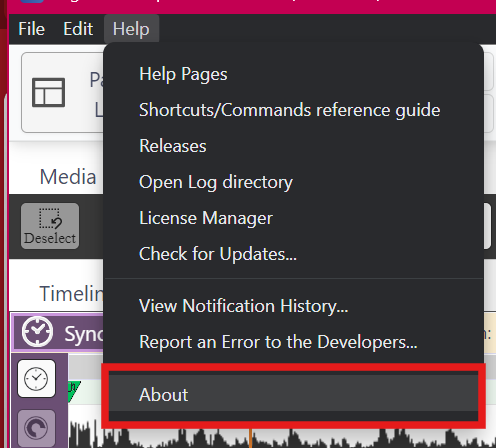
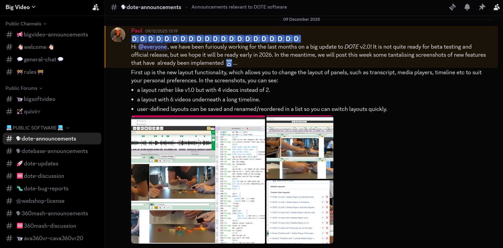

## Help guide for release v2.0

This help guide provides you with instructions to get started with basic and more advanced transcription tasks using _DOTE_.
The help guide gives guidance on all features and functionality, including the _Pro_ Editions.
Some of the functionality described will not be available in the free Edition of _DOTE_.
See the [comparison chart on our webshop](https://www.dote.aau.dk/license-compare#compare-detail).

### Which version am I using?

Click the link `About` under the `Help` menu to find out which version you are using.

If you have recently [downloaded the v2.0](https://www.dote.aau.dk/download/) release to install or update _DOTE_, then you are on the right webpage.

If you are still using the older v1.0 releases of _DOTE_, then you need to go to the [archived help guide](help.v1/help.md).
We recommend that you [upgrade](install.md) as soon as possible to v2.0.

### What is new in v2.0?

You can find a [quick overview](new-v2.md) of some of the key features in v2.0.

### Where are the release notes?

The [release notes](https://github.com/BigSoftVideo/DOTE/releases/) for the current release are on GitHub, as are release notes for earlier versions.

Watch the [video tutorial](https://www.youtube.com/watch?v=x_HvKftJsQw) showing off the latest release on YouTube.

### How to download and install _DOTE_

_DOTE_ can be installed on the Microsoft Windows and Apple macOS desktop platforms.

- Please follow the [instructions to install, update or upgrade](install.md).

### _DOTE_ Lego demo Project

Try the [_DOTE_ Lego demo Project](demo.md).
There are several different transcript versions made according to [Jeffersonian and Mondadaian conventions](conventions.md).
Some work well with the Free Edition of _DOTE_ (with restrictions) and others are more appropriate for the fully featured Pro and Pro Community Editions.

### Help pages on using _DOTE_

Here is a list of help tutorials on specific topics:

- [Layout of the user interface](ui.md) - easy-to-use and functional
- [Creating, opening and saving transcription Projects](projects.md) - easy project management
- [Exporting Projects, Transcripts and Clips](export.md) - share your transcripts efficiently
- [Importing Projects and Transcripts](import.md) - import shared transcripts efficiently
- [Media Manager](media-manager.md) - manage your audiovisual data
- [Timeline panel](timeline.md) - intuitive navigation of timecoded data
- [Media Player panel](media-panel.md) - multiple media and views including 360-degree video (unique to _DOTE_)
- [Audiovisual playback](play.md) - silky-smooth audiovisual playback while typing
- [Transcript Editor](transcript.md) - with transcript heuristics (unique to _DOTE_)
- [Conventions supported by _DOTE_](conventions.md) - conforming transcripts to a clear style (unique to _DOTE_)
- [Primary Tier and Subtier types](tiers.md) - adding multimodal complexity (unique to _DOTE_)
- [Find and Replace tool](find.md) - powerful and accurate search
- [Publishing to RTF and subtitles](export.md) - create publishable transcripts and subtitles (unique to _DOTE_)
- [Subtitle overlay](subtitles.md) - overlaying stylised subtitles in a Media Player panel (unique to _DOTE_)
- [Sync-codes](sync-code.md) - linking transcripts to audiovisual playback
- [Video-cues](cues.md) - bringing cinema to audiovisual playback (unique to _DOTE_)
- [Transcript Clip](transcript-clip.md) - add stylish annotations and tags to a transcript
- [Undo/Redo](undo.md) - undoing and redoing changes while editing (unique to _DOTE_)
- [Checkpoints and Autobackups](versioncontrol.md) - two safe and reliable backup systems (unique to _DOTE_)
- [Project & Transcript information](project-info.md) - display information and stats about the current project and its associated transcripts
- [Merge two or more Transcripts](merge-transcripts.md) - great for teamwork and dividing up the labour
- [Settings and Transcript Options](settings.md) - a tailorable UI and Transcript fit for a Queen
- [Errors when using _DOTE_ and editing a transcript](errors.md) - letting you know what might go wrong
- [How to transcribe with _DOTE_](howto.md) - practical advice for different transcription practices
- [Error reporting](logfile.md) - report bugs directly to the developers
- [Tips & Tricks](tips.md) - how to get some mundane and special tasks done
- [Commands and shortcuts guide](commands.md) - a visual guide all in one place
- [Glossary of key terms](glossary.md) - what you need to know
- [Integration with _DOTEbase_](dotebase.md) - our spectacular toolkit to support qualitative analysis

### Browse our _DOTE_ video tutorials 

We have made a bunch of [video tutorials](tutorials.md) you can view to learn how to use _DOTE_.

### User error and bug reports

You can easily submit an [error report](logfile.md) to our developers using the link `Report an Error to the Developers` under the `Help` menu.

How to enter a [bug report issue](https://github.com/BigSoftVideo/DOTE/issues/new/choose) if you find anything that doesn't seem to work.

In many cases it helps us if you attach the [_DOTE_ logfile](logfile.md) to the bug report.
The folder on your computer in which the logfiles are stored can be accessed by the link "Open LogFile directory" under the `Help` menu.

### User feature requests

How to enter an idea you have for a [feature or enhancement](https://github.com/BigSoftVideo/DOTE/issues/new/choose) to _DOTE_.

### Tracking bugs and features as a user

You will be able to track bugs and features in our [project board](https://github.com/BigSoftVideo/DOTE/projects/1).

### Suggestions for help pages and tutorials

Please [submit a suggestion](https://github.com/BigSoftVideo/DOTE/issues/new/choose) for how we can improve the help pages and guide, as well as ideas for video tutorials.

### Using our _DISCORD_ server

If you are using the free edition of _DOTE_, then there are some public channels on our [Discord server](https://discord.gg/8BmuHP7xh4).
We cannot guarantee that we have time to respond to everything posted in these free public channels, but we try our best.

If you have purchased the license for the _Pro_ Edition, then you will be invited to a private Discord channel for Pro features on our server.
You will be able to share ideas and experiences quickly, and to fix issues interactively with other users and the developers.

If you have purchased the license for the _Pro Community_ Edition, then you will be invited to several private Discord channels on our server, as well as our private GitHub repo for early beta releases, testing and feedback.

### How to cite _DOTE_

If you are using _DOTE_ for transcription, then we would appreciate that you [cite it](citeDOTE.md) where appropriate.

### Structure of our meta-data files

If you are interested in inspecting the meta-data files used within _DOTE_ Projects & Transcripts, see our detailed [JSON file documentation](json-formats.md).
