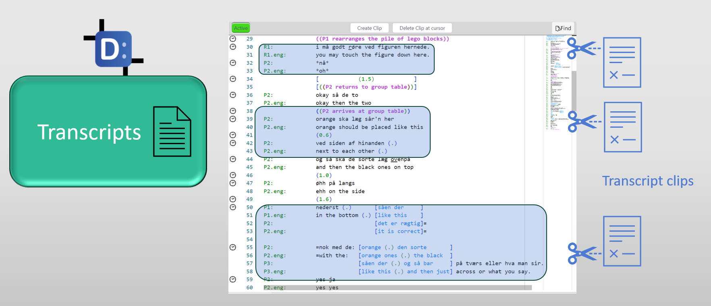
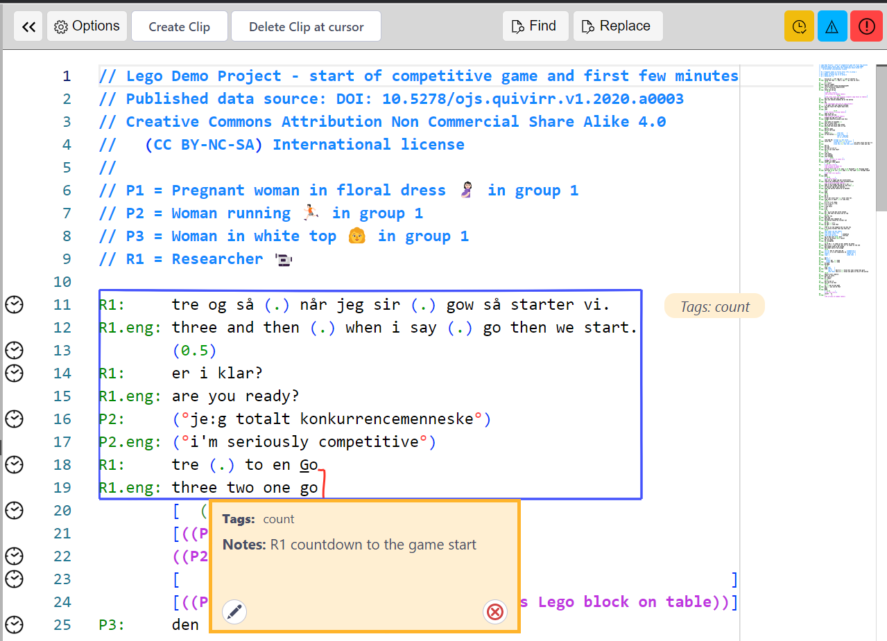
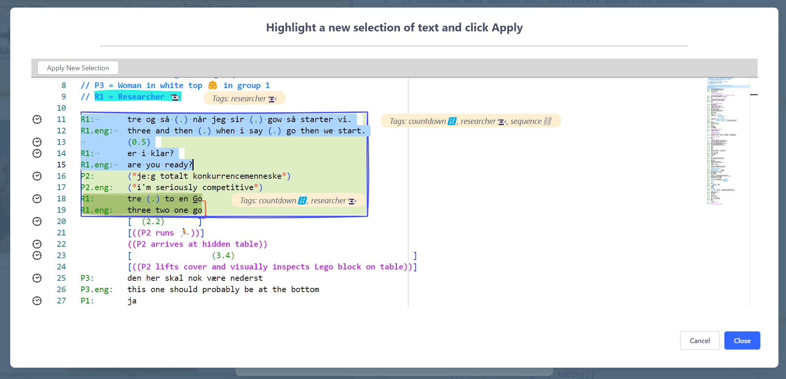

## Integration with _DOTEbase v1.0

[_DOTEbase_](https://bigsoftvideo.github.io/DOTEbase/) is our new software package that is designed to support qualitative analysis of large audio-visual data sets.

We built it because we wanted a software tools to help researchers to analyse larger corpora of data, either before they have been transcribed or after.

It piggybacks on sets of transcripts created using _DOTE_ that are stored on the same computer or are accessible via an external drive or remote file system.

To use _DOTEbase_, you will need to purchase a license for _DOTE_ from our webshop.

To be able to use _DOTEbase_, you must update _DOTE_ to at least v1.1.0+.
See the help guide for how to install and use DOTEbase.

The main changes to _DOTE_ are as follows:

1. Support for creating, viewing and deleting Transcript Clips in the Transcript panel.
2. Support for importing and exporting Transcripts and Projects with Transcript Clips.
3. Support for importing and exporting Projects with Media Clips.
4. Support for tracking changes to Transcript Clips in Checkpoints and Autobackups.

### Making Transcript Clips

1. The first step is to locate the relevant transcript in _DOTE_ that you wish to clip from.
2. Find the relevant lines to be clipped.
3. Select those lines using your mouse by dragging from the onset character/line to the offset character/line.
Clips do not have to start and terminate at the beginning or end of lines.
1. Then select CREATE CLIP at the top of the Transcript panel.
2. There are several options to select when creating the clip:
    - Add one or more Tags.
      Autocompletion is available if Tags have already been created in the Transcript.
    - Add a comment note in a text field.
    - Choose the styling (background/foreground colours) and visual style for the clip
        - Colours can be chosen directly from the colour wheel or with [Presets created and edited in _DOTEbase_ using the Colour Swatch Manager](https://bigsoftvideo.github.io/DOTEbase/colour-manager.html) that are in the current Transcript or Project.
    - Add user-defined field names/values.
1. Click CREATE and the clip will be inserted and displayed in the Transcript.
    - It will also be added to the list of clips in the current Project.

This is the same process as in _DOTEbase_.
When the Transcript is saved, then the clip will appear in _DOTEbase_ if that Transcript is included in the current DOTEspace.
If the same Transcript is open in both _DOTE_ and DOTEbase, then T-Clips in that Transcript cannot be edited in _DOTEbase_.
_DOTE_ locks the Transcript for editing.
If _DOTE_ is closed or a different Transcript is opened, then the Transcript is released and can be edited again in _DOTEbase_.

#### Colour Swatches

A simplified Colour Swatch Manager manages the Colours that are available in _DOTE_ in regard to Transcript Clips.

To open the Colour Swatch Manager, click on the colour swatch when editing a T-Clip.
A panel opens up on the right side.

A colour can be selected by clicking on the colour wheel, entering a value or clicking on a swatch.
The primary swatch will change colour to the value selected.

If you wish to return to the previous colour before experimenting with swatches in the Manager, then click the `Revert to Previous Colour button` when applicable.

The Colour Swatch Manager has two sections:
1. The top shows the colour wheel, HEX/RGB numbers and the options to create/edit a Preset.
2. The bottom lists the Default Colours and the Swatch Presets, as well as any Colours/Presets in relevant Projects and Transcripts.

Colour Presets are created and edited only in _DOTEbase_.
In _DOTE_, those that are available (because they were created in _DOTEbase_) are displayed for each Transcript or for a Project.
They can be applied to a Transcript Clip.

### Editing and deleting Transcript Clips

T-clips can be edited and deleted.

#### Method 1

- Click uniquely inside the T-clip in a transcript panel.
Make sure that the cursor is inside only one clip.
- Select Delete Clip at Cursor.

#### Method 2

- Hover over the clip and select the pencil edit or delete icon in the T-clip panel that opens.

### Changing the scope of an existing T-Clip

The scope of a T-Clip (eg. from line X/character Y to line W/character Z) can be adjusted using the `Edit Selection` button at the top of the Edit T-Clip box.
- Scroll to find the original clip.
- Make a new selection for the scope of the T-clip by dragging the cursor from the onset to the offset character.
- Click `APPLY NEW SELECTION` button.

Note that [Media Clips](https://bigsoftvideo.github.io/DOTEbase/media-clip.html) are not viewable in _DOTE_, only in _DOTEbase_; however, the Media Clip meta-data is still stored locally in each Project folder.

Note that when a Project/Transcript is open in _DOTE_ the same Transcript in a DOTEspace in _DOTEbase_ will be locked so that it cannot be edited in two places at the same time, which would lead to conflicts.
As soon as a different Transcript is opened in _DOTE_, the previous Transcript will be unlocked in _DOTEbase_, so the relevant clips can be edited again in _DOTEbase_.

Note that users of the Free edition of _DOTE_ will only be able to view and delete Transcript Clips that others have made and shared with them.
They will not be able create nor edit Transcript Clips.
An activated license will be necessary.

### Clip Presets

[Clip Presets](https://bigsoftvideo.github.io/DOTEbase/clip-presets.html) are not available in _DOTE_ when creating/editing a Transcript Clip.
Use _DOTEbase_ to create, edit and apply your Clip Presets to Clips.
