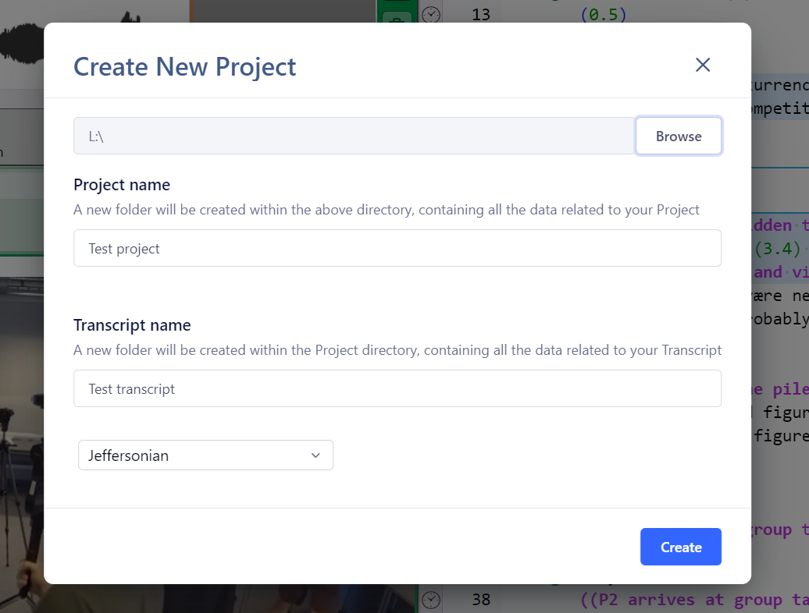
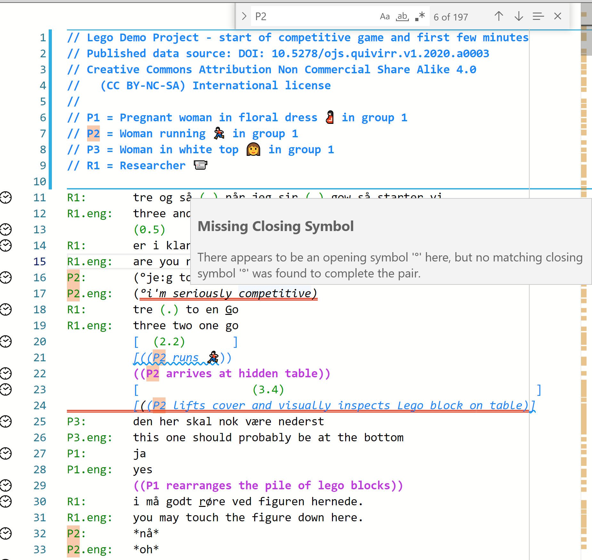
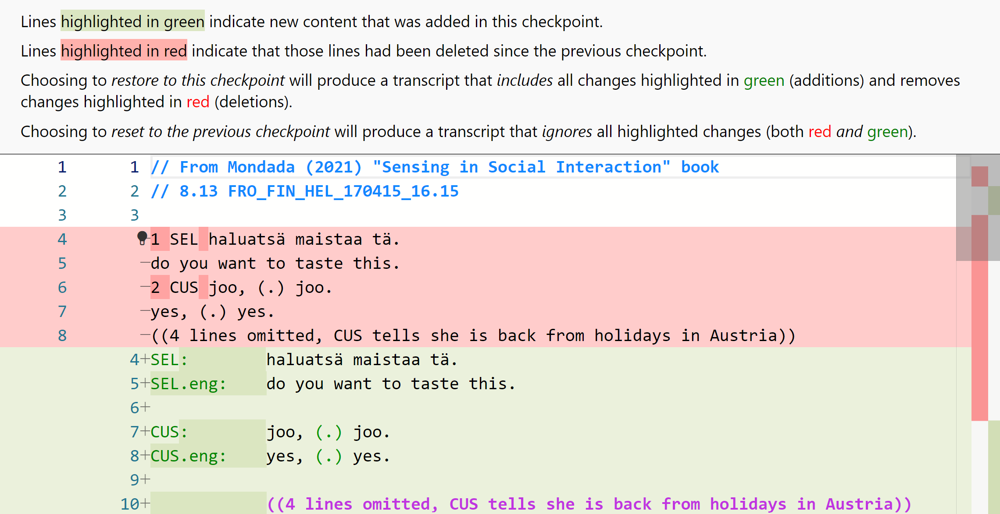
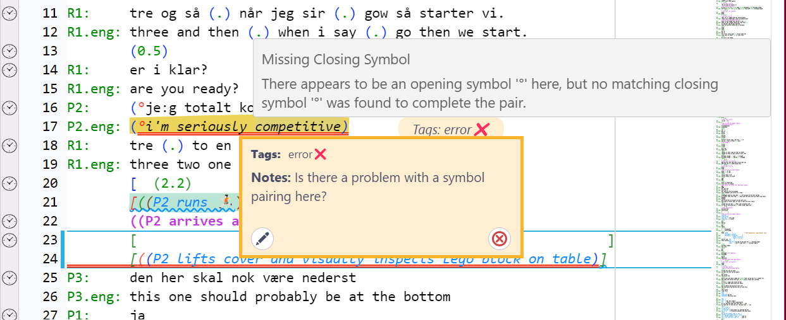
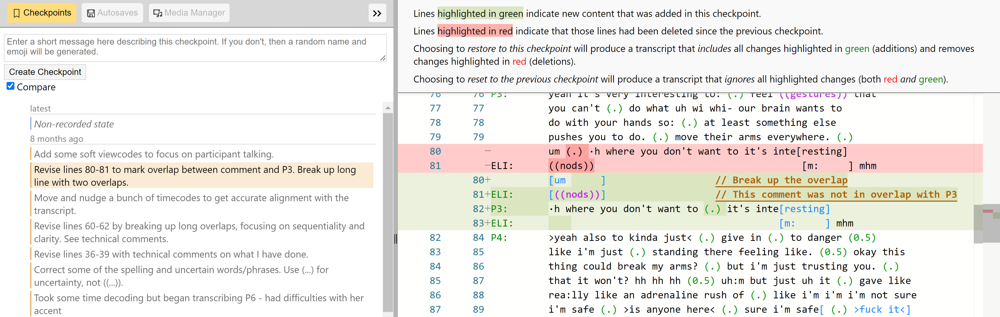

## In what ways can _DOTE_ support your transcription practices

Watch [How to Start a New Transcript](https://www.youtube.com/watch?v=raBDE5520gY) and [How to Edit a Transcript](https://www.youtube.com/watch?v=7JGCKmTg_6Q) video tutorials on YouTube.

There are several ways in which _DOTE_ can help support transcription:

1. [1st time through](#first)
1. [Next time through](#next)
1. [Import transcript and conform](#conform)
1. [Review transcript by someone else](#review)

Below we outline some of the key tools and resources that _DOTE_ provides for each of these methods.
There are links to the help guide for more in-depth guidance, as well as tutorial videos on our DOTE YouTube channel.

### 1st time through 

In this case, a _DOTE_ project is created and a new transcript is started.

_DOTE_ gives the following support:

- Autocomplete to assist with speaker-ids, [subtier types and alignment symbols](tiers.md), key transcription symbols and overlaps.
- Highlight [errors and warnings](errors.md) to assist with symbol pairing, alignment and formatting ([Jeffersonian/Mondadaian](conventions.md)).
- Highlight [errors and warnings](errors.md) to assist with subtier alignment symbol matching and subtier continuers (Mondadaian).
- Suggest solutions in the error and warning popup messages.
- Suggest [fixes for alignment issues](tiers.md#realign).

A typical strategy to use _DOTE_ for a 'first time through' could be the following:

1. Create a [new project](projects.md#new-project).
2. Give the Project and the first Transcript each an informative name.
3. Select the [conventions](conventions.md) you prefer.
You can change this in [Transcript Options](settings.md#options) later.
    - If using the Jeffersonian conventions, then don't forget to add later any translation and interlinear gloss [subtiers](tiers.md) in [Transcript Options](settings.md#options).
    - If using the Mondadaian conventions, then add later your favourite alignment symbols in [Settings](settings.md), then add your named action [subtier](tiers.md) types and assigned symbols in [Transcript Options](settings.md#options).
1. Click Create and a new Project will be created and the new, blank transcript will be opened.
2. Add at least one video source using [Media Manager](media-manager.md).
    - Set the video format and projection if relevant.
    - Make the video _active_ and close.
3. Decide on what mode you want for the [user interface](ui.md) and a tailored [layout of panels](layout.md) appropriate for the transcription task.
4. Add any metadata at the top of the Editor following the characters <kbd>//</kbd> (a technical comment) on each line.
5. Consider using [Checkpoints](versioncontro.md) to track your changes.
Create your first checkpoint with an informative name.
1. Position the playhead on the [timeline](timeline.md) when you wish to begin transcribing and add a [sync-code](sync-code.md) to a new line in the editor.
    - You can turn on `CS` (show highlight of current sync-code block) mode to enable the current [sync-code](sync-code.md) block to be highlighted as you play the media.
2. Start replaying the audio or video file using the [playback controls](play.md).
3. Type the speaker-id, followed by a <kbd>:</kbd> and a <kbd>TAB</kbd>.
    - Every time you add a new speaker-id, then autocomplete will offer it next time in addition to the others already used.
    It will do so as you begin to type the first letters of the speaker-id.
    - If you have setup a [translation subtier](tiers.md) in the [Transcript Options](settings.md#options), then that subtier will also be autocompleted if you select an already used speaker-id from the list.
4. After the single <kbd>TAB</kbd> on each line, [type your transcription](transcript.md).
    - If you wish to add a pause or comment on its own line, then type <kbd>TAB</kbd> on a new line and then the pause or comment.
5. If you need a special symbol or pair, then type <kbd>CTRL</kbd>+<kbd>ENTER</kbd> (or <kbd>⌘</kbd>+<kbd>ENTER</kbd>).
Select from the list or continue typing.
1. Whenever appropriate, frequently enter a [new sync-code](sync-code.md) on a line.
One can do that just by positioning the playhead on the timeline and pressing <kbd>CTRL</kbd>+<kbd>M</kbd> (or <kbd>⌘</kbd>+<kbd>M</kbd>).
Then you can quickly jump around the emerging transcript body by clicking on a sync-code.
1. Save the Transcript frequently using <kbd>CTRL</kbd>+<kbd>S</kbd> (or <kbd>⌘</kbd>+<kbd>S</kbd>).
1. Whenever appropriate, and frequently, create a [new checkpoint](versioncontrol.md) to account for the work you have done since the last checkpoint.
1. As you type, _DOTE_ will try to help you by flagging potential [errors and warnings](errors.md) according to its model of what a good transcript should be (eg. Jeffersonian or Mondadaian [conventions](conventions.md)).
1. If you need to Undo some steps while editing, then use the [Undo Manager](undo.md).
In the Editor, you can just use  <kbd>CRTL</kbd> + <kbd>Z</kbd> or  <kbd>⌘</kbd> + <kbd>Z</kbd> to undo text edits.
2. If necessary, add some [video-cues](cues.md) to automatically change the view in the Media Player panel to highlight the phenomena of interest at that point in the video and the Transcript.
3. When the transcript is complete, then [Export to RTF](exportRTF.md) or [Export to Subtitles](exportSRT.md) or choose another [Export](export.md) option.

Watch the [video tutorial](https://www.youtube.com/watch?v=0fELQTTOiW0) on YouTube.

### Next time through 

In the case of next time through, an already created transcript is revisited and revised.

_DOTE_ gives the following support:

- Autocomplete to assist with additional speaker-ids, [subtier types and alignment symbols](tiers.md), key transcription symbols and overlaps.
- Fixes for overlap and/or alignment symbol realignment after edits.
- [Error and warnings](errors.md) to assist with maintaining symbol pairing, temporal and spatial alignment and formatting (Mondadaian).
- Errors and warnings to assist with matching assigned [subtier](tiers.md) alignment symbols and continuity of subtier continuers ([Mondadaian](mondada.md)).

A typical strategy to use _DOTE_ for a 'next time through' could be the following:

1. If they have been added, use the sync-codes to jump to a line or lines or start at the beginning.
1. Make sure that `CS` (show highlight of current sync-code block) mode as well as `Warnings` and `Errors` are toggled on.
2. Open and arrange [Media Player panels](media-panel.md) to look for alternative camera positions or to zoom in on interesting phenomena.
3. [Play the audio/video](play.md) and look for ways to improve the Transcript.
4. Use <kbd>CTRL</kbd>+<kbd>J</kbd> and <kbd>CTRL</kbd>+<kbd>K</kbd> (or <kbd>⌘</kbd>+<kbd>J</kbd> or <kbd>K</kbd>) to move back and forward to relisten to excerpts.
5. Use <kbd>CTRL</kbd>+<kbd>SHIFT</kbd>+<kbd>SPACE</kbd> (or <kbd>⌘</kbd>+<kbd>⇧</kbd>+<kbd>N</kbd>) to play and then return to the starting position on the timeline.
This is useful to find the best point on the [timeline](timeline.md) to insert a new [sync-code](sync-code.md).

### Import transcript and conform 

Watch the [video tutorial](https://www.youtube.com/watch?v=Npfmg7MpCZw) on YouTube.

In the case of revising an already existing transcript (created in other software or copy/pasted from a published transcript) which needs to be heavily edited to match the _DOTE_ conventions.

The first step is to [import](import.md) the correctly formatted file.
There are several possibilities in _DOTE_.

_DOTE_ gives the following support for editing the imported transcript:

- Adjust and reformat to fit _DOTE_ [conventions](tips.md#tip1).
- Use [multicursor](transcript.md) to adjust and repair malformatted blocks.
- Use [find/replace](find.md) to rename speaker-ids or other words/phrases.
- Correct highlighted [warnings and errors](errors.md).

A typical strategy to use _DOTE_ to revise a transcript could be the following:

1. Make sure that `CS` (show highlight of current sync-code block) mode as well as `Warnings` and `Errors` are toggled on.
1. Check the [speaker-ids and the basic formatting](tips.md#tip1) of each line.
1. Use `Change All Occurrences` to rename any unique names in the whole transcript or use `Find/Replace`.
1. Use a [multicursor](transcript.md) to change text on multiple lines at the same time.
1. Add more [sync-codes](sync-code.md) to better jump around the transcript and play the video.

### Review transcript by someone else 

A new method of making comments and annotations ([Transcript-Clips](dotebase.md)) on a Transcript is available for PRO and PRO COMMUNITY Edition users in _DOTE_ v2.0+.
This new method involves creating [Transcript Clips](transcript-clip.md) in the Editor that annotate and tag review comments, and then sharing the [exported Project or Transcript](export.md) with them to view.
This method interfaces nicely with [_DOTEbase_](https://bigsoftvideo.github.io/DOTEbase), our companion software to support qualitative analysis of transcripts and audio-visual data.

Watch the [video on YouTube](https://www.youtube.com/watch?v=x_HvKftJsQw).

Note that the creation and editing of transcript clips is not available for Free Edition users of _DOTE_.
However, transcript clips made by someone else in an [exported Transcript(export.md)] that is imported into _DOTE_ can be viewed by Free Edition users provided the display of annotations is toggled on in the Editor.

#### Older method of making comments

Watch the [video tutorial](https://www.youtube.com/watch?v=hc3CH9oOsKQ) on YouTube.

In this case, a transcript already prepared in _DOTE_ by someone else (eg. a colleague or a student) is shared and reviewed.
_DOTE_ gives the following support:

- Open a shared transcript prepared with _DOTE_ in a copy of the project.
- Use the _DOTE_ [editor](transcript.md) to make changes.
- Use technical comments (everything after `//`) to make written suggestions and comments in addition to the transcript.
- Use [checkpoints](versioncontrol.md) to incrementally document the revision and review process for the original author.
- Share the reviewed transcript with the owner.
- The owner can peek at the checkpoints and read the technical comments at the level of granularity chosen by the reviewer.

A typical strategy to use _DOTE_ to comment on someone else's transcript could be the following:

1. Import the shared transcript into the correct project folder.
2. Open [Checkpoints](versioncontrol.md) to see a list of changes made by the original author(s).
3. Making comments
    1. Make a small change or changes to the transcript.
    Keep them small and focused so they are easy to account for.
    2. If helpful, write a technical comment (everything after `//`) on the same line as the change.
    3. Create a checkpoint with a useful message documenting the change(s) you made.
    4. Repeat.
4. Export the transcript and share with the original author(s) or others.
