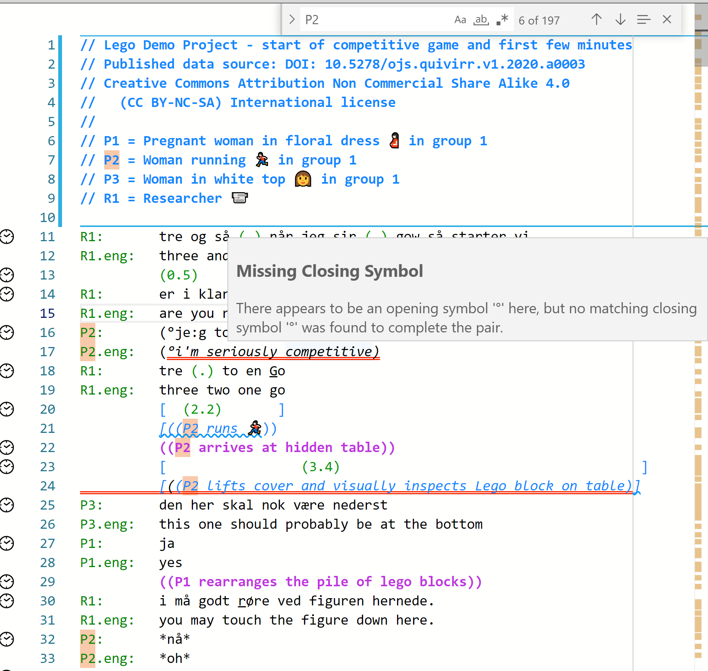

## In what ways can _DOTE_ support your transcription practices

There are several ways in which _DOTE_ can help support transcription:

1. [1st time through](#first)
1. [Next time through](#next)
1. [Import transcript and conform](#conform)
1. [Review transcript by someone else](#review)

Below we will outline some of the key tools and resources that _DOTE_ provides for each of these methods.
There are links to the help guide for more in-depth guidance, as well as tutorial videos on our DOTE YouTube channel.

### 1st time through 

In this case, a _DOTE_ project is created and a new transcript is started.

_DOTE_ gives the following support:

- Autocomplete to assist with speaker-ids, [subtier types and alignment symbols](tiers.md), key transcription symbols and overlaps.
- Highlight [errors and warnings](errors.md) to assist with symbol pairing, alignment and formatting ([Jeffersonian/Mondadaian](conventions.md)).
- Highlight [errors and warnings](errors.md) to assist with subtier alignment symbol matching and subtier continuers (Mondadaian).
- Suggest solutions in the error and warning popup messages.
- Suggest [fixes for alignment issues](tiers.md#realign).

A typical strategy to use _DOTE_ for a 'first time through' could be the following:

1. Create a [new project](projects.md#new-project).
1. Select the [conventions](conventions.md) you prefer.
You can change this in [Transcript Options](settings.md#options) later.
    - If using the Jeffersonian conventions, then don't forget to add later any translation and interlinear gloss [subtiers](tiers.md) in [Transcript Options](settings.md#options).
    - If using the Mondadaian conventions, then add later your favourite alignment symbols in [Settings](settings.md), then add your named action [subtier](tiers.md) types and assigned symbols in [Transcript Options](settings.md#options).
1. Add a video using Media Manager
    - Set the video format and projection if relevant.
    - Activate the video and close.
1. Add any metadata at the top of the Editor following the characters <kbd>//</kbd> (a technical comment) on each line.
1. If you have [Checkpoints](versioncontro.md) setup (see [Installing Git](install.md)), then create your first checkpoint.
1. Position the playhead on the [timeline](timeline.md) when you wish to begin transcribing and add a [sync-code](sync-code.md) to a new line in the editor.
    - You can turn on `CS` (show highlight of current sync-code block) mode to enable the current [sync-code](sync-code.md) block to be highlighted as you play the media.
1. Start replaying the audio or video file using the [playback controls](play.md).
1. Type the speaker-id, followed by a <kbd>:</kbd> and a <kbd>TAB</kbd>.
    - Every time you add a new speaker-id, then autocomplete will offer it next time in addition to the others already used.
    It will do so as you begin to type the first letters of the speaker-id.
    - If you have setup a [translation subtier](tiers.md) in the [Transcript Options](settings.md#options), then that subtier will also be autocompleted if you select an already used speaker-id from the list.
1. After the single <kbd>TAB</kbd> on each line, [type your transcription](transcript.md).
    - If you wish to add a pause or comment on its own line, then type <kbd>TAB</kbd> on a new line and then the pause or comment.
1. If you need a special symbol or pair, then type <kbd>CTRL</kbd>+<kbd>ENTER</kbd> (or <kbd>⌘</kbd>+<kbd>ENTER</kbd>).
Select from the list or continue typing.
1. Whenever appropriate, enter a [new sync-code](sync-code.md) on a line.
One can do that just by positioning the playhead on the timeline and pressing <kbd>CTRL</kbd>+<kbd>M</kbd> (or <kbd>⌘</kbd>+<kbd>M</kbd>).
1. Save the Transcript frequently using <kbd>CTRL</kbd>+<kbd>S</kbd> (or <kbd>⌘</kbd>+<kbd>S</kbd>).
1. Whenever appropriate, and frequently, create a [new checkpoint](versioncontrol.md) to account for the work you have done since the last checkpoint.
1. As you type, _DOTE_ will try to help you by flagging potential [errors and warnings](errors.md) according to its model of what a good transcript should be.
1. If necessary, add some [video-cues](cues.md) to automatically change the view in the video panel to highlight the phenomena of interest at that point in the video and the Transcript.
1. When the transcript is complete, then [Export to RTF](export.md) or [Export to SRT](export.md).

### Next time through 

In the case of next time through, an already created transcript is revisited and revised.

_DOTE_ gives the following support:

- Autocomplete to assist with additional speaker-ids, [subtier types and alignment symbols](tiers.md), key transcription symbols and overlaps.
- Fixes for overlap and/or alignment symbol realignment after edits.
- [Error and warnings](errors.md) to assist with maintaining symbol pairing, temporal and spatial alignment and formatting (Mondadaian).
- Errors and warnings to assist with matching assigned [subtier](tiers.md) alignment symbols and continuity of subtier continuers ([Mondadaian](mondada.md)).

A typical strategy to use _DOTE_ for a 'next time through' could be the following:

1. If they have been added, use the sync-codes to jump to a line or lines or start at the beginning.
1. Make sure that `CS` (show highlight of current sync-code block) mode as well as `Warnings` and `Errors` are toggled on.
1. [Play the audio/video](play.md) and look for ways to improve the Transcript.
1. Use <kbd>CTRL</kbd>+<kbd>J</kbd> and <kbd>CTRL</kbd>+<kbd>K</kbd> (or <kbd>⌘</kbd>+<kbd>J</kbd> or <kbd>K</kbd>) to move back and forward to relisten to excerpts.
1. Use <kbd>CTRL</kbd>+<kbd>SHIFT</kbd>+<kbd>SPACE</kbd> (or <kbd>⌘</kbd>+<kbd>⇧</kbd>+<kbd>N</kbd>) to play and then return to the starting position on the timeline.
This is useful to find the best point on the [timeline](timeline.md) to insert a new [sync-code](sync-code.md).

### Import transcript and conform 

In the case of revising an extant transcript (created in other software or copy/pasted from a published transcript) which needs to be heavily edited to match the _DOTE_ conventions.

_DOTE_ gives the following support:

- Adjust and reformat to fit _DOTE_ [conventions](tips.md#tip1).
- Use [multicursor](transcript.md) to adjust and repair malformatted blocks.
- Use [find/replace](find.md) to rename speaker-ids or other words/phrases.
- Correct highlighted [warnings and errors](errors.md).

A typical strategy to use _DOTE_ to revise a transcript could be the following:

1. Make sure that `CS` (show highlight of current sync-code block) mode as well as `Warnings` and `Errors` are toggled on.
1. Check the [speaker-ids and the basic formatting](tips.md#tip1) of each line.
1. Use `Change All Occurrences` to rename any unique names in the whole transcript or use `Find/Replace`.
1. Use a [multicursor](transcript.md) to change text on multiple lines at the same time.
1. Add more [sync-codes](sync-code.md) to better jump around the transcript and play the video.

### Review transcript by someone else 

In the last case, a transcript already prepared in _DOTE_ by someone else (eg. a colleague or a student) is shared and reviewed.
_DOTE_ gives the following support:

- Open a shared transcript prepared with _DOTE_ in a copy of the project.
- Use the _DOTE_ [editor](transcript.md) to make changes.
- Use technical comments (everything after `//`) to make written suggestions and comments in addition to the transcript.
- Use [checkpoints](versioncontrol.md) to incrementally document the revision and review process for the original author.
- Share the reviewed transcript with the owner.
- The owner can peek at the checkpoints and read the technical comments at the level of granularity chosen by the reviewer.

A typical strategy to use _DOTE_ to comment on someone else's transcript could be the following:

1. Import the shared transcript into the correct project folder.
1. Open [Checkpoints](versioncontrol.md) to see a list of changes made by the original author(s).
1. Making comments
    1. Make a small change or changes to the transcript.
    Keep them small and focused so they are easy to account for.
    1. If helpful, write a technical comment (everything after `//`) on the same line as the change.
    1. Create a checkpoint with a useful message documenting the change(s) you made.
    1. Repeat.
1. Export the transcript and share with the original author(s) or others.
