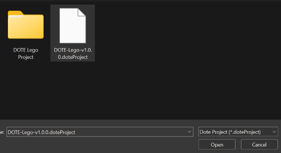
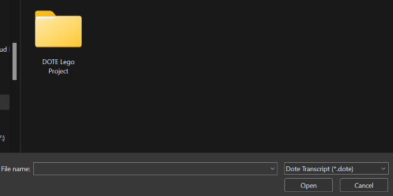

## Importing Data into _DOTE_ 

Watch the [video tutorial](https://www.youtube.com/watch?v=w_u5ESNRelY) on YouTube.

With release v2.0, _DOTE_ has a unified and integrated Import Manager that guides the user step-by-step through the import process.
The following data can be imported into _DOTE_:

1. [Import Project from file with native DOTE format](#importing-a-project-from-a-file)
1. [Import Transcript from file with native DOTE format](#importing-a-transcript-from-a-file)
1. [Import Basic Text file](importTXT.md)
1. [Import from SRT subtitle file](importSRT.md)
1. [Import from OpenWhisper format file](importWhisper.md)
1. [Import transcript clips from JSON file](importJSON.md)

Below we elaborate on Export Project or Transcript to file.
Click the links above to find more information on the other export options.
Please read the [crucial information about Projects and Transcripts](export.md#things-to-note-about-projects-and-transcripts-in-order-to-successfully-import-them) that you need to know before importing them.

### Importing a Project from a file 

To import a Project you have received as a file with the native DOTE format, follow these steps:

1. Select `File ➔ Import Project from File with native DOTE format`.
2. Locate the exported Project file (`.doteProject`) on your file system and click `Open`.
3. Select a destination directory/folder or use the suggested default.
4. Enter a unique name for your imported Project.
If there already is a Project with that name, you can overwrite it.
Be aware that this is destructive and the overwritten Project cannot be recovered.
1. After you have imported the Project, you can open a shared Transcript in that Project using `Open Transcript` or `File ➔ Open Transcript` or <kbd>CTRL</kbd>+<kbd>O</kbd> [or <kbd>⌘</kbd>+<kbd>O</kbd> on macOS] using the `Project Manager`.

### Importing a Transcript from a file with native DOTE format 

To import a single Transcript that has been shared (as a file with the native DOTE format) into a local Project, then do the following:

1. Open the target Project in `DOTE` by opening one of its Transcripts using `Open Transcript` or `File ➔ Open Transcript` or <kbd>CTRL</kbd>+<kbd>O</kbd> [or <kbd>⌘</kbd>+<kbd>O</kbd> on macOS] using the `Project Manager`.
1. Select `File ➔ Import Transcript from File`.
1. Locate the exported Transcript file (`.dote`) on your file system and click `Open`.
1. The Transcript will be imported into the currently open Project (shown in the dialog box).
1. Enter a unique name for your imported Transcript.
If there already is a Transcript with that name, you can overwrite it.
Be aware that this is destructive and the overwritten Transcript cannot be recovered.
1. After you have imported the Transcript, you can open it using `Open Transcript` or `File ➔ Open Transcript` or <kbd>CTRL</kbd>+<kbd>O</kbd> [or <kbd>⌘</kbd>+<kbd>O</kbd> on macOS] using the `Project Manager`.

