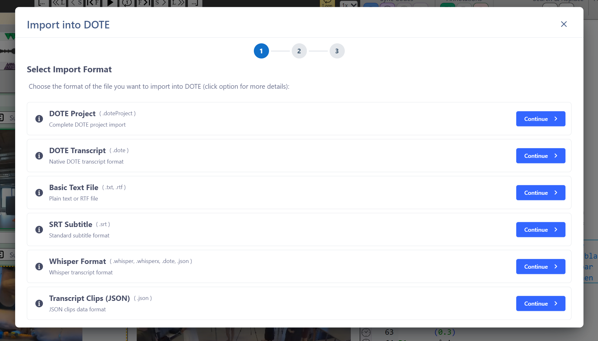

## Importing Data into _DOTE_ 

Watch the [video tutorial](https://www.youtube.com/watch?v=leB3mDiIrTw) on YouTube.

With release v2.0, _DOTE_ has a unified and integrated Import Manager that guides the user step-by-step through the import process.

The following data can be imported into _DOTE_:

1. [Import Project from file with native DOTE format](#importing-a-project-from-a-file)
2. [Import Transcript from file with native DOTE format](#importing-a-transcript-from-a-file)
3. [Import Basic Text file](importTXT.md)
4. [Import from SRT subtitle file](importSRT.md)
5. [Import from OpenWhisper format file](importWhisper.md)
6. [Import transcript clips from JSON file](importJSON.md)

Below we elaborate on Export Project or Transcript to file.
Click the links above to find more information on the other export options.
Please read the [crucial information about Projects and Transcripts](export.md#things-to-note-about-projects-and-transcripts-in-order-to-successfully-import-them) that you need to know before importing them.

### Importing a Project from a file with native DOTE format 

To import a Project you have received as a file with the native DOTE format, follow these steps:

1. Select `File ➔ Import` or click the `Import` button on the ribbon bar.
1. Click on the relevant `Continue` button for "DOTE Project".
1. Specify the "Source File" location for the Project file (`.doteProject`) to import.
1. Select a destination directory/folder under "Unpack Directory".
1. Enter a unique name for your imported Project Name.
1. Choose from the DOTE Project Import Options:
    - Show Transcript Browser after import.
    - Overwrite if Project already exists.
If there already is a Project with that name, you can overwrite it.
Be aware that this is destructive and the overwritten Project cannot be recovered.
1. When ready, click on `Start Import`.

A Preview is not available for importing a Project.

### Importing a Transcript from a file with native DOTE format 

It is important to note that one can only import a Transcript from a file with native DOTE format into an already existing Project.
That Project must contain the active media sources (see [Media Manager](media-manager.md)) that match those expected by the imported Transcript.
This option is designed for users to share Transcripts quickly when all who are sharing also share the same Project.
Rather than sharing the relatively large media files every time one wishes to share just a Transcript (eg. Export/Import Project), the much smaller Transcript export file does not take up much disk space.

To import a single Transcript that has been shared (as a file with the native DOTE format) into a local Project, then do the following:

1. Select `File ➔ Import` or click the `Import` button on the right of the ribbon bar.
1. Click on the relevant `Continue` button for "DOTE Transcript".
1. Specify the "Source File" location for the Project file (`.dote`) to import.
1. Enter a unique name for your imported Project Name.
If there already is a Project with that name, you can overwrite it.
Be aware that this is destructive and the overwritten Project cannot be recovered.
1. Choose from the DOTE Project Import Options:
    - Load Transcript after import.
    - Overwrite if Transcript already exists.
    - Add to recent projects.
1. When ready, click on `Start Import`.

A Preview is not available for importing a Transcript.
