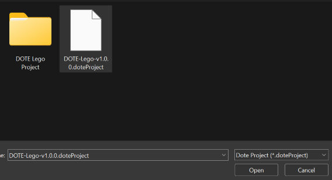

## Exporting and importing Transcripts and Projects to File

Once you have created a _DOTE_ Project and one or more Transcripts in that project, you may wish to share them with others.
This is relatively straightforward provided you understand how _DOTE_ [projects and transcripts are structured](projects.md).
_DOTE_ provides support for exporting any Project and its Transcripts, as well as exporting individual Transcripts.
It also provides support for importing a complete Project and its Transcripts, as well as individual Transcripts that reside in an already existing Project.
This means that one can share a Project with [video data, waveforms](video.md), [transcripts](transcript.md) and [checkpoints](versioncontrol.md), for example.
And one can share the current version of a Transcript with others who already have the Project with the necessary audio or video data.
In the latter case, one is sharing a very small file, since there is no need to share the same video data repeatedly.
You can also decide to include or exclude all the checkpoints and/or autobackups in the shareable Project or Transcript.

A good workflow is to first share your Project with someone, including any Transcripts that you wish to share with them.
After they have imported that Project, you can share just the Transcript(s) for that Project as they are revised.
All they have to do is import the Transcript(s) into the same open Project that they imported earlier.
Of course, they can also share their version of the Transcript(s) with you.
Because you can rename the Transcripts (and the Projects) that you share, you can share multiple versions of a Transcript back and forth by adding an author, version number and/or date in the Transcript's filename.

To share an exported Project or Transcript(s), just send the file that is created by _DOTE_ to the recipient.
This could be done by email, but for Projects that include large video files this may not work well.
In that case, you will need to use a file sharing service (eg. Dropbox or FileSender) or a physical storage device.
Shareable exported Transcript files will always be small in size.

### Exporting a Project 

To export a Project, do the following:

1. Open the Project in `DOTE` by opening one of its Transcripts using `Open Transcript` or `File ➔ Open Transcript` or <kbd>CTRL</kbd>+<kbd>O</kbd> [or <kbd>⌘</kbd>+<kbd>O</kbd> on macOS] from the `Project Manager`.
2. Select `File ➔ Export Project to File`.
3. A dialogue box will appear with several options:
    - `Include Checkpoint history` - Include or exclude all checkpoints in each of the selected Transcripts.
    - `Include Autobackup history` - Include or exclude all autobackups in each of the selected Transcripts.
    - `Include Active Media files` - Include or exclude all active media in each Transcript (see [Media Manager](media.md))
    - `Include all Media files` - Include or exclude all media files (active or inactive) for the Project (see [Media Manager](media.md)).
    - `Filter by name` - If you have lots of Transcripts in a Project, then you can filter out by typing a string of characters.
4. Choose which Transcripts to include in the export from the list of available transcripts.
5. Click `Export`.
6. Specify the location for the exported Project file (`.doteProject`).
7. Click `Save`.
8. Share that file with others, who can import it.

> **NOTE: Exporting and Importing Projects with Media files may take some time to complete, depending on the access speed of your storage device and the size of the media files. When importing, all the media files have to be written to the location of the new Project. This could take more than 5 seconds.**

### Importing a Project 

To import a Project you have received, follow these steps:

1. Select `File ➔ Import Project from File`.
1. Locate the exported Project file (`.doteProject`) on your file system and click `Open`.
1. Select a destination directory/folder or use the suggested default.
1. Enter a unique name for your imported Project.
If there already is a Project with that name, you can overwrite it.
Be aware that this is destructive and the overwritten Project cannot be recovered.
1. After you have imported the Project, you can open a shared Transcript in that Project using `Open Transcript` or `File ➔ Open Transcript` or <kbd>CTRL</kbd>+<kbd>O</kbd> [or <kbd>⌘</kbd>+<kbd>O</kbd> on macOS] from the `Project Manager`.

### Exporting a Transcript to a File 

If you wish to share a single Transcript, then follow these steps:

1. Open that Transcript using `Open Transcript` or `File ➔ Open Transcript` or <kbd>CTRL</kbd>+<kbd>O</kbd> [or <kbd>⌘</kbd>+<kbd>O</kbd> on macOS] to open the `Project Manager`.
1. Select `File ➔ Export Transcript to File`.
1. You can choose to include or exclude the complete checkpoint history and/or autobackup history for that specific Transcript.
1. Click on `Export` and select a destination directory/folder and a filename.
The filename suggested will be the same as the name of the Transcript in `DOTE`.
1. Click `Save` and the exported Transcript file will be created and saved (`.dote`).

### Importing a Transcript from a File 

To import a single Transcript that has been shared into a local Project, then do the following:

1. Open the target Project in `DOTE` by opening one of its Transcripts using `Open Transcript` or `File ➔ Open Transcript` or <kbd>CTRL</kbd>+<kbd>O</kbd> [or <kbd>⌘</kbd>+<kbd>O</kbd> on macOS] from the `Project Manager`.
1. Select `File ➔ Import Transcript from File`.
1. Locate the exported Transcript file (`.dote`) on your file system and click `Open`.
1. The Transcript will be imported into the currently open Project (shown in the dialog box).
1. Enter a unique name for your imported Transcript.
If there already is a Transcript with that name, you can overwrite it.
Be aware that this is destructive and the overwritten Transcript cannot be recovered.
1. After you have imported the Transcript, you can open it using `Open Transcript` or `File ➔ Open Transcript` or <kbd>CTRL</kbd>+<kbd>O</kbd> [or <kbd>⌘</kbd>+<kbd>O</kbd> on macOS] from the `Project Manager`.

### Notes

- The shareable exported Project or Transcript file created by _DOTE_ is compressed, but it is _not_ encrypted.
If you wish to keep the contents secure, then you will have to encrypt it yourself with a password.
This is easy to do with standard archiving software or hardware encryption.
- If the shareable exported Transcript includes checkpoints and/or autobackups, then anyone who imports it will see all those checkpoints and/or autobackups.
This can be very useful for collaboration and instruction, but for other purposes you may wish to exclude them if they are personal.
- Do NOT share _DOTE_ Projects or Transcripts in a file sharing server or cloud service (eg. Dropbox) if two or more users could access the Project or Transcript at the same time.
Within _DOTE_, Projects and Transcripts are for single-user-at-time use and cannot be accessed and edited simultaneously.
- For the more sophisticated user, one can use GitHub and distributed version control to manage Projects and Transcripts as Git repositories.
See [Checkpoints](versioncontrol.md) for hints how to do this.
