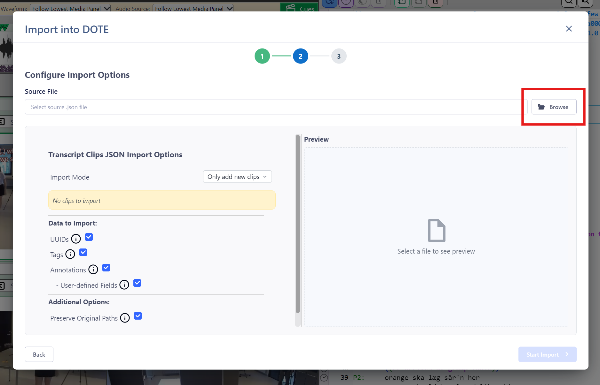

## Import transcript clips (JSON file)  

It is possible to import Transcript Clips generated by DOTE (or 3rd party software, such as another transcription or qualitative analysis tool that allows annotations of transcripts).

1. The assumption is that the currently loaded Transcript will be the destination for the imported Clips.
Make sure that the correct Transcript is loaded.
2. Select `File ➔ Import`.
3. Click on the relevant `Continue` button for "Transcript Clips (JSON)".
4. Specify the "Source File" location for the Basic Text file (`.json`) to import.
5. Choose from the options:
    - Import Mode - there are several choices concerning how the Clips will be incorporated into the current Transcript.
A list of Clips to import according to the criteria selected above will be shown.
    - Data to import:
        - UUIDs - these are unique identifiers used in _DOTE_ and _DOTEbase_.
        - Tags.
        - Annotations (in the Transcript Clip).
            - User-defined Fields - these are special fields designated by the user.
        - Include Original Paths - important for consistency with _DOTEbase_.
6. When ready, click on `Start Import`.
7. The Transcript Clips will be added to the current Transcript.
In case they are incompatible, create a Checkpoint before importing so that the Transcript can be easily restored to its state before importing.
