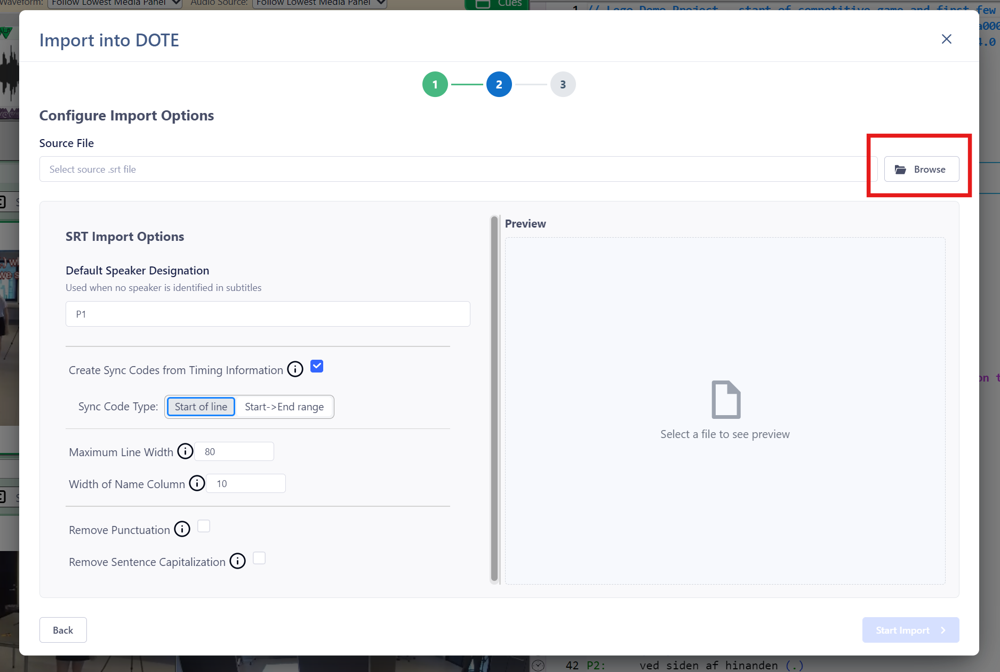

## Import from SRT file 

For those who wish to import from other software (that can export to SRT) or from already generated time-coded subtitles (see how to [export SRT subtitles](exportSRT.md) from _DOTE_), then we offer an import tool.

1. Select `File ➔ Import`.
1. Click on the relevant `Continue` button for "SRT Subtitle".
1. Specify the "Source File" location for the Basic Text file (`.srt`) to import.
1. Enter a unique name for your new Transcript Name.
1. Choose from the options:
    - Default Speaker Designation - in case there is no speaker-id on each line you can add a default on import.
    - Create Sync-codes from Timing Information.
        - Start of line - the timing information is to be found at the beginning of lines.
        - Start -> End range - the timing information is at the beginning but also has a duration, eg. equivalent to a [ranged sync-code](sync-code.md).
    - Maximum Line Width - if a line exceeds this, then it is wrapped.
    - Width of Name Column.
    - Remove Punctuation - remove any punctuation symbols (".,?"). NOTE: this will also remove those symbols even if they are used to mark interactional intonation, eg. Jeffersonian.
    - Remove Sentence Capitalisation - from the body of the transcript to be imported. NOTE: this will also decapitalise proper nouns and abbreviations.
1. When ready, click on `Start Import`.
1. The Transcript will be added to the current Project, so make sure the audio/video file and the transcript are comparable.

A preview of the imported transcript will be updated on the right side after any changes to the Options.
