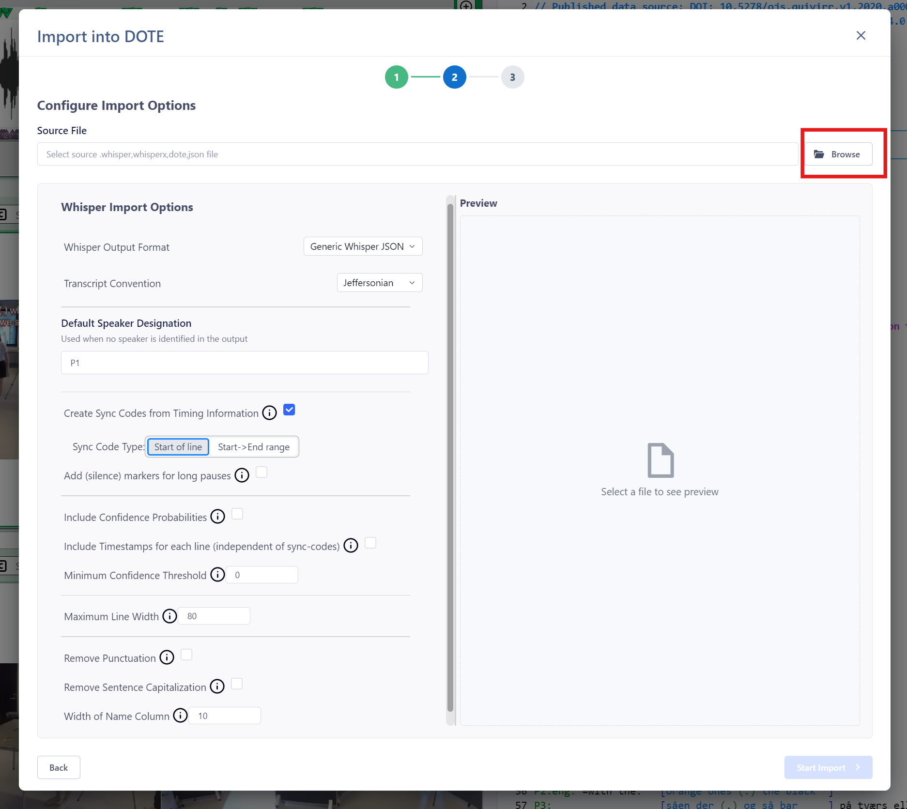

## Import from Whisper format file 

Watch the [video tutorial]() on YouTube.

We only directly support [`Whisper`](https://goodsnooze.gumroad.com/l/macwhisper) at present, which can export a transcript in the correct `.dote` or `.json` format suitable for _DOTE_, as well as in native formats (`.whisper`, `.xwhisperx`).
See the MacWhisper website for more details.
Currently, MacWhisper only works on macOS (and not all OS versions).
A Windows version is forthcoming.

For those who wish to import from Whisper, which exports for _DOTE_, then we offer a way to import provided the data structure is standardised for _DOTE_.
The file extension should be `.whisper`, `.whisperx`, `.dpte` or `.json`.

1. Select `File ➔ Import` or click the `Import` button on the right of the ribbon bar.
2. Click on the relevant `Continue` button for "Whisper Format".
3. Specify the "Source File" location for the Whisper file to import.
4. Enter a unique name for your new Transcript Name.
5. Choose from the Whisper Import Options:
    - Whisper Output Format - there are several different output formats in which the JSON file may have been exported.
    - Transcript Convention - basically, Jeffersonian or Mondadaian.
    - Default Speaker Designation - in case there is no speaker-id on each line you can add a default on import.
    - Create Sync-codes from Timing Information.
        - Start of line - the timing information is to be found at the beginning of lines.
        - Start -> End range - the timing information is at the beginning but also has a duration, eg. equivalent to a [ranged sync-code](sync-code.md).
        - Add silence markers for long pauses.
    - Include Confidence Probabilities - these are specific to Whisper.
    - Include Timestamps for each line - this is independent of the creation of Sync-codes.
    - Minimum Confidence Threshold - these are specific to Whisper.
    - Maximum Line Width - if a line exceeds this, then it is wrapped.
    - Remove Punctuation - remove any punctuation symbols (".,?"). NOTE: this will also remove those symbols even if they are used to mark interactional intonation, eg. Jeffersonian.
    - Remove Sentence Capitalisation - from the body of the transcript to be imported. NOTE: this will also decapitalise proper nouns and abbreviations.
    - Width of Name Column.
6. When ready, click on `Start Import`.
7. The Transcript will be added to the current Project, so make sure the audio/video file and the transcript are comparable.

A preview of the imported transcript will be updated on the right side after any changes to the Options.
