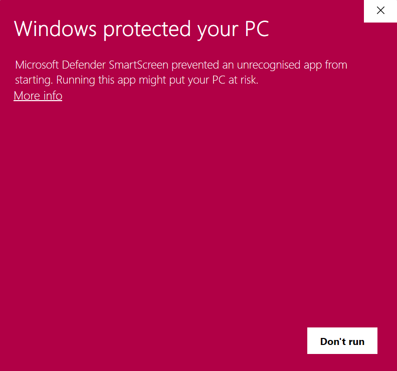
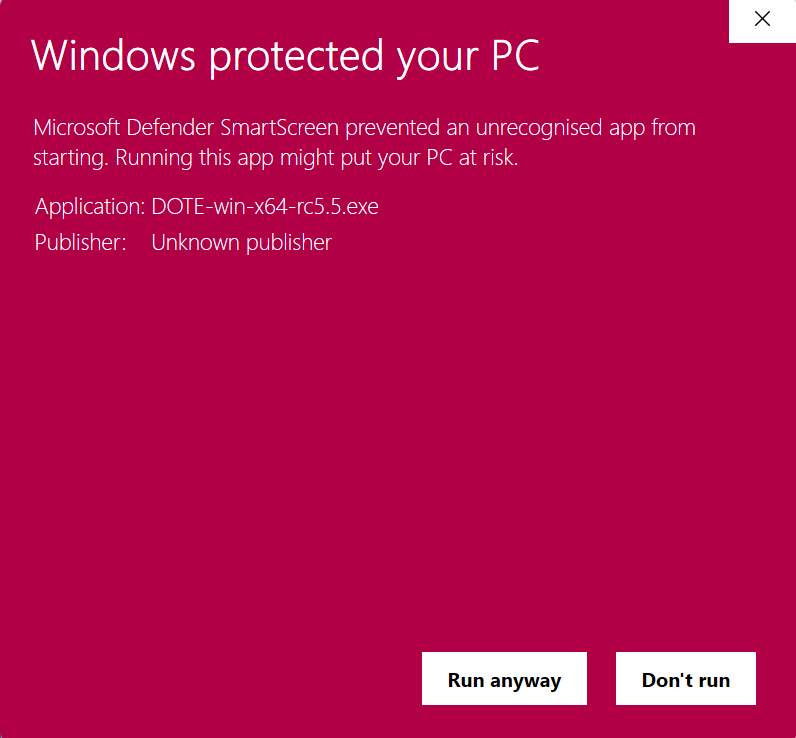
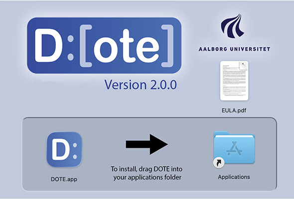
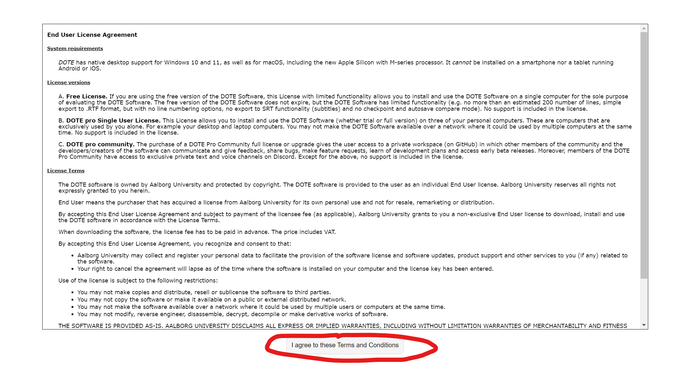
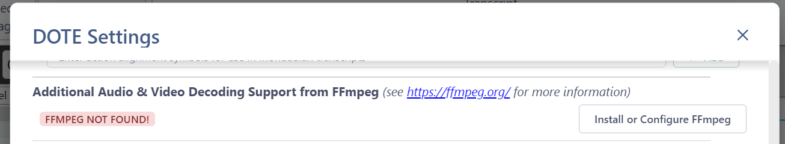
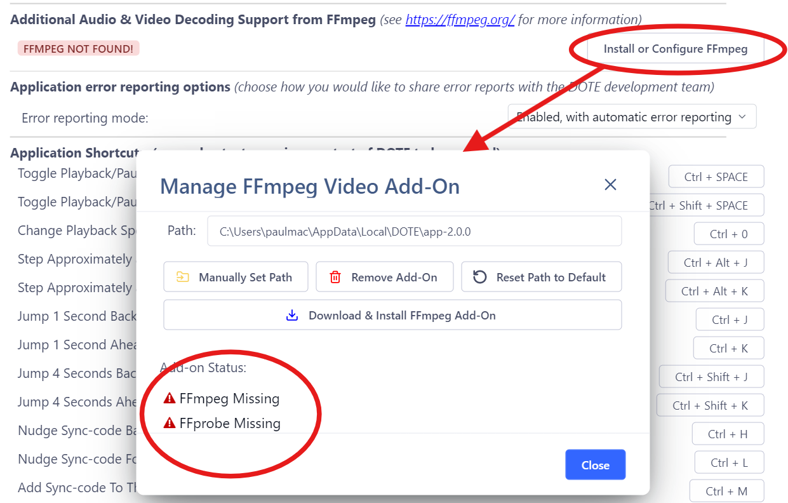

## _DOTE_ v2.0 install and update

We have recently released [v2.0](new-v2.md) of _DOTE_.
We think it is a fantastic improvement on v1.0 that incorporates many suggestions from our user base.

If you are new to _DOTE_, then just follow the instructions below.

If you have already installed _DOTE_ v1.0, then you need to upgrade.

> We _strongly recommend_ that you backup all your _DOTE_ projects and transcripts to a safe place.
The update will migrate a bunch of hidden files in each of your project and transcript folders to the new data structures only when you open an already existing _DOTE_ project or a transcript in a project.
If something goes wrong, then you can simply replace all the files and folders from your backup.

#### Updating to a new release

When you run _DOTE_, it will remind you if there is a new release available online.
It is up to you to manually [download the new release](https://www.dote.aau.dk/download/) and install it.

To update _DOTE_ on both operating systems, just close _DOTE_, download the update and follow the same procedure above.
_DOTE_ will be updated and restart automatically.

### How to download and install _DOTE_

Watch [basic](https://www.youtube.com/watch?v=zbB6lczk4f8) and [advanced](https://www.youtube.com/watch?v=RDbYopAerCw) video tutorials on YouTube.

_DOTE_ is a desktop application that runs on your local computer.
It is very easy to download and install the software and run it on the Windows and Mac desktop platforms.
It should run on the latest versions of Microsoft Windows 10/11 and also Apple macOS (10.13 High Sierra or later; also macOS 12+ for the Apple Silicon M-series).
Let us know if you have a problem installing and running _DOTE_ on these platforms.
Contact us if you are interested in using _DOTE_ on Linux, or if you can provide financing to support _DOTE_ development specifically for Linux.
Note that only one instance of _DOTE_ is allowed to run at the same time on a given computer. If you need to view more than one transcript at a time, please consider using _DOTEbase_, which provides multi-transcript viewing.

Choose the correct and latest version for your operating system from our [_DOTE_ Webshop](https://www.dote.aau.dk/downloads) or you can browse archived [releases](https://github.com/BigSoftVideo/DOTE/releases) on our public _DOTE_ GitHib repository.

As of **_DOTE_ v2.0**, there are now two types of installers for both Windows and Mac.
- Most users who use their own devices, or who have administer permissions on their machines should continue to use the '.exe' & '.dmg' installers.
- For institutional-managed computers, multi-user shared devices, or those with limited administrator access, please use our '.msi' & '.pkg' installers.
---
#### **Windows installation**
- To install the Windows version, `double click` on the installer file that was downloaded.
- If you get a Windows warning message, then click the `More info` link, and choose `RUN ANYWAY`.
- _DOTE_ will start after the install is complete.
- The _DOTE_ icon should also appear on your desktop.
  In future, just `double click` the icon and _DOTE_ will start.

---
#### **MacOS installation**
- For macOS, double click on the _DOTE_ installer icon (`DMG`).
- Drag and drop the unpacked `DOTE` app into your `Applications` folder.
- NOTE: your macOS system settings may be set to restrict installations.
- If _DOTE_ is prevented due to security restructions, open `System Preferences`, select `Security & Privacy`, select `General` tab, and select and approve `Allow apps downloaded from App Store and identified developers`.
  You may need to _unlock_ your settings with the padlock to make these changes.

### End User License Agreement

The first thing you need to do after installing _DOTE_ is agree to the Terms and Conditions of the EULA.

If you do, then _DOTE_ won't ask again on that machine.
If you don't, then _DOTE_ will not start.

### PRO Editions license key

You will need to purchase and enter a [license key](pro.md#license) to unlock the premium features in _DOTE_.
If you are upgrading, then you do not need to re-enter these details.

### Installation problems 

On Windows, the installation may fail because Windows Defender does not recognise the software.
You can set Defender to allow _DOTE_ to run on your computer.

On Windows, the installation may fail because your Windows setting does not allow software to be installed except from the App Store.
If you wish to install _DOTE_, then you have to change that setting to allow apps to be installed from 3rd party sources.

Another reason for failure is that you may have an Anti-virus/malware programme installed.
It may not recognise _DOTE_ and warn you about installing/running the software on your computer.
Just set the Anti-virus software to trust _DOTE_.

If the installation fails because you do not have administrator rights, then you may need to get permission from your IT support to allow installation of the _DOTE_ software.

- For example, you may not have permission in Windows (Group Policy) to install unknown or unapproved software.
This is a local problem with how your computer has been setup by a security conscious IT support.
    - Ask your system administrator to allow running `DOTE_ExecutionStub.exe` AND `DOTE.exe`.
    The installer must be run after this has succeeded, then you should be able to run _DOTE_ normally.
    - Alternatively use _DOTE_ on a computer that is not constrained by such policies (for example a computer that you own personally).

### Installing other open source packages that _DOTE_ needs for specific purposes

#### Installing FFmpeg 

_DOTE_ can import many audio formats on its own in order to generate a waveform automatically, but not all.
If you have trouble generating a waveform for a video or audio clip, then one can either transcode the clip (see [Tips](tips.md)) and try again by importing the new video or by regenerating the waveform (see [Media Manager](media-manager.md)).

Alternatively, you can let _DOTE_ install the free and open source _FFmpeg_ application on your computer, and add the folder path to `ffmpeg.exe` to your _DOTE_ [Settings](settings.md).

1. Go to Settings and scroll down to the bottom to see the `Additional Audio & Video Format Support` section.
1. Because _DOTE_ installs _FFmpeg_ automatically, it should report "FFMPEG INSTALLED".
1. If not, then:
    1. In [Settings](settings.md), click the button `Install or Configure FFmpeg`
    2. Click `Download & Install FFmpeg Add-On`.
    3. The files will be downloaded and installed.
    4. The "Not found" indicators should change to "Available".
    5. Under some circumstances you may need to `Reset Path to Default` first if you upgraded to v2.0 and the file path is still for v1.0.
    5. Try restarting _DOTE_ if something looks amiss, or try `Remove Add-On`, and then retry to reinstall.

<!-- WARNING:

 -->

###### FFMPEG MISSING:

> 

###### AFTER DOWNLOAD:

> 

Like many other software, _DOTE_ has to do this extra step because of licensing restrictions.

NOTE: After using _DOTE_ to install _FFmpeg_ once you will not have to redo this step if you reinstall _DOTE_ or update to a newer version. _DOTE_ will remember you decision and reinstall _FFmpeg_ automatically.

#### Installing FFmpeg yourself:

If you wish to use a known version that you have installed yourself on your computer in a specific location, then click `Manually Set Path`.
Both _ffmpeg_ and _ffprobe_ have to be installed.
See [these instructions](https://bbc.github.io/bbcat-orchestration-docs/installation-mac-manual/) for more detail if you get stuck.

For a [Windows](https://www.gyan.dev/ffmpeg/builds/ffmpeg-release-essentials.zip) installation, the folder path might look like this, depending on how you installed it:
- `C:\FFmpeg\bin\`
- `C:\Program Files\FFmpeg\bin`

For a [macOS](https://evermeet.cx/ffmpeg/) installation, the folder path might look like this, depending on how you installed it:

- `/usr/local/bin`
- `/opt/homebrew/bin`

You may have to request permission from your IT services to install these software.
And you may have to unlock a folder (on macOS) to be able to install into that folder.
Finally, you may not have access rights to the standard folder for installation (on macOS), so select a public folder that you do have access to.
