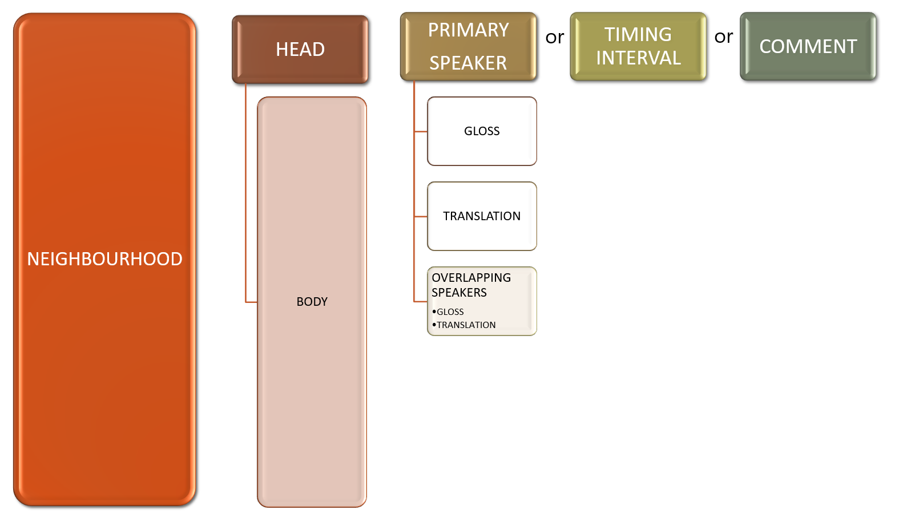

## Jeffersonian style CA transcription conventions supported by _DOTE_

There are many guides to using the Jeffersonian-derived CA transcription conventions that Gail Jefferson developed.
The most recent and comprehensive can be found in:

- Hepburn, Alexa, and Galina B. Bolden. 2017. _Transcribing for Social Research_. London: Sage.

_DOTE_ supports a Jeffersonian style in three ways:

1. Normative - _DOTE_ expects a specific style and [gives help](errors.md) (errors, warnings and suggestions).
    - eg. Overlap bracket (eg. `[...]`) alignment across speakers is supported.
1. Agnostic - _DOTE_ cannot parse the specific stylistic feature and ignores it.
    - eg. Special symbol pair for specific voice quality.
1. Clash - _DOTE_ cannot parse a specific (legacy) stylistic feature and it interferes with the normative style.
    - eg. Single angle bracket `>` or double square bracket `[[`.

### The structure of a Jeffersonian transcript <a id='neighbourhood'></a>

A typical transcript in the script-based Jeffersonian style has the following formal structure:

- Each transcript is made up of independent neighbourhoods that follow each other temporally.
- A neighbourhood consists of a line or lines that are temporally demarcated and bounded.
- A neighbourhood is made up of one of the following Head elements:
    - A primary speaker line with a speaker-id.
  - A primary timing interval line, which only contains a pause `(x.y)`.
  - A primary comment line, which only contains a comment `((...))` or comments.
- A neighbourhood with a primary speaker line can be extended with an optional element:
    - Overlapping secondary speaker line or lines with speaker-id(s).
        - If there is overlap, then the speaker who first speaks before an overlap is the primary speaker; the other overlapping speaker(s) are secondary speaker(s).
        Together they form a neighbourhood.

This diagram should help simplify the composition of a neighbourhood:



For example,

```
1 AAA:  A speaks
2 BBB:  B speaks
3 AAA:  A speaks and [overlaps]
4 BBB:               [overlaps]
5       (1.0)
6       ((comment))
```

There are 5 neighbourhoods in the example above:

1. Line 1
1. Line 2
1. Lines 3-4
1. Line 5
1. Line 6

### Translation and interlinear glosses <a id='subtiers'></a>

For languages other than English, a primary or secondary speaker line in a neighbourhood may be directly followed by:

(a) an interlinear gloss line or lines.
(b) a translation line or lines.

These additions are still within the same neighbourhood anchored by the primary speaker line.
For example, here is a short example in Danish of a single neighbourhood from Heinemann & Steensig (2017)

```
Mia:      Je:g konsekvent   holdt    op med
Mia@gls:  I    consequent-N hold-PPT up with
Mia.eng:  I've consistently stopped
```

### Overlapping speech <a id='overlap'></a>

- Overlapping speech by two or more speakers `[...]` is supported and highlighted.
- Non-sequential overlapping speech or sound `{...}` is supported and highlighted.
- Embedded overlaps are supported.
- Multiple overlaps on the same line are supported.
- Lazy or indeterminate overlaps with no offset to complete the pair are given a warning.
- `[[` at the start of a turn is not supported.

### Realign overlaps <a id='realign'></a>

Overlaps across multiple lines in the same [neighbourhood](#neighbourhood) can be automatically realigned with each other.
With its transcript heuristics, _DOTE_ scans for overlaps in every neighbourhood.
If an overlap is misaligned vertically, then _DOTE_ can do a pretty good job of realigning it.

- One can see if realignment is a possibility by placing the cursor in a line where there is one or more overlaps and clicking the small lightbulb icon that appears.
- Alternatively, use the shortcut <kbd>CTRL</kbd>+<kbd>.</kbd> or <kbd>⌘</kbd>+<kbd>.</kbd>.
- A small dialog box will appear, and a suggested realignment can be performed.

### Insert single symbol

The following are supported:
- Inbreath: `·h`
- Pitch raise: `↑`
- Pitch fall: `↓`

When editing the transcript, type <kbd>CTRL</kbd>+<kbd>ENTER</kbd> or <kbd>⌘</kbd>+<kbd>ENTER</kbd> to show all available symbols in a drop-down list.
Type the first (and second etc) letter of the name to bring up the closest suggestions to autocomplete.
Note that autocomplete does not work when the cursor is inside or just after a word.

### Insert and highlight paired symbols

The following pairs are supported and autocompleted when the first of the pair is typed:
- Fast: `>...<`
- Slow: `<...>`
- Soft: `°...°`
- Overlap: `[...]` or `{...}`

When editing the transcript, type <kbd>CTRL</kbd>+<kbd>ENTER</kbd> or <kbd>⌘</kbd>+<kbd>ENTER</kbd> to show all available paired symbols in a drop-down list.
Or type the first letter of the symbol name to bring up the closest suggestions to autocomplete, eg. typing "s" will bring up the "soft" and "slow" choices.
Overlap is only available when an overlap is predictable and expected in the context of the neighbourhood.

### Stress

- Underlining to mark stress is supported (<kbd>CTRL</kbd>+<kbd>U</kbd> or <kbd>⌘</kbd>+<kbd>U</kbd>) and exportable.
- Use of bold and italic is not supported.

### Latching

- Latching (`=`) is supported within a line and across lines/speaker turns.

### Pausing

- `(.)` and `(x.y)` time intervals are supported and highlighted.

### Transcriber comments

- `((....))` is supported and highlighted.
- Overlap onsets or offsets inside comments are not supported.

### Special subtiers

- Interlinear gloss subtiers are supported using the `@gloss` subtier type, but not yet fully supported, eg. gloss acronyms and unit-by-unit alignment.
- Translation subtiers are supported using the `.language` subtier type.
For example, marking overlaps with brackets in translations when present in the original language is optional.
If they are present, then they will be realigned on request.
