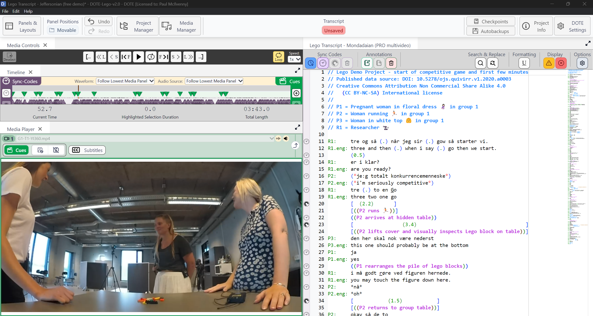
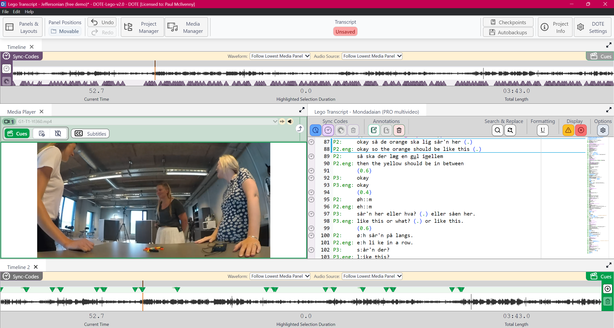
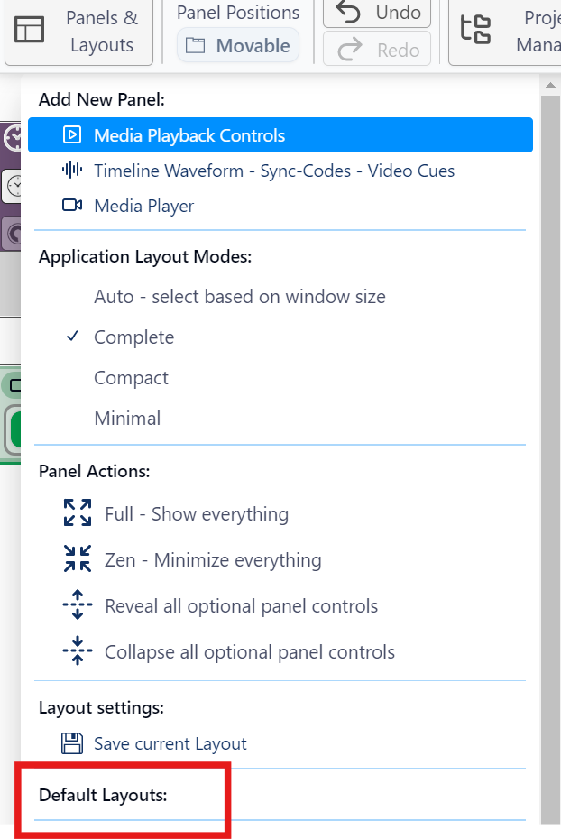
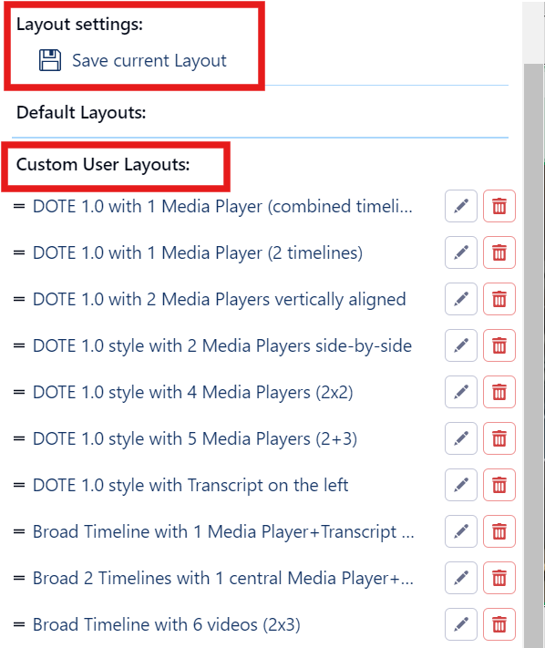
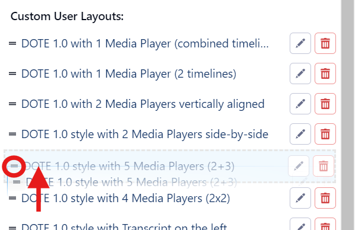

## Using the default and user-defined layouts

A new feature of v2.0 is the ability to create and switch between a flexible variety of panel configurations that provide access to the main tools available in _DOTE_.

Here is a layout similar to the default layout in v1.0:

Here is a more adventurous layout in v2.0:

### Switching Layouts

There are default layouts hard-coded into DOTE that cannot be changed and user-defined layouts that can be created, edited, renamed and deleted.

#### Switching to a Default Layout

1. Click on the `Panels & Layouts` button at the top left of the ribbon bar.
1. Select one of the Default Layouts listed and click.
1. The layout will change.

Note that if the new layout has more Media Player Panels than you have active media used in layouts deployed so far (eg. you have not yet opened Media Player panel 2), then they will be filled with a default active source.
You can change that source, modify the view in the Media Player panel, and it will be remembered between sessions (eg. Media Player panel 2 will always be reloaded with that video/view no matter which layout is chosen).

### Creating and editing Custom User Layouts

If you adjust a layout of panels and would like to be able to reuse it again, then:

1. Click on the `Panels & Layouts` button at the top left of the ribbon bar.
1. Under Layout Settings, click `Save Current Layout`.
1. Give it a useful name and an optional description and `Save`.
1. It will appear at the bottom of the list of user-defined layouts.
1. User-defined layouts can be renamed 🖋️ and deleted 🗑️ by clicking the respective icon.

#### Reordering the list of Custom User Layouts

1. Click on the `Panels & Layouts` button at the top left of the ribbon bar.
1. Scroll down to the list of user-defined layouts.
2. Click and press on the equals icon `=` for one of the layouts.
A hand icon will appear.
3. Once selected, drag and drop the layout to a new location in the list.

### Plans for Custom User layouts

We hope at some point to implement an export/import function for Custom User Layouts, so users can share their favourite layouts.
