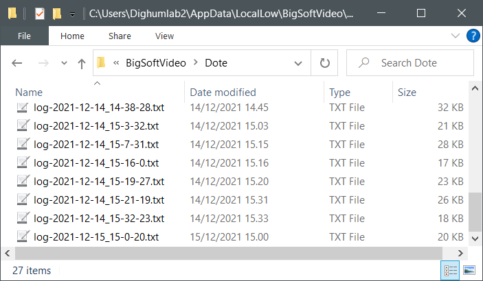

## How to find the logfile

Each time _DOTE_ is opened, a new logfile is created. The filename shows the date (`year-month-day`) and time
(`hour-minute-second`) of creation. When attaching a logfile to a bugreport, select the one
that was created just before you experienced the bug, or attach multiple logfiles if unsure.

The correct log folder can be opened from the _DOTE_ `Help` menu.
The screenshot below shows what might be contained within that folder.

Alternatively, you can navigate to the folder manually as follows.

### Logfiles on Windows

1. Open a file explorer window (for example by pressing <kbd>WIN</kbd>+<kbd>E</kbd>)
2. Press <kbd>CTRL</kbd> + <kbd>L</kbd>
3. Paste this into the address bar: `%USERPROFILE%\AppData\LocalLow\BigSoftVideo\Dote`
4. Press <kbd>ENTER</kbd>

### Logfiles on macOS

1. Open a Finder window (for example by pressing <kbd>cmd ⌘</kbd>+<kbd>⌥</kbd>+<kbd>SPACE</kbd>)
2. Press <kbd>cmd ⌘</kbd>+<kbd>⇧</kbd>+<kbd>G</kbd> to open the "Go to folder"
3. Paste this into the address bar: `~/Library/Logs/BigSoftVideo/Dote`
4. Press <kbd>ENTER</kbd>
