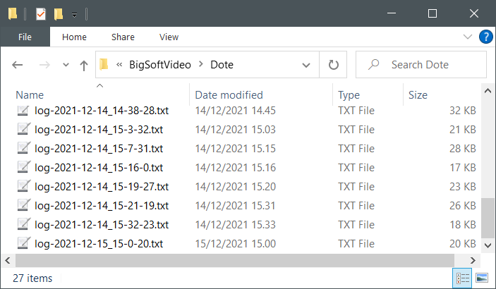

## Submitting an Error Report

With DOTE v2.0 it has become much easier to send the developers an Error Report with useful information.

One can manually submit an Error Report, usually when the user detects that some sort of error has occurred, or _DOTE_ will offer to submit an error report because it has detected an error.

### Manually submit an Error Report

You can easily submit an [error report](logfile.md) to our developers using the link `Report an Error to the Developers` under the `Help` menu.

1. Type a description of the error in the `Error Description` box.
2. Optionally you can add your email address for possible correspondence with the developers.
You can select the email suggested, which is the one registered for the Edition license for your device.
1. Additionally, you can choose what will be included in the Error Report that is sent.
The default is to include the full log of errors and warnings, as well as application settings, transcript settings and anonymised Transcript meta-data (not the Transcript itself).
You can downscale what is sent to just your textual description and/or just the error message (not the log) by toggling between these choices.
You can also toggle off the other inclusions.
1. Details of what will be sent can be previewed at the bottom.
2. When ready, click `Submit Report`.

The automatic Error Report submission process has the same options.

### How to find the logfile

Each time _DOTE_ is opened, a new logfile is created. The filename shows the date (`year-month-day`) and time
(`hour-minute-second`) of creation. When attaching a logfile to a bugreport, select the one
that was created just before you experienced the bug, or attach multiple logfiles if unsure.

The correct log folder can be opened from the _DOTE_ `Help` menu.
The screenshot below shows what might be contained within that folder.

Alternatively, you can navigate to the folder manually as follows.

### Logfiles on Windows

1. Open a file explorer window (for example by pressing <kbd>WIN</kbd>+<kbd>E</kbd>)
2. Press <kbd>CTRL</kbd> + <kbd>L</kbd>
3. Paste this into the address bar: `%USERPROFILE%\AppData\LocalLow\BigSoftVideo\Dote`
4. Press <kbd>ENTER</kbd>

### Logfiles on macOS

1. Open a Finder window (for example by pressing <kbd>cmd ⌘</kbd>+<kbd>⌥</kbd>+<kbd>SPACE</kbd>)
2. Press <kbd>cmd ⌘</kbd>+<kbd>⇧</kbd>+<kbd>G</kbd> to open the "Go to folder"
3. Paste this into the address bar: `~/Library/Logs/BigSoftVideo/Dote`
4. Press <kbd>ENTER</kbd>
