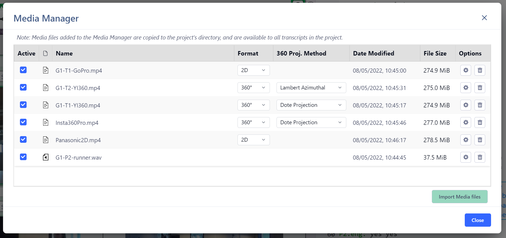
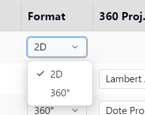
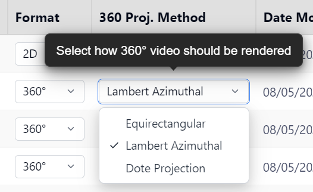
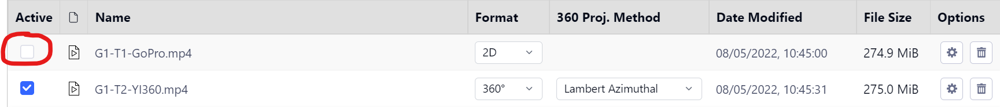
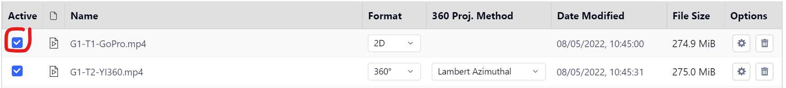
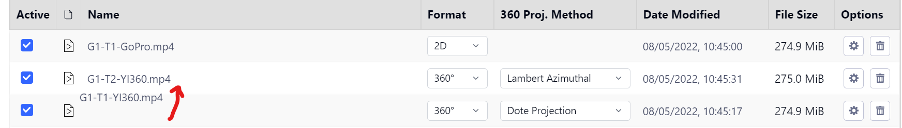
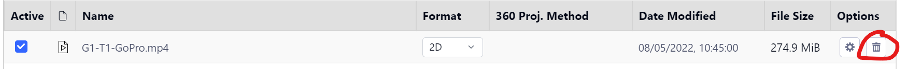

## Media Manager

Watch the [basic](https://www.youtube.com/watch?v=enN7aKYZEGg) and [advanced](https://www.youtube.com/watch?v=-xIPZAJoNkU) video tutorials on YouTube.

_DOTE_ projects can contain one or more media files associated with that Project.
Media such as audio and video files can be imported directly into a new Project.
The function of the `Media Manager` is to be able to add, remove and make active different media sources for your current Project.

Note: it is essential to use synced media files that have the same IN and OUT points, eg. the start and duration of each clip is the same with respect to the event that was recorded.
Otherwise, if you have used sync-codes or video-cues, then switching between media sources for the same transcript will simply not work because the timecodes for both will not align correctly across media.
Syncing media clips is something to undertake outside _DOTE_, eg. with video editor software.

Watch the [video tutorial](https://www.youtube.com/watch?v=cKWagutZV4I) on YouTube.

### How to add a media source to your current Project 

1. Open `Media Manager` by clicking on the button at the top of the _DOTE_ window.
1. Select `Import Media Files` to locate a media file and import it into your current Project.
More than one media file can be added to a Project.
    - The file of the added media source will be automatically _copied_ to your Project folder on your computer's file system, unless it is already present in that folder.
    - The media source will appear in the list.
    - In addition, more than one file can be selected at the same time (using the file browser in your OS) to batch import.
1. If relevant, select which video format from the pull-down list, eg. `2D` or `360`.
If "360" is present in the filename, then it is assumed that the video is `360` equirectangular format.
1. If relevant, select which Video Projection you prefer, ie. how the 360 equirectangular format is rendered in the [Media Player panel](media-panel.md).
This can be changed at any time from the pull-down menu at the top of the Media Player panel.
Experiment to see which Projection you prefer; there are subtle differences.

NOTE:

- If necessary, the waveform for a media source can be regenerated by clicking the regenerate button for a specific media source in the list.
This is only necessary if the waveform is corrupted or is not displaying correctly or the media file in the Project folder was replaced with a different file with the same filename.
- It is also possible in v2.0 to [move files directly into the Project folder](#media-file-system).

Watch the [video tutorial](https://www.youtube.com/watch?v=_WLkZVxamhY) on YouTube.

#### NOTES on media file types

- A variety of video formats can be imported:
    - The video file works best when it is encoded as `MP4` with `H.264` or `H.265` compression.
    - Quicktime (`MOV`) format on macOS is not supported.
    Importing videos in this format may cause _DOTE_ to freeze or crash, so make sure your videos are formatted in a non-Quicktime `MP4` format.
    - 2D and 360-degree _monoscopic_ _equirectangular_ video formats are supported at present (_not_ stereoscopic).
    - Resolutions up to and beyond 4K are permitted, but many computers will have trouble playing a high resolution video beyond 4K.

- Audio only formats can be imported as well.
    In that case, the Media Player panel will be empty.
    - Audio formats supported include `WAV`, `MP3`, `OGG`.
    - Mono and stereo tracks are supported at present (not ambisonic).

### How to activate a media source(s) in your current Transcript 

Media sources that are added to a Project form a common pool available for activation in every Transcript in the current Project.
For each Transcript, one or more media can be activated locally in that Transcript.
They are selected from the list of media in the pool and activated.

BEFORE:

AFTER:

1. Select one or more media sources from the list to be activated or de-activated by clicking the tickbox.
1. Click `Close`.
1. The active media will be available in the [Media Player panel](media-panel.md) of the current Transcript.
The video will be loaded and the waveform will be automatically generated when the media source is selected in the Media Player panel.
If the waveform does not appear, then the waveform can be regenerated in the `Media Manager` for each media source by clicking the `Regenerate` ⚙️ button.
If this does not work, see [these instructions](projects.md#waveform-troubles).

### How to rearrange media source items in the list 

The list of media added to the Project can be rearranged in two ways:

1. Each column can be sorted by clicking on the column header.
Clicking on the same column header switches between ascending/descending sort order.
1. A media source can be selected.
Then click and drag it to a new position vertically in the list and drop.

### How to delete a media source from your current Project 

1. Decide which media source is to be deleted.
1. Click `Delete Selected File` 🗑️ button on the right side of the panel for that source.
The media file(s) (and the associated waveforms) will no longer be available in the Project.
1. **Note that the media file(s) will be deleted from the Project folder on your computer's file system**.
In fact, the file(s) will be sent to the Recycle Bin or Trash on your computer.
If you empty the Recycle Bin or Trash, then the file(s) will be lost.
If you wish to use the file(s) again, then restore and make a copy first in another location.
Then import again in the Media Manager.

### Adding Media files using the File System on Windows or macOS 

It is also possible, but not recommended unless no other choice is available because of restricted space on the file system, to move media files directly into the Project folder from another location on your file system.
When a file is dropped into the correct folder, it will automatically be added to the Media Manager when the Project (and one of its Transcripts) is reopened in _DOTE_.
Moreover, it will also be automatically made active, so it can immediately be accessed from the Media Player and Timeline panels.

Be warned that if you _move_ media files into a Project folder, so that the original file is now only in the _DOTE_ project folder, and later delete the Project in DOTE, then the media files will also be deleted (to the Recycle/Trash bin).
Also, if you delete the Project folder on your file system, you will lose the original media files as well using this method.
If you import media files from Media Manager, then you will always be making a copy for use in _DOTE_.
The original will remain somewhere else on your file system.
