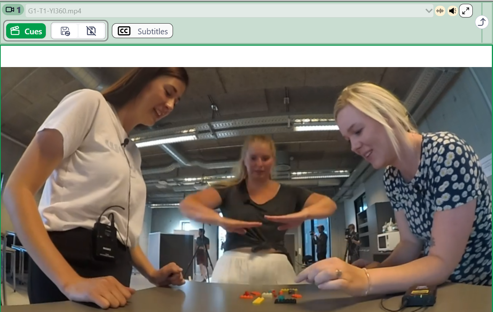
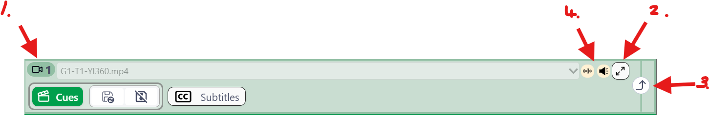
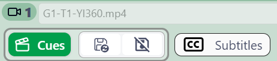
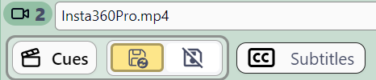
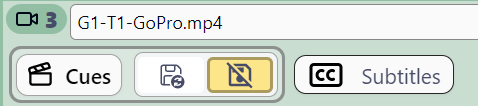
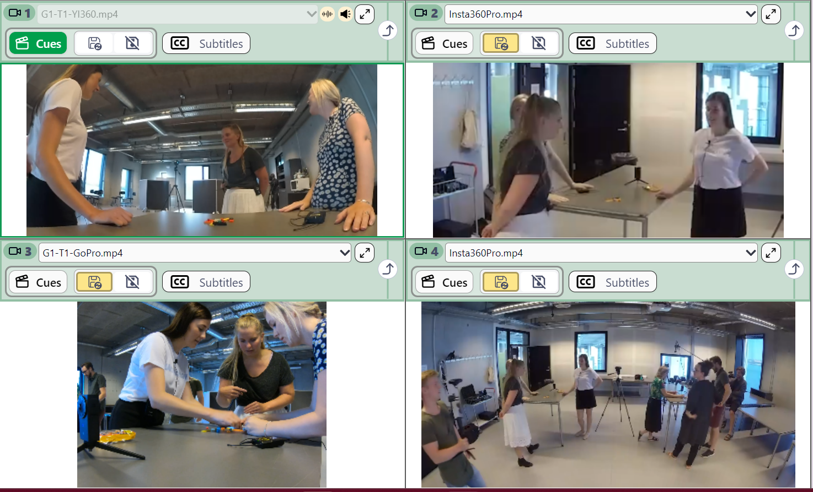

## How to use Media Player panels

Watch the [video tutorial](https://youtu.be/dQwelIB2JvM) on YouTube.

When you start _DOTE_ or create a new project, only one Media Player panel is displayed in the standard default layout.
You can add more Media Player panels to display the same video source (different zoom/pan) or different video sources that have been added in the Media Manager.
The video format, either 360 or 2D, must be set in the [Media Manager](media-manager.md), so that the video will appear correctly in a Media Player panel.
For 360 videos, one can choose from three different projection systems for each media panel.
Experiment to see which one suits your 360 video recording.

Watch the [video tutorial](https://www.youtube.com/watch?v=eBWNqeIo450) on YouTube.

You can open as many Media Player panels as you wish.
Each one can contain any active media source in your current Project.
This means one can simultaneously zoom in on one viewpoint of the video image in one Media Player panel while also looking at a second viewpoint at a different zoom scale or in another direction in a second Media Player panel.
Or one can open the view from one camera in one Media Player panel, while also looking at the view from a different camera in a second Media Player panel.
Lush! 🌱

### Media Player panel information

Information is displayed in different sections of the panel:

1. Each Media Player panel is numbered.
2. Each panel can be expanded to full screen and shrunk back to its original position.
3. The options bar can be hidden.
4. If the Waveform or the Audio Source in a [Timeline](timeline.md) is tracking this specific Media Player panel (eg. "Follow Media Panel 1"), then this is indicated in the panel.

### How to view videos in a Media Player panel

Because it is analytically useful to zoom in, pan around and switch video sources, _DOTE_ provides several options to display a video source in a Media Player panel, one of which is integrated with [Video-cues](cues.md) on the [Timeline](timeline.md).

There are three basic ways to view a video in a Media Player panel:

Lock to Video-cues:

Saved viewport:

Freeview:

1. One can manually switch between active videos and viewports on the fly.
However, this is only possible if a Media Player panel is _not locked_ to Video-cues; if it is locked, then it will always follow the active video selected in Video-cues.
1. By clicking the save viewport button, and thus follow Video-cues is deactivated, then one can automatically save and restore whatever video is selected and any changes to its viewport in the current media panel.
2. In addition, if freeview is selected, and thus follow Video-cues and save viewport are deactivated, the active media showing in the primary media panel can be selected manually, as can the zoom and pan.
Changes will not be saved.
1. If at any time you try to create, edit or move a video-cue when the [lock video to video-cue](media-panel.md#video-tips) slider button is not selected, then _DOTE_ will warn you that video-cues will not be tracked in the media panels unless you toggle them on in one or both media panels.
This warning message can be turned off in [Settings](settings.md).

### More than one video available in active media

If one has imported _more than one_ video source into the current Project using [Media Manager](media-manager.md), and made them active for the current Transcript, then the Media Player panel will list the available videos in a pull-down menu at the top left of each Media Player panel.

1. If you have selected Follow Video-cues, then the it is not possible to switch to another video source (see Media Player panel 1 above).
The drop-down menu will be greyed out.
2. Just click on Save viewport or Freeview to switch video source (eg. Media Player panels 2, 3 and 4 above).

Depending on the quality and bit rate of the videos and the power of your computer, one can play/loop the video and switch live between synchronised videos of the event that the current Project (and Transcripts) covers.

### Adjusting Video-cues in a Media Player panel

See the [Video-cues](cues.md) help page for more details.

### Some tips for using the Media Player panels 

- The relative size of the Media Player panels can be changed by selecting and dragging the dividers between them.
Just hover over the dividing line until the cursor changes, then click and drag.
- One can zoom in by using <kbd>right click</kbd> and dragging the mouse vertically (or use the shuttle wheel on a mouse or two fingers on a touchpad).
- One can reposition the viewport focus of any Media Player panel using <kbd>left click</kbd> and dragging the mouse.
This is especially useful for composite 2D video clips and 360 video clips.
- The view in each media panel can be independently _locked_ to the inserted [video-cues](cues.md).
This means that the media panel will follow the cues that manipulate the view that the user sees.
- Or the video and viewport can be saved for the current media panel.
This means that one can switch video source or adjust the viewport (pan/zoom) and both will be saved and restored later as default for this panel, even when restarting DOTE or reopening the current Transcript.
- Or they can be left in freeview mode and adjusted manually.
This is useful for playing around with different configurations.
Any changes will not be saved.
As soon as the save icon button is toggled on, then the default state is restored (or if lock to video-cues is toggled on, then the current Video-cue is followed).
- It is often useful to have one Media Player panel locked to video-cues and the others in saved or free view mode.
However, there is a lot of flexibility, so you can setup a configuration that suits you.

A [complete list of commands and shortcuts](commands.md) is available.
Some shortcuts can be reassigned to other key combinations in the [Settings](settings.md).
