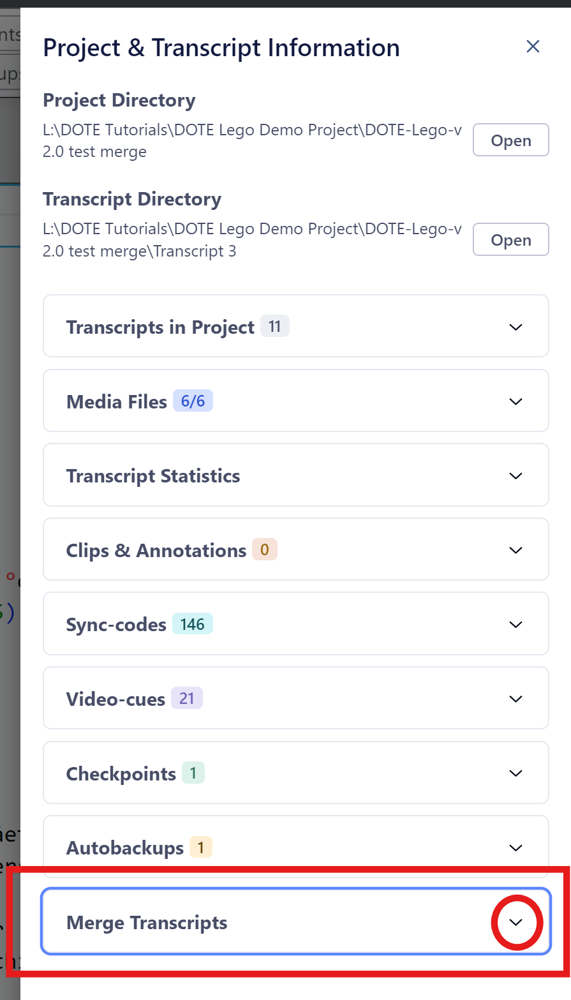
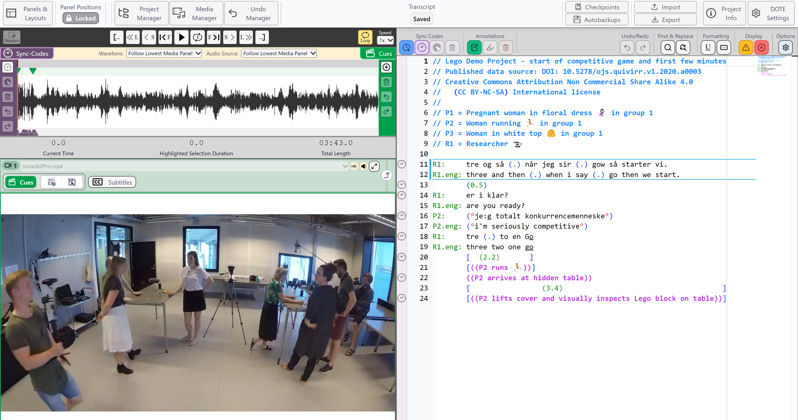
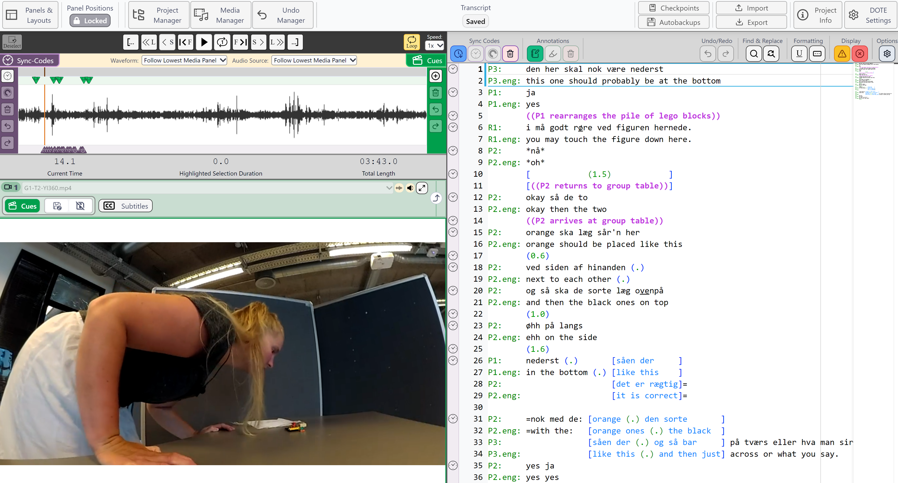
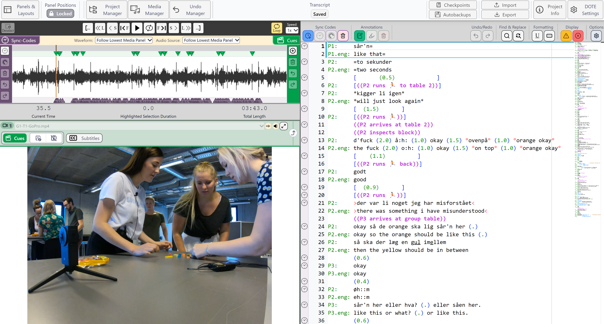
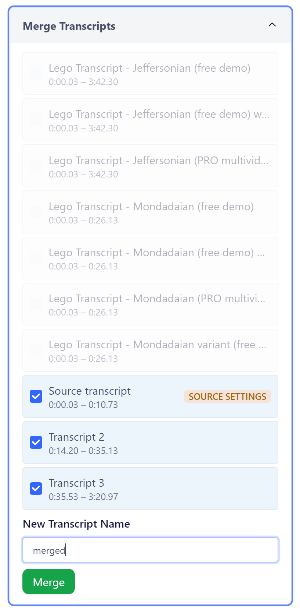
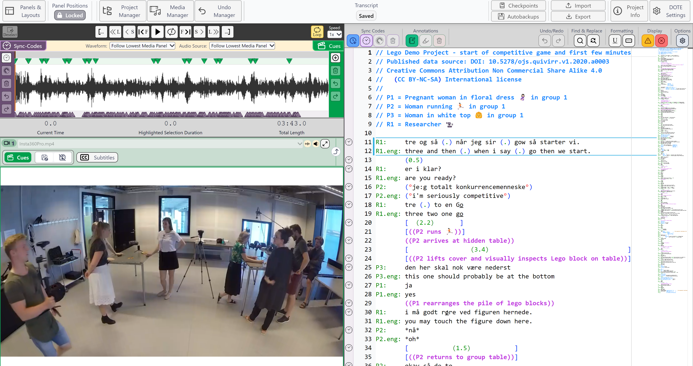

## How to merge Transcripts in a Project

See the video tutorial on YouTube.

_DOTE_ v2.0 now offers the possibility to merge two or more Transcripts in a Project.
This is useful if you have a long video and you wish to divide up the labour amongst team members or different transcribers.

### Important to remember

There are some crucial requirements in order to merge:

- You can only merge Transcripts if they have [Sync-codes](sync-code.md) assigned.
- You can only merge Transcripts if their Sync-codes are not overlapping.
- You can only merge Transcripts if they reside in the current Project.

It is best to create a Project on the source computer and export the Project ([Export Project](export.md)).
Distribute the file to the other team members or transcribers who will import it ([Import Project](import.md)) on their computer.
Agree on which non-overlapping sections of the [Timeline](timeline.md) each member will transcribe.
Each member then assigns Sync-codes to their sections only.

Note that all [Video-cues](cues.md) will be merged unless they are duplicates.

### Get your Transcripts ready to merge

You will need to decide on a source Transcript that other transcripts are to be merged with.
This source will dictate the conventions, TAB spacing, font size etc. that the other Transcripts will conform to.

If some of the Transcripts are on other computers, then they need to be exported ([Export Transcript](export.md)) from _DOTE_ on those computers, and the exported file imported ([Import Transcript](import.md)) into the master Project on the source computer.
They must be from the same Project.

### Merging Transcripts

1. Click on the `Project Information` button at the top right of the banner bar.
2. Scroll down to _Merge Transcripts_ and expand.
3. Select from the list of Transcripts a source Transcript and then other Transcripts to merge.
DOTE will progressively grey out those Transcripts that cannot be merged because they do not satisfy the requirements.
1. Enter a file name for the new merged Transcript.
It will be stored in the current Project.
1. Click on the `Merge` button.
2. The new Transcript will be loaded.

### Example

For example, here are three Transcripts, one source and two to be merged, in the same Project:

#### Source Transcript

#### Transcript 2

#### Transcript 3

Here is the merging dialog box under Project Information:

And this is the resulting merged Transcript:

Notice that the Sync-codes and Video-cues have also been merged into Source.

### Notes
