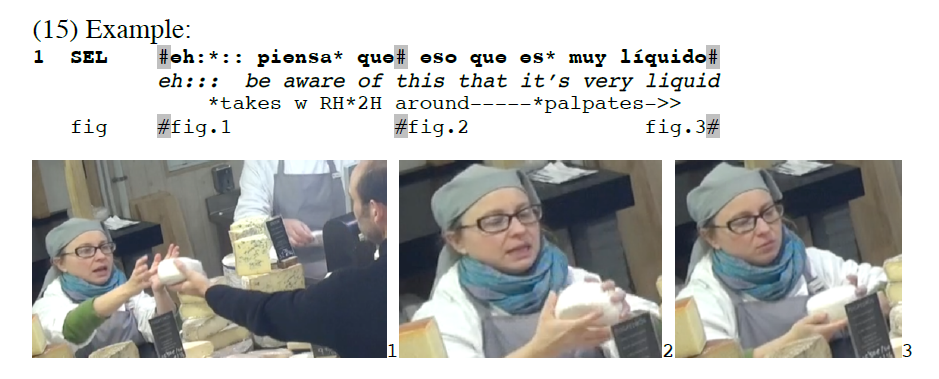
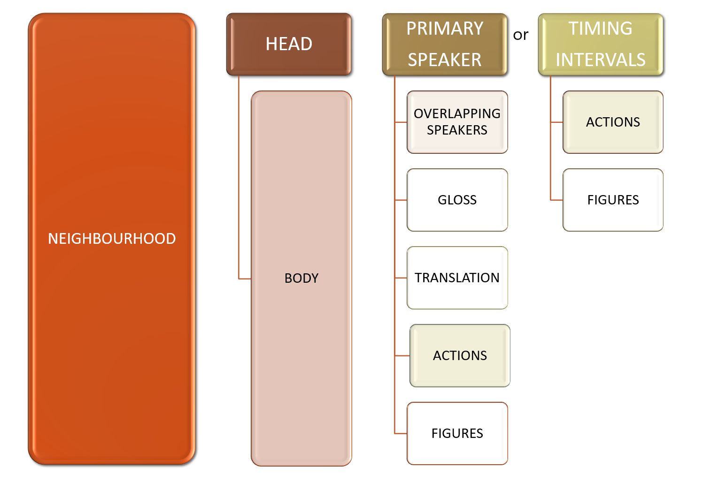
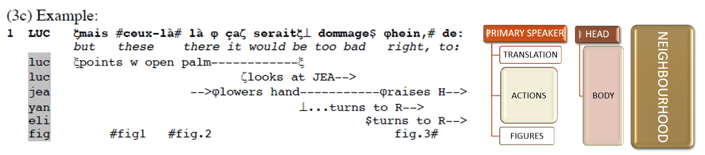
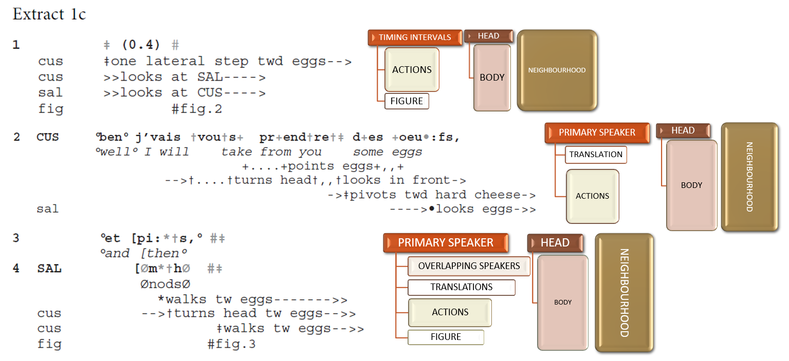

## Mondadaian style transcription conventions supported by *DOTE*

Documentation of the multimodal transcription conventions developed by Lorenza Mondada can be found here:

- [www.lorenzamondada.net/multimodal-transcription](https://www.lorenzamondada.net/multimodal-transcription)

This release of _DOTE_ fully supports this style according to `v6.0.1` (and the older v5.0.1), with other minor variations supported as well.

[](images/conventions/example2.png)

### The structure of a Mondadaian transcript

As with the Jeffersonian system, the basic structure is grounded in primary speaker lines in a temporally demarcated _neighbourhood_.
See the description of the [structure of the Jeffersonian system](jefferson.md) for the basics.
The key difference is that the neighbourhood can have additional [subtiers](tiers.md) that map multimodal actions occuring simultaneously to the primary (and secondary) speaker tier(s) or to a primary timing interval tier that forms the the Head of the neighbourhood.

A typical transcript in the Mondadaian style has the following structure:

- A neighbourhood is made up of one of the following elements (called the _Head_):
    - A primary speaker tier with a speaker-id.
    - A primary timing interval tier, which contains one or more pauses in the form `(x.y)` interspersed with alignment symbols.
- A neighbourhood with a primary speaker tier can be extended by the optional element:
    - Overlapping secondary speaker tier(s) with speaker-id(s).
        - If there is overlap, then the speaker who first speaks before an overlap is the primary speaker; the other overlapping speaker(s) are secondary speaker(s).
- A neighbourhood with a primary speaker tier or secondary speaker tier(s) can be extended with one or more of the optional elements:
    - A translation subtier.
    - An interlinear gloss subtier.
- A neighbourhood with a primary speaker tier or a primary timing interval tier can be extended with one or more of the optional elements:
    - An action subtier.
    - A figure subtier, marked with `#`.

This diagram should help simplify the composition of tiers and subtiers within a neighbourhood:

[](images/conventions/neighbourhoodM.png)

Notes:

- Every action subtier must have one or more assigned alignment symbols and/or a continuation marker both in the line and in the primary (an/or secondary) speaker tier(s).
- These symbols must match and align vertically within the neighbourhood.
- If some action continues beyond the neighbourhood, then a continuation marker must be used.

This example (from v5.0.1) shows the breakdown of a single neighbourhood:

[](images/conventions/neighbourhoodM1.png)

This longer example (from Mondada 2018: "Multiple Temporalities of Language and Body in Interaction") shows the breakdown of neighbourhoods:

[](images/conventions/neighbourhoodM2.png)

Here is an example in the Mondadaian formatting style that has more than one neighbourhood:

```
1 AAA      A speaks
2 BBB	   B %speaks% and &continues
3 bbb        %action%
4 aaa                     &action-->
5          (2.0)&(1.0) &
6 aaa        -->&action&
```

There are three neighbourhoods in this example, as follows:

1. Line 1 - A primary speaker tier on its own.
Line 1 is the Head.
1. Lines 2-4 - Line 2 is the primary speaker tier that anchors this neighbourhood.
Line 2 is the Head.
The action subtier in line 3 terminates within the neighbourhood, but the action subtier in line 4 continues beyond the neighbourhood.
1. Lines 5-6 - The action subtier in line 4 continues into line 6, which is a new neighbourhood anchored in the primary timing interval tier on line 5.
Line 5 is the Head.

### Features supported

The full range of features of the style of multimodal transcription are supported, including:

- Translation and interlinear gloss subtiers.
- Action subtiers
- Figure subtiers, eg. `#fig:`.
- Subtier symbol vertical alignment to primary tier across multiple action subtiers.
- Prior/Next/Earlier/Later marking of an action, eg. `>>`, `-->`, `-->>`.


> **WARNING: Be careful _not_ to use some of the more esoteric symbol pairs, eg. smiley voice `£...£` or creaky voice `#...#`, that can be found in the Jeffersonian system because they may be confused with Mondadaian alignment symbols. These symbols are very commonly used alignment symbols and thus there will be an irresolvable clash between the two very different functions of each symbol.**

### Supporting a variant of the Mondadaian conventions

_DOTE_ also supports a variant of the Mondadaian conventions that orients to a proportional timing interval.

- The key difference is that timing intervals that are usually marked with `(x.y)`, eg. (1.5) is equivalent to one-and-a-half seconds, are transcoded into a proportional system using the symbol `◘`, which represents 0.1 seconds.
- Thus, neighbourhoods that have a primary timing interval tier as a HEAD should use strings of `◘`s to mark the timing intervals on which to hang the BODY of the neighbourhood, eg. action subtiers.

An example transcript that uses this variation is included in the [Lego Demo Project](demo.md).

In future release, DOTE will be able to convert on the fly between the standard timing `(x.y)` and the proportional system.

### Exporting to RTF

The _DOTE_ [subtier type system](tiers.md) is needed to give better help and suggestions within _DOTE_.
As a result, it is easy to [export your transcript](export.md) to match the exact style and layout recommended in the Mondadaian system.
For example, one can export the transcript to match the compressed and sparse naming conventions and layout of subtiers in the minimal Mondadaian style with formatting.
