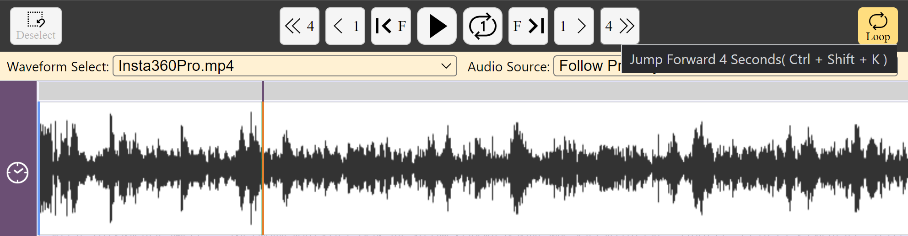

## Video and audio playback

There are two ways to playback the media associated with the current _DOTE_ project.

1. Use the video transport buttons above the main timeline.
2. Use the shortcuts, see below.
Note: over over the buttons and you will see the relevant shortcut.

- To play and pause the video, press <kbd>CTRL</kbd>+<kbd>SPACE</kbd> [<kbd>⌘</kbd>+<kbd>N</kbd> on macOS].
- To play the video and return on pause to the current position of the playhead in the timeline.
    - <kbd>CTRL</kbd>+<kbd>SHIFT</kbd>+<kbd>SPACE</kbd> [<kbd>⌘</kbd>+<kbd>⇧</kbd>+<kbd>N</kbd> on macOS]
- To jump back, press <kbd>CTRL</kbd>+<kbd>J</kbd> [<kbd>⌘</kbd>+<kbd>J</kbd>] and to jump forwards press <kbd>CTRL</kbd>+<kbd>K</kbd>.
Add the <kbd>SHIFT</kbd> or <kbd>⇧</kbd> key to jump by a bigger interval.
    - <kbd>CTRL</kbd>+<kbd>J</kbd>/<kbd>⌘</kbd>+<kbd>J</kbd> = 1 second back
    - <kbd>CTRL</kbd>+<kbd>SHIFT</kbd>+<kbd>J</kbd>/<kbd>⌘</kbd>+<kbd>⇧</kbd>+<kbd>J</kbd> = 4 seconds back
    - <kbd>CTRL</kbd>+<kbd>K</kbd>/<kbd>⌘</kbd>+<kbd>K</kbd> = 1 second forward
    - <kbd>CTRL</kbd>+<kbd>SHIFT</kbd>+<kbd>K</kbd>/<kbd>⌘</kbd>+<kbd>⇧</kbd>+<kbd>K</kbd> = 4 seconds forward
- To step forward or backwards by one frame (may skip a frame)
    - <kbd>CTRL</kbd>+<kbd>ALT</kbd>+<kbd>J</kbd> or [<kbd>⌘</kbd>+<kbd>⌥</kbd>+<kbd>J</kbd>] = one frame back
    - <kbd>CTRL</kbd>+<kbd>ALT</kbd>+<kbd>K</kbd> or [<kbd>⌘</kbd>+<kbd>⌥</kbd>+<kbd>K</kbd>] = one frame forward

See the guide to using the [Timeline](timeline.md) for help on looping.

The speed of the playback cannot be changed in the current release.
A later release will add functionality to modify the playback speed using the UI and shortcuts.

A [complete list of commands and shortcuts](commands.md) is available.
Some shortcuts can be reassigned in the [Settings](settings.md) to other key combinations.
