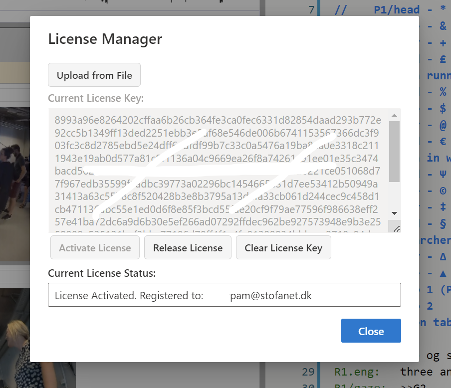

## _DOTE_ vs _DOTE Pro_ and _DOTE Pro Community_ Editions

_DOTE_ software is available in two Editions:

1. _DOTE_ (free) is an open build that can be installed by anyone, though it lacks premium features.
One can use this to transcribe data according to both Jeffersonian and Mondadaian conventions and export to RTF (simple format) ready for publication, though the number of lines per transcript is restricted.
The premium features will be greyed out and unavailable.
1. _DOTE Pro_ (paid) is the same software plus premium functionality and no restriction on the number of lines.
One time payment for one license that can be installed on up to three computers.

A license is granted for access to the current release version of _DOTE Pro_, including hotfixes and minor updates (eg. from `v1.1` to `v1.2`).
With each new major release (eg. from `v1` to `v2`), a new license or an upgrade is required.

There is an additional [_DOTE Pro Community_](https://bigsoftvideo.github.io/DOTE-Pro-Community/) Edition that gives the user exclusive access to fast-track bug reports and feature requests, as well as private access to new beta versions before release.

Go to our [WEBSHOP](https://dote.sfx.aau.dk) to purchase a license and read more information about Editions.

### _DOTE Pro_ license installation 

To unlock the full feature set of _DOTE Pro_, you will have to do the following:

1. [Purchase the _DOTE Pro_ license](https://dote.sfx.aau.dk/license-compare).
2. You will receive the license key in an email message.
3. Download the license key file to your computer on which you have installed the latest version of _DOTE_ (free).
4. From the `File/About`, select `license Manager`.
5. Select `Upload from File` and browse for the license key file on your computer and select it.
6. Click `Activate License`.
_DOTE_ will check with the license server online.
7. If the license file is registered, and there are unfilled device slots, then _DOTE Pro_ will be unlocked.
8. The email address of the license key holder will appear in `Current License Status` box.
And the name associated with the license will appear in the title bar of the application.

#### Notes

- One _DOTE Pro_ license can unlock up to three different computers (slots) owned by that user.
The same license file is used to unlock each device.
- If all three slots are full, then one slot will have to be released so that a new computer can receive that free slot.
You can release a device that has a license key already installed. Open _DOTE_ and go to `File/About/License Manager` and select `Release License`.
If all your device slots are full, and you cannot unregister any of the devices because they are unavailable, then contact us explaining the situation (dote@id.aau.dk).
- If you wish to enter a different licence key, then select `Clear License Key`.
This is useful if you are sharing a computer or you have purchased a new license.
