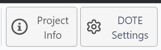
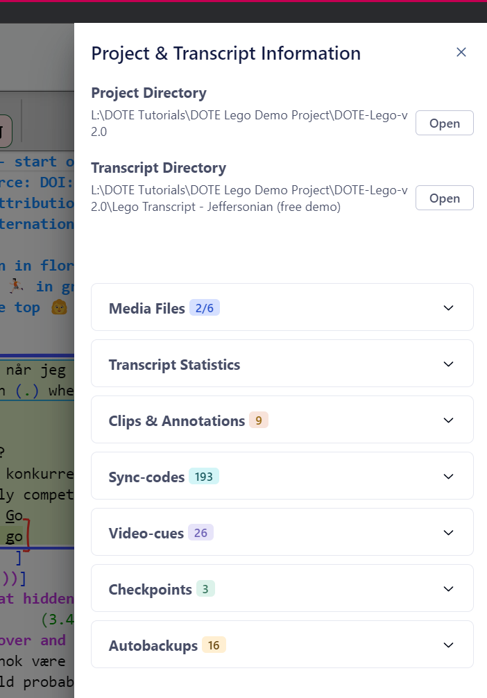
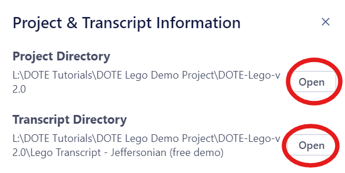
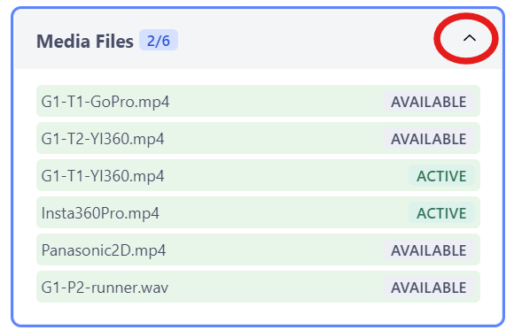
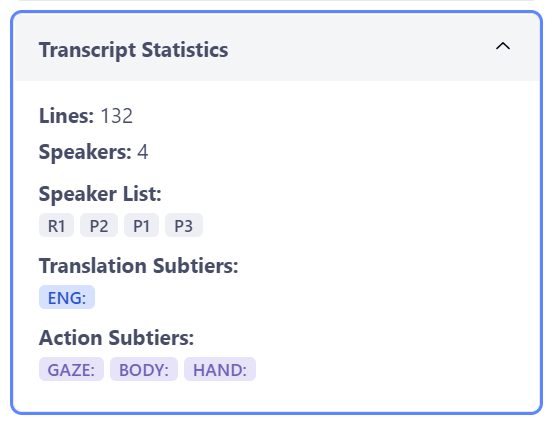
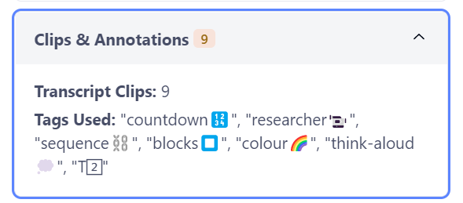
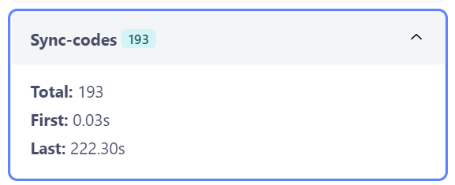
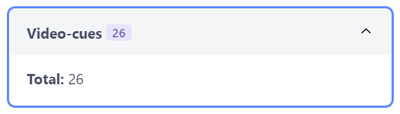
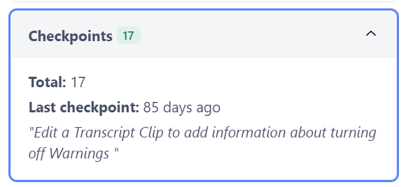
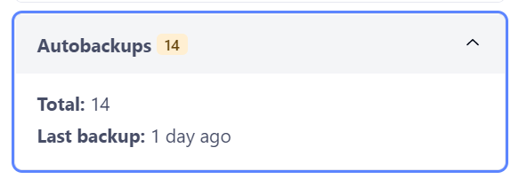

## What information can be found about a _DOTE_ Project?

### How to open and close the Project & Transcript Information panel

The panel opens when clicking the `Project Info`ℹ️ button at the top right of the _DOTE_ window.

The Project & Transcript Information panel assembles a range of helpful data about the currently open Project, including:

- Directory links
- Media Files
- Transcript Statistics
- Clips & Annotations
- Sync-codes
- Video-cues
- Checkpoints
- Autobackups

### Types of information

Basic quantitative information is shown in the heading of each category, eg. number of sync-codes.
Clicking the down arrow expands and the up arrow shrinks each information segment.

#### Opening Directories

Sometimes one needs to access the directory or folder in which the [Project](projects.md) or a Transcript is stored.
Click the `Open` button to do so in your file system.

#### Media Files

This segment displays the following information gathered from the currently open Project:

- All media files available in the Project - see [Media Manager](media-manager.md).
- Which media files are currently active in the current transcript.

#### Transcript Statistics

This segment displays the following information gathered from the currently open Transcript:

- How many lines in the current transcript.
- How many distinct speakers found in the current transcript.
- A list of those speakers using their speaker ids.
- A list of [subtiers](tiers.md) in the current transcript according to type.

#### Clips & Annotations

This segment displays the following information gathered from the currently open Transcript:

- The number of [transcript clips](transcript-clip.md) found in the current transcript.
- A list of all the tags used in the current transcript.

#### Sync-codes

This segment displays the following information gathered from the currently open Transcript:

- Total number of [sync-codes](sync-code.md) in the current transcript.
- The timestamp of the first sync-code.
- The timestamp of the last sync-code.

#### Video-cues

This segment displays the following information gathered from the currently open Project:

- The total number of [video-cues](cues.md) in the current transcript.

#### Checkpoints

This segment displays the following information gathered from the currently open Transcript:

- The total number of [checkpoints](versioncontrol.md) in the current transcript.
- The title and date/time of the last known checkpoint.

#### Autobackups

This segment displays the following information gathered from the currently open Transcript:

- The total number of [autobackups](versioncontrol.md) in the current transcript.
- The date/time of the last known autobackup.

