## How to use the Project Manager

Make sure that you understand the [concept and data structure of the Project and the Transcript](projects.md) before working with Projects and Transcripts in _DOTE_.

The `Project Manager` allows you to browse and load your _DOTE_ Projects and Transcripts across your file system on your local computer or an external device.
It also allows you to see basic [information](#info) about each Project and each Transcript that is found, eg. one can see a rough preview of a Transcript.
Moreover, Projects and Transcripts can be [renamed and deleted](#rename-delete).
They cannot, however, be moved around the file system: you will need to use a file explorer on your computer to do that.
What is crucial in that case is that the project folder and all files and subfolders are always kept together.
Do not separate them or try to edit them outside of _DOTE_.

[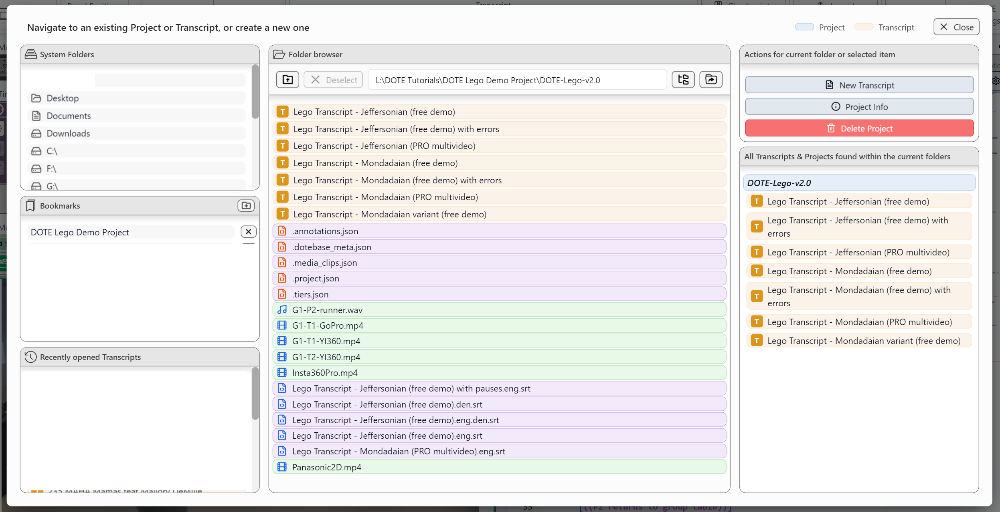](images/projects/project-manager.png)

### Open a Project 

To open an already existing Project, one must first [select and open a Transcript in a Project](#open-transcript).
Selecting `File ➔ Open Project` will open the `Project Manager` or click the button on the top bar.

[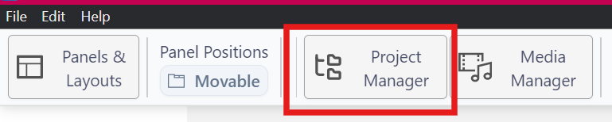](images/projects/button.png)

### Open a Transcript in a Project 

To open the last saved Transcript/Project in the next session, then just run _DOTE_.
It automatically loads the last opened Transcript if it is accessible on the file system.

To open a previously saved Transcript, then select `Open Transcript` or `File ➔ Open Transcript` or <kbd>CTRL</kbd>+<kbd>O</kbd> [or <kbd>⌘</kbd>+<kbd>O</kbd> on macOS] using the `Project Manager`.

To open a Transcript in a Project that is on a different drive or a mapped drive or volume, then you will need to select the drive letter in the `System Folders` panel of the `Project Manager` (see below).
That drive will be opened and you can locate the correct Project folder and Transcript.

### Navigation 

There are several ways to navigate your Projects and Transcripts in the `Project Manager`.
The panel has three vertical panes (see Figure):
- **Left/Top 1**: _System Folders_
    - Just select to open that folder or drive/volume in the middle pane.
    - The available Transcripts are shown in the right pane.

[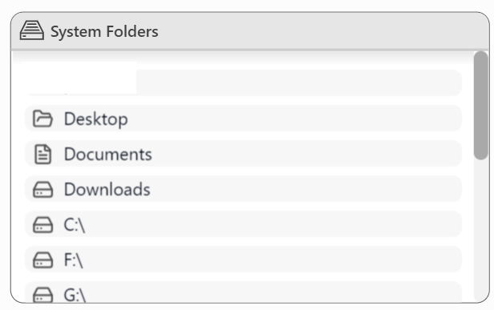](images/projects/system-folders.png)

- **Left/Centre 2**: _Bookmarks_
    - Just select a bookmark to open the bookmarked folder in the middle pane.
    - Bookmarks can be added and deleted using the icons `+` and `X`.
    - Selecting `+` adds the current folder open in the middle pane to the list.
    - A bookmarked entry can be moved up and down in the list by selecting an entry and then click and drag it to a new position in the list.

[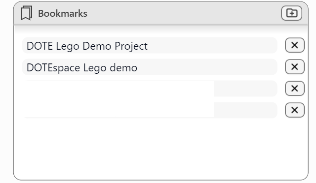](images/projects/bookmarks.png)

- **Left/Bottom 3**: The most recent Transcripts_
    - A list of the most recent Transcripts opened.
    - The recent Transcript names are highlighted on a brown background.
    - The number of recents listed can be changed in [Settings](settings.md).

[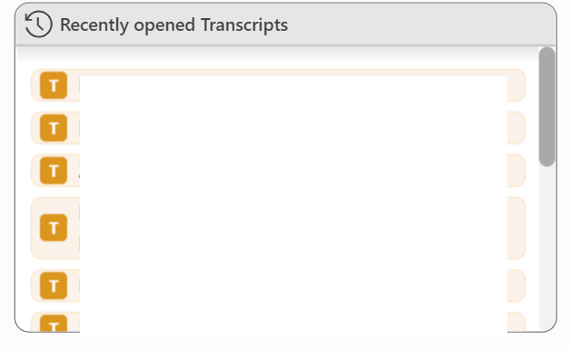](images/projects/recent.png)

- **Middle 4**: _Folder browser_
    - This is just like the standard file/folder explorer in Windows and macOS platforms.
    - Navigate up and down the folder hierarchy.
    - Possible actions based on the selected Project or Transcript are shown in the _Actions_ panel in the right pane.
    - Different types of files and folders are colour-coded:
       - Projects are blue (P icon)
       - Transcripts are brown (T icon)
       - Media files are green (blue film frame icon or blue musical note icon)
       - Metadata files are purple (red file icon or blue file icon)

[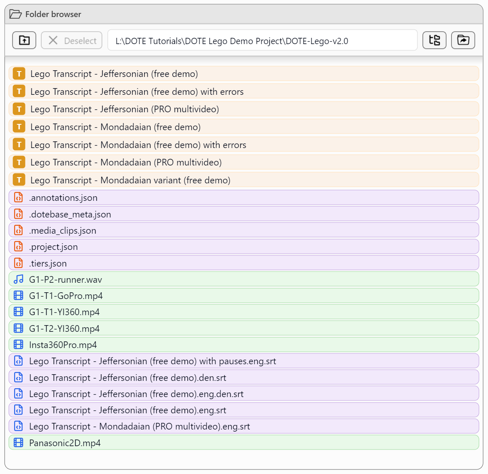](images/projects/folder-browser.png)

- **Right 5**: _All Transcripts within Projects below the selected folder_
    - A list of all known Projects and their Transcripts in all subfolders beneath the current folder open in the middle pane.
    - The Project names are in grey and the Transcript names are highlighted on a blue background.

[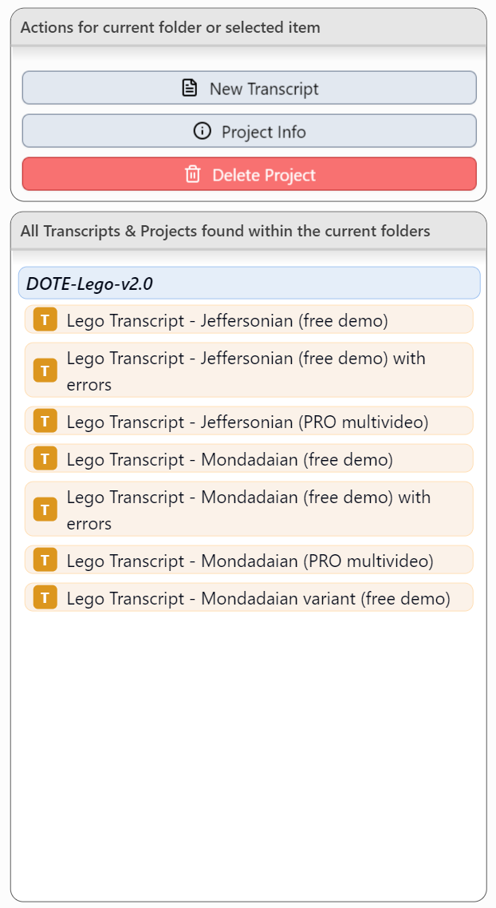](images/projects/actions.png)

Note that in some of the panes, recognised _DOTE_ Projects are highlighted with an orange background and recognised Transcripts (in Projects) are highlighted with a blue background.

[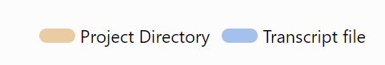](images/projects/highlight.png)

Clicking on a Transcript will open it in _DOTE_.

### Renaming and deleting Projects and Transcripts 

It is also possible to rename a Project or a Transcript in the `Project Manger`:
- Click the Transcript or Project listed in the _Folder Browser_.
- Click the Rename Project/Transcript button in the _Actions_.
- Note that you cannot rename a Project or a Transcript if it is currently loaded.
Load a different Project or Transcript, and return to the _Project Manager_.

[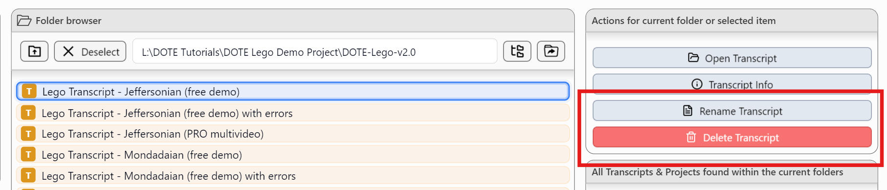](images/projects/rename-delete.png)

It is also possible to delete a Project or a Transcript in the `Project Manager`:
- Click the Transcript or Project listed in the _Folder Browser_.
- Click the Delete Project/Transcript button in the _Actions_.
- Confirm the deletion.
- The deleted file(s) will be placed in the Recycle Bin/Trash.
- Deleting the last or only Transcript in a Project will generate a blank Transcript in the same Project.
This is because a Project should always contain at least one Transcript (even if blank).
- Deleting a Project will also delete all Transcripts in that Project.
Be careful!

### Creating a new Project

Projects can be created directly in the Project Manager, in addition to the File Menu.

The option to create a project is only available when a folder is open that is _not_ already a _DOTE_ Project folder or contains a _DOTE_ Project in a subfolder.

### Project and Transcript Information 

Basic information can be found about each Project and Transcript listed in the folder browser before loading a Project/Transcript:

[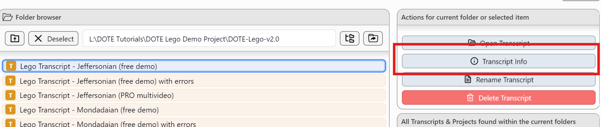](images/projects/info-button.png)

Project information includes:
- Creation date
- Last modified date
- List of Transcripts in the Project

[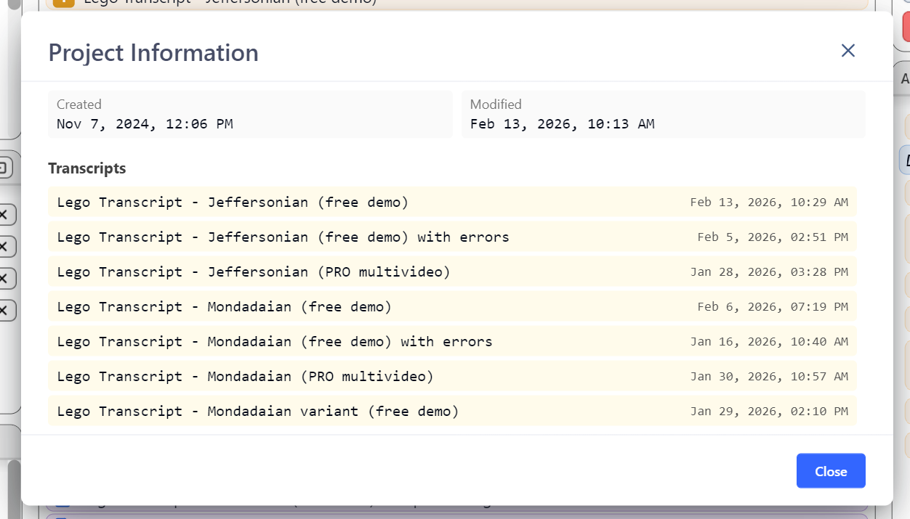](images/projects/info-project.png)

Transcript information includes:
- [Conventions](conventions.md) used
- Statistics
- Time range covered by [Sync-Codes](sync-code.md)
- Speaker list
- Transcript preview - rough, unformatted text of transcript

[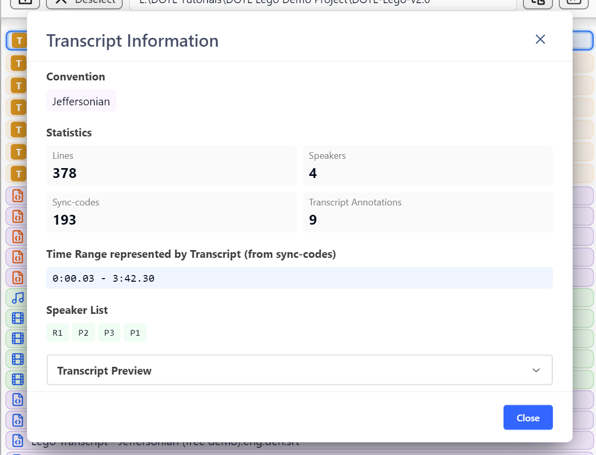](images/projects/info-transcript.png)

More detailed information can be found about Projects and their Transcripts in the [Project Info](project-info.md).

### Problems with orphan Transcripts and corrupted Transcripts 

[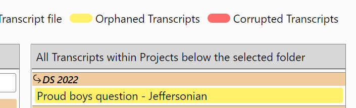](images/projects/orphan-transcript.png)

NOTE: If an orphan Transcript without a parent Project is discovered, then it will be highlighted in yellow.
_DOTE_ will not be able to open it until the transcript folder is reunited under its project folder.

NOTE: If a Transcript is corrupted, then it will be highlighted in red.

[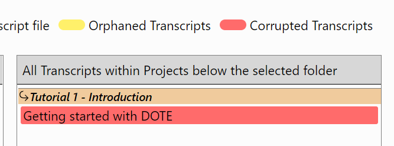](images/projects/corrupt-transcript.png)

This can happen for a variety of reasons, including a computer crash, lack of disk space, or accidental destruction of some of the files in the transcript folder.
_DOTE_ will offer to restore the Transcript to the last known autobackup.

In the rare case that there are no autobackups available, then _DOTE_ will restore as best it can from the files that are available in the transcript folder.

[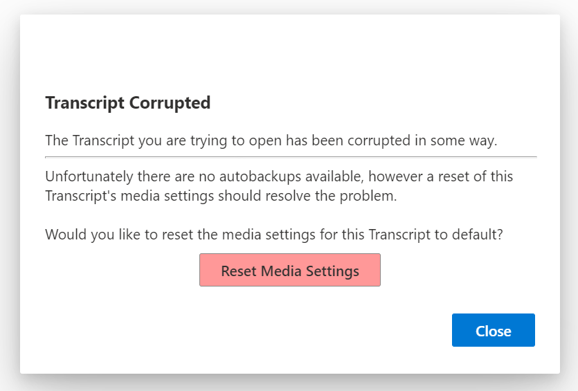](images/projects/corrupt-transcript-fix.png)

As a result, in this case, you may lose certain Media Player panel settings and the video-cues that may have been present in the original.
