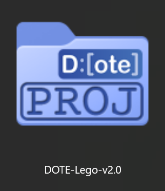
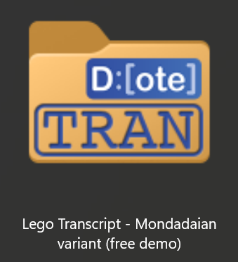
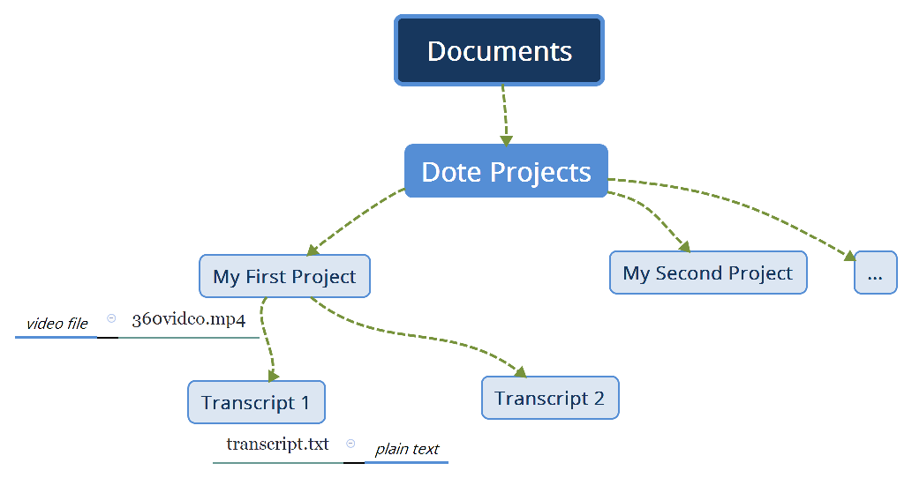
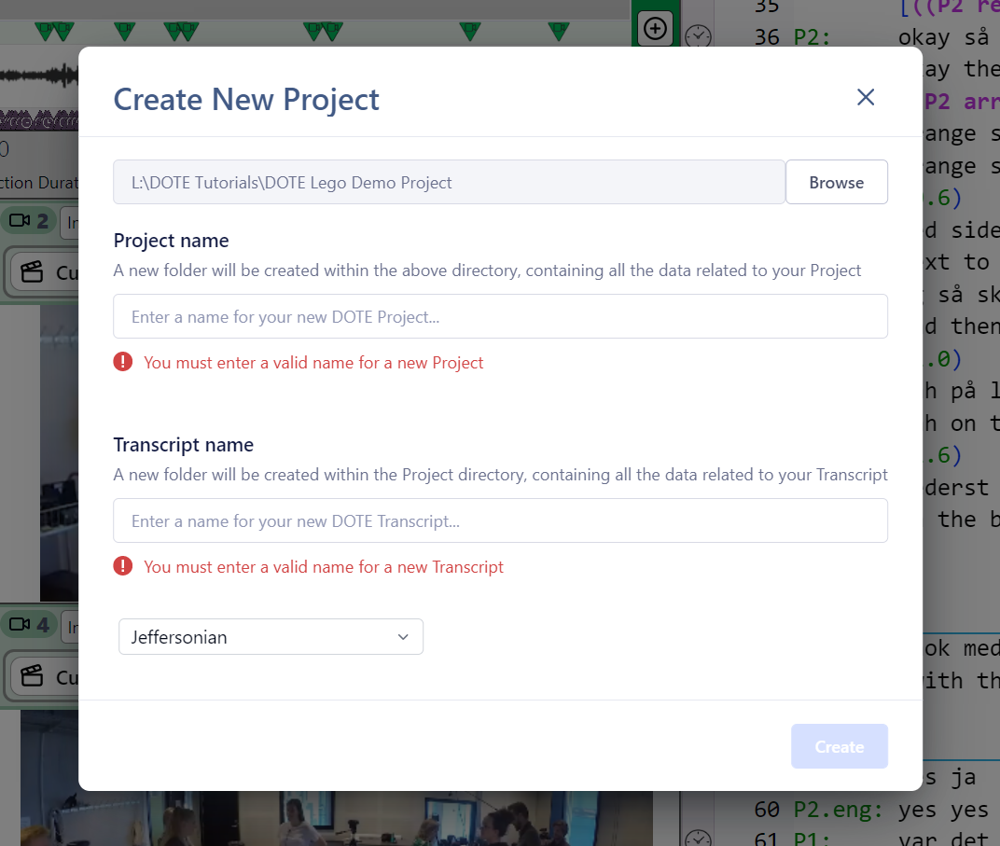
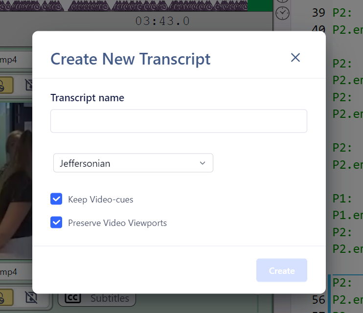
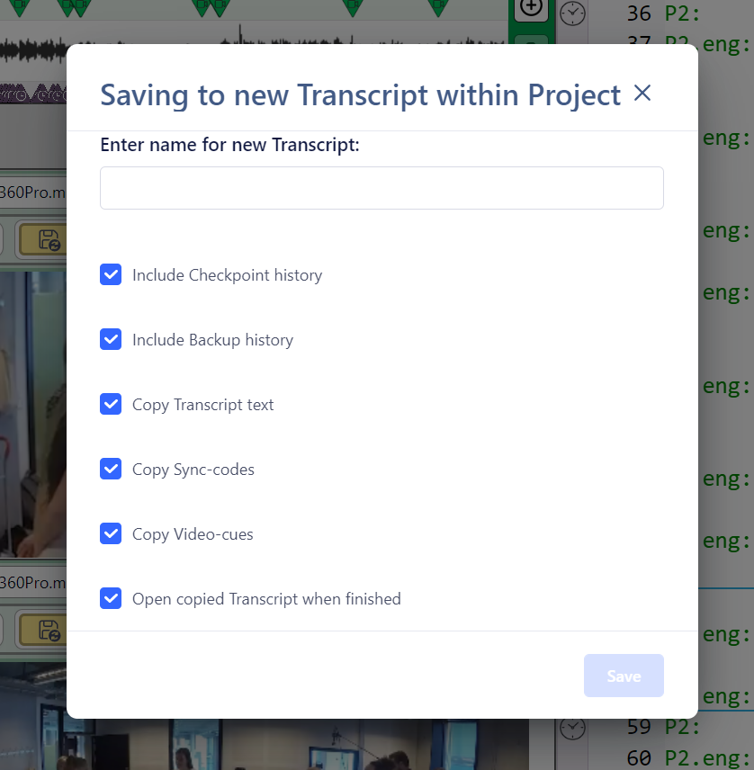
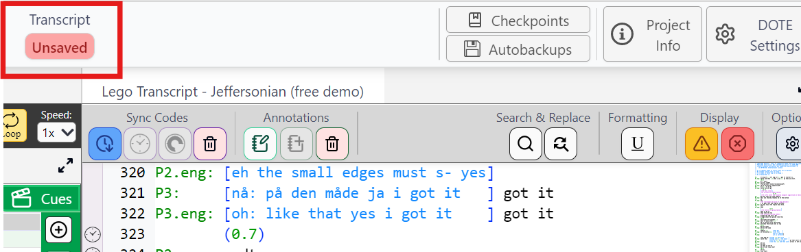

## What are _DOTE_ Projects?

Watch the [basic](https://www.youtube.com/watch?v=7oHE1KsIGTo) and [advanced](https://www.youtube.com/watch?v=GkjMwL6zqmM) video tutorials on YouTube.

First, the concept and data structures of the Project and the Transcript in _DOTE_ is explained.
Below that there is a help guide to:
- [Creating a new Project with an initial Transcript](#new-project)
- [Creating a new Transcript in the current Project](#new-transcript)
- [Duplicating the current Transcript](#duplicate)
- [Saving a Project/Transcript](#saving)

There is also a guide to the [Project Manager](project-manager.md).

### What is a _DOTE_ Project and Transcript?

A _DOTE_ Project is stored as a folder on your file system, which contains all the Transcripts for a specific event with its audio or video clips (media sources).
You can give this (Project) folder a unique and informative name.
Always keep this Project folder, files and subfolders together on your file system, otherwise _DOTE_ will not be able to recover older edited versions nor underlining, sync-codes and video-cues.
Each Transcript folder on your file system contains the plain `transcript.txt` file and other hidden files needed to support _DOTE_ for that specific Project:

- Each Transcript can be given a unique and informative name.
- Each Project is usually stored in a _DOTE_ Projects master folder.
- You can decide the name of this folder and where it is located on your file system.
- You can make multiple, independent Projects in this folder.
- One can also have multiple _DOTE_ Projects master folders, for example on different drives or removable media.
- Generally, Projects are colour-coded orange and Transcripts are blue.
- _DOTE_ can assign a special icon to the Project and Transcript folders on your file system.

Note that _DOTE_ is _not_ a cloud service.
It is a desktop application that stores data on your local computer's file system.
Thus, you can edit your Transcripts _without_ being online.
_DOTE_ does not save and store every keystroke on the cloud; the user must [save](projects.md#saving) their work frequently.
To ensure that users do not lose their work, [version control](versioncontrol.md) independently supports automatic and semantic backup.

### Folder structure 

For more experienced users, here is a hint about the [hidden folder structure](images/projects/folders.png) that _DOTE_ uses.

### Where to store your _DOTE_ projects? 

It is best to keep your _DOTE_ Project folders on a hard drive or an external hard drive, perferably an SSD for fast access.
You can store all your _DOTE_ Projects under a folder, eg. `MY _DOTE_ PROJECTS`, in `My Documents`.
Or you can store them in separate locations.
_DOTE_ projects are not dependent on their current location.
They can be moved, copied and shared.

You can use a shared folder provided that it is mapped to a drive letter, eg. on Windows, the path `//shareddrive/folder` could be mapped onto the `R:` drive letter.
Then in _DOTE_ you would create new Projects and open Transcripts that were stored on the `R:` drive, eg. in `R:/folder/`.
(If you use just the shared folder path, then _DOTE_ will fail to load the video and the transcript.)
With macOS and a shared drive, then you will have to assign the shared folder using the correct path and find it under `Volumes` in Finder.

> **NOTE: On Windows systems, the default path name length is quite short. This can cause problems for _DOTE_ and [Checkpoints](versioncontrol.md) if you use many embedded subfolders. You can change the default to long path names. There are [guides online](https://weblog.west-wind.com/posts/2022/Jan/03/Integrating-Long-Path-Names-in-Windows-NET-Applications), which you can follow.**

#### Not recommended storage solutions 

If you are synching the drive or folder in which _DOTE_ projects will be backed up and accessible over the Internet, then you may run into trouble.
Playing media, using checkpoints, working with lots of sync-codes or very long transcripts, and switching projects/transcripts may slow down _DOTE_.
This is because all the file operations and data transfers take more time over the internet, especially if you have a slow connection or a backup server.
There is nothing _DOTE_ can do about that, so if you have problems try and switch to a local drive that is not synced over the Internet.
Or else, be very patient and expect access problems! ⌛

For the same reason, we do NOT recommend using _icloud_ or _Dropbox_ because data will be stored in the cloud; _DOTE_ may have trouble locating files it needs or loading large files, or syncing lots of files may be too slow.
In addition, it is not a good idea to store sensitive videos and data (unencrypted) on a commercial cloud service since it will almost certainly be surveilled for unknown purposes by the company and third parties. Their bad! 👿

### How to create a new Project with an initial Transcript 

1. Open the Project creation panel by selecting `Create Project` or by clicking on `File ➔ New Project`.
An alternative is to create a new Project from the [Project Manager](project-manager.md).
2. Enter a unique name for your Project.
3. Enter a unique name for your first Transcript in this Project.
"Main" is the default suggestion.
1. Select the [conventions](conventions.md) you prefer.
You can change this in [Transcript Options](settings.md#options) later.
1. Click on `Select Folder` to select or create a parent folder where you want your _DOTE_ projects to be stored.
Once you create a Project, a new folder within the _DOTE_ Projects folder will be created with the name that you specified.
Otherwise, select an already created _DOTE_ Projects folder.
    - For example, if you named your Project "MyFirstProject" and chose `Documents/DoteProjects` for the parent folder, than your Project files will reside inside the folder `Documents/DoteProjects/MyFirstProject`.
1. Once this is done, add a media source to your Project using [Media Manager](media-manager.md).
2. After adding and selecting a media source and saving in Media Manager, a waveform will be generated (if it hasn't already been generated).
And if the media selected is a video, then it will appear in the [Media Player panel](media-panel.md).

Note: The path to the current Project folder on your computer's file system is displayed in [Transcript Options](settings.md#options).
Clicking on that path will open it in your file browser.

Note: It is not permitted to create _nested_ Projects, ie. one cannot create a new Project inside another Project.
If we allowed this, then chaos would ensue with regard to [version control](versioncontrol.md) and [media file storage](media-manager.md).

> **NOTE: Creating a waveform when a media file is first imported or the waveform is regenerated can take time. This could take more than 5 seconds. Progress is visible as the waveform appears gradually from left to right in the timeline.**

### Waveform troubles 

> **NOTE: If _DOTE_ fails to display a video or generate a visual waveform, then try transcoding the audio or video file to a more common MP4 or WAV format, such as for YouTube or Vimeo.
> See the [Tips & Tricks](tips.md) for instructions how to do that using _HandBrake_, for example.
> After you have exported a transcoded video, then import it into the same project or create a new project.
> If you give it the same name, then select `Regenerate Waveform` in the [Media Manager](media-manager.md).
> If you return to the main editor after selecting this option, then you will see the transcript being regenerated.
> If that fails, however, then create a new project and try to import it again.

### Create a new Transcript in the current Project 

1. To create a new Transcript in the _current_ Project that is open, with the same media sources available, then click on `File ➔ New Transcript`.
Each project can host multiple transcripts of the same video clip(s) added with [Media Manager](media-manager.md).
1. Give the Transcript a name.
1. Select the [conventions](conventions.md) you prefer.
You can change this in [Transcript Options](settings.md#options) later.
1. Choose the following options:
   - Keep Video-cues - it is useful to reuse any video-cues that are already tracked in the currently open Transcript.
   - Preserve Video Viewports - this preserves any saved viewports in any Media Player panels.
2. Click `Create`.

### Duplicate the current Transcript 

Another possibility is to repurpose the current Transcript using the `Save As New Transcript` on the `File` menu.
A new Transcript in the current Project will be created from the Transcript that is currently loaded.

1. Open the Transcript that you wish to duplicate.
2. Select `Save As New Transcript` on the `File` menu.
3. Type a unique name for your new Transcript (in the current Project), unless you wish to overwrite an already existing one.
4. Select the options that fit your purpose:
   - "Include Checkpoint history" - You have the option to include/exclude your Checkpoint history in the new Transcript.
   - "Include Backup history" - You can exclude the Backup history if you wish in the new Transcript.
   - "Copy Transcript text" - You don't have to include the body of the Transcript in the new Transcript.
   - "Copy Sync-codes" - This is useful to toggle on if you wish to work with the same sync-codes in the new Transcript.
   - "Copy Video-cues" - This is useful to toggle on if you wish to keep the same active media and video-cues in the new Transcript.
   - "Open copied Transcript when completed" - Toggle off if you don't want to immediately open the new Transcript.

Select `Save` and the new Transcript will be quickly created (and opened).
The original Transcript will still be listed in the list of Transcripts in the current Project.
It can be edited independently of the new, forked Transcript that has its own life.
This is useful for using an already developed Transcript as the origin of a shell (don't copy Transcript text) or spin-off version, while drawing on the same set of Sync-codes (copy sync-codes) and/or Video-cues (copy video-cues).

### Save a Project 

Projects are saved when a [Transcript in a Project is saved](#saving).
Project settings are saved automatically when changes are made.

When there are changes made to the text in the Transcript in the [Editor](transcript.md) or to [Sync-codes](sync-code.md) in the Editor or [Timeline](timeline.md), then a warning is flagged in the top ribbon that the Transcript is `Unsaved`.
This will disappear when the Project/Transcript is manually saved.

### Save a Transcript in a Project

To save the current Transcript, then select `File ➔ Save Transcript` or <kbd>CTRL</kbd>+<kbd>S</kbd> [or <kbd>⌘</kbd>+<kbd>S</kbd> on macOS.

- Saving is _not_ the same as [Autobackup](versioncontrol.md#autobackup).
Saving the current Transcript writes the Transcript data to disk, while Autobackup makes a new copy and writes that to disk so the previous state can be recovered.
Autobackup does _not_ save the current Transcript automatically; that is a manual decision by the user.
It just makes a series of backup copies at regular intervals.

That's it! You are ready to start [transcribing](transcript.md).
