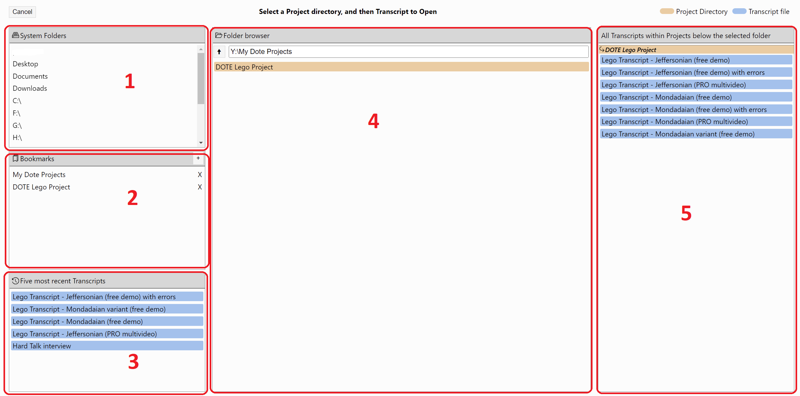

## What are _DOTE_ Projects?

A _DOTE_ Project is a folder containing all the Transcripts for a specific audio or video clip (media source).
You can give this folder a unique and informative name.
Always keep this Project folder, files and subfolders together, otherwise _DOTE_ will not be able to recover older edited versions nor underlining, sync-codes and video-cues.
Each transcript folder contains the plain `transcript.txt` file and other hidden files needed to support _DOTE_ for that specific Project.
Each transcript can be given a unique and informative name.
Each project is stored in a _DOTE_ Projects master folder.
You can decide the name of this folder and where it is located on your operating system.
You can make multiple, independent Projects in this folder.
One can also have multiple _DOTE_ Projects master folders, for example on different drives or removable media.

Note that _DOTE_ is _not_ a cloud service.
It is a desktop application that stores data on your local computer's file system.
Thus, you can edit your Transcripts _without_ being online.
_DOTE_ does not save and store every keystroke on the cloud; the user must [save](projects.md#saving) their work frequently.
To ensure that users do not lose their work, [version control](versioncontrol.md) independently supports automatic and semantic backup.

### Folder structure 

For more experienced users, here is a hint about the [hidden folder structure](images/projects/folders.png) that _DOTE_ uses.

### Where to store your _DOTE_ projects? 

It is best to keep your _DOTE_ Project folders on a hard drive or an external hard drive, perferably an SSD for fast access.
You can store all your _DOTE_ Projects under a folder, eg. `MY _DOTE_ PROJECTS`, in `My Documents`.
Or you can store them in separate locations.
_DOTE_ projects are not dependent on their current location.
They can be moved, copied and shared.

You can use a shared folder provided that it is mapped to a drive letter, eg. on Windows, the path `//shareddrive/folder` could be mapped onto the `R:` drive letter.
Then in _DOTE_ you would create new Projects and open Transcripts that were stored on the `R:` drive, eg. in `R:/folder/`.
(If you use just the shared folder path, then _DOTE_ will fail to load the video and the transcript.)
With macOS and a shared drive, then you will have to assign the shared folder using the correct path and find it under `Volumes` in Finder.

> **NOTE: On Windows systems, the default path name length is quite short. This can cause problems for _DOTE_ and [Checkpoints](versioncontrol.md) if you use many embedded subfolders. You can change the default to long path names. There are [guides online](https://weblog.west-wind.com/posts/2022/Jan/03/Integrating-Long-Path-Names-in-Windows-NET-Applications), which you can follow.**

#### Not recommended storage solutions 

If you are synching the drive or folder in which _DOTE_ projects will be backed up and accessible over the Internet, then you may run into trouble.
Playing media, using checkpoints, working with lots of sync-codes or very long transcripts, and switching projects/transcripts may slow down _DOTE_.
This is because all the file operations and data transfers take more time over the internet, especially if you have a slow connection or a backup server.
There is nothing _DOTE_ can do about that, so if you have problems try and switch to a local drive that is not synced over the Internet.
Or else, be very patient and expect access problems! ⌛

For the same reason, we do NOT recommend using _icloud_ or _Dropbox_ because data will be stored in the cloud; _DOTE_ may have trouble locating files it needs or loading large files, or syncing lots of files may be too slow.
In addition, it is not a good idea to store sensitive videos and data (unencrypted) on a commercial cloud service since it will almost certainly be surveilled for unknown purposes by the company and third parties. Their bad! 👿

### Quick start to create a new Project with an initial Transcript 

1. Open the Project creation panel by selecting `Create Project` or by clicking on `File ➔ New Project`.
1. Enter a unique name for your Project.
1. Enter a unique name for your first Transcript in this Project.
"Main" is the default suggestion.
1. Select the [conventions](conventions.md) you prefer.
You can change this in [Transcript Options](settings.md#options) later.
1. Click on `Select Folder` to select or create a parent folder where you want your _DOTE_ projects to be stored.
Once you create a Project, a new folder within the _DOTE_ Projects folder will be created with the name that you specified.
Otherwise, select an already created _DOTE_ Projects folder.
    - For example, if you named your Project "MyFirstProject" and chose `Documents/DoteProjects` for the parent folder, than your Project files will reside inside the folder `Documents/DoteProjects/MyFirstProject`.
1. Once this is done, add a media source to your Project using [Media Manager](media.md).
1. After adding and selecting a media source and saving in Media Manager, a waveform will be generated (if it hasn't already been generated).
And if the media selected is a video, then it will appear in the [video panel](video.md).

Note: The path to the current Project folder on your computer's file system is displayed in [Transcript Options](settings.md#options).
Clicking on that path will open it in your file browser.

Note: It is not permitted to create _nested_ Projects, ie. one cannot create a new Project inside another Project.
If we allowed this, then chaos would ensue with regard to [version control](versioncontrol.md) and [media file storage](media.md).

> **NOTE: Creating a waveform when a media file is first imported or the waveform is regenerated can take time. This could take more than 5 seconds. Progress is visible as the waveform appears gradually from left to right in the timeline.**

> **NOTE: If _DOTE_ fails to display a video or generate a visual waveform, then try transcoding the audio or video file to a more common MP4 or WAV format, such as for YouTube or Vimeo.
> See the [Tips & Tricks](tips.md) for instructions how to do that using _HandBrake_, for example.
> After you have exported a transcoded video, then import it into the same project or create a new project.
> If you give it the same name, then select `Regenerate Waveform` in the [Media Manager](media.md).
> If you return to the main editor after selecting this option, then you will see the transcript being regenerated.
> If that fails, however, then create a new project and try to import it again.
> Or see the [Installation guide](install.md#ffmpeg) for an alternative solution using _FFmpeg_ that will generate a waveform for a wider range of audio and video formats.**

## Open a Project 

To open an already existing Project, one must first [select and open a Transcript in a Project](#open-transcript).
Selecting `File ➔ Open Project`, will open the Transcript/Project browser panel.

## Save a Project

Projects are saved when a [Transcript in a Project is saved](#saving).
Project settings are saved automatically when changes are made.

## Save a Transcript in a Project 

1. To save the current Transcript, then select `File ➔ Save Transcript` or <kbd>CTRL</kbd>+<kbd>S</kbd> [or <kbd>⌘</kbd>+<kbd>S</kbd> on macOS.
Saving is _not_ the same as [Autobackup](versioncontrol.md#autobackup).
Saving the current Transcript writes the Transcript data to disk, while Autobackup makes a new copy and writes that to disk so the previous state can be recovered.
Autobackup does _not_ save the current Transcript automatically; that is a manual decision by the user.
It just makes a series of backup copies at regular intervals.

### Open a Transcript in a Project 

To open the last saved Transcript/Project, then just run _DOTE_.
It automatically loads the last opened Transcript if it is accessible on the file system.

To open a previously saved Transcript, then select `Open Transcript` or `File ➔ Open Transcript` or <kbd>CTRL</kbd>+<kbd>O</kbd> [or <kbd>⌘</kbd>+<kbd>O</kbd> on macOS].

To open a Transcript in a Project that is on a different drive or a mapped drive or volume, then you will need to select the drive letter in the `System Folders` panel of the `Open Transcript` panel (see below).
That drive will be opened and you can locate the correct Project folder and Transcript.

There are several ways to navigate your Projects and Transcripts in the `Open Transcript` panel.
The panel has three vertical panes (see Figure):
- **Left/Top 1**: _System Folders_
    - Just select to open that folder or drive/volume in the middle pane.
    - The available Transcripts are shown in the right pane.
- **Left/Centre 2**: _Bookmarks_
    - Just select a bookmark to open the bookmarked folder in the middle pane.
    - Bookmarks can be added and deleted using the icons `+` and `X`.
    - Selecting `+` adds the current folder open in the middle pane to the list.
    - A bookmarked entry can be moved up and down in the list by selecting an entry and then click and drag it to a new position in the list.
- **Left/Bottom 3**: _Five most recent Transcripts_
    - A list of the 5 most recent Transcripts opened.
    - The recent Transcript names are highlighted on a blue background.
- **Middle 4**: _Folder browser_
    - This is just like the standard file/folder explorer in Windows and macOS platforms.
    - Navigate up and down the folder hierarchy.
    - Results are shown in the panel in the right pane.
- **Right 5**: _All Transcripts within Projects below the selected folder_
    - A list of all known Projects and their Transcripts in all subfolders beneath the current folder open in the middle pane.
    - The Project names are in grey and the Transcript names are highlighted on a blue background.

Note that in some of the panes, recognised _DOTE_ Projects are highlighted in green and recognised Transcripts (in Projects) are highlighted with a blue background.

Clicking on a Transcript will open it in _DOTE_.

##### Renaming and deleting Projects and Transcripts 

It is also possible to rename a project or a Transcript in the `Open Transcript` panel:
- Click the rename icon next to the Transcript or Project listed in the middle panel (_Folder Browser_).
- Choose a new name and confirm.

It is also possible to delete a project or a Transcript in the `Open Transcript` panel:
- Click the delete icon next to the Transcript or Project listed in the middle panel (_Folder Browser_).
- Confirm the deletion.
- The deleted file(s) will be placed in the Recycle Bin/Trash.
- Deleting the last or only Transcript in a Project will generate a blank Transcript in the same Project.
This is because a Project should always contain at least one Transcript (even if blank).
- Deleting a Project will also delete all Transcripts in that Project.
Be careful!

#### Problems with orphan Transcripts and corrupted Transcripts 

NOTE: If an orphan Transcript without a parent Project is discovered, then it will be highlighted in yellow.
_DOTE_ will not be able to open it until the transcript folder is reunited under its project folder.

NOTE: If a Transcript is corrupted, then it will be highlighted in red.

This can happen for a variety of reasons, including a computer crash, lack of disk space, or accidental destruction of some of the files in the transcript folder.
_DOTE_ will offer to restore the Transcript to the last known autobackup.

In the rare case that there are no autobackups available, then _DOTE_ will restore as best it can from the files that are available in the transcript folder.

As a result, in this case, you may lose certain video panel settings and the video-cues that may have been present in the original.

### Create a new Transcript in the current Project 

1. To create a new Transcript in the _current_ Project that is open, with the same media sources available, then click on `File ➔ New Transcript`.
Each project can host multiple transcripts of the same video clip(s) added with [Media Manager](media.md).
1. Give the Transcript a name.
1. Select the [conventions](conventions.md) you prefer.
You can change this in [Transcript Options](settings.md#options) later.
1. Click `Create`.

### Duplicate the current Transcript 

Another possibility is to repurpose the current Transcript using the `Save As New Transcript` on the `File` menu.
A new Transcript in the current Project will be created from the current Transcript.

1. Open the Transcript that you wish to duplicate.
2. Select `Save As New Transcript` on the `File` menu.
3. Type a unique name for your new Transcript (in the current Project), unless you wish to overwrite an already existing one.
4. Select the options that fit your purpose:
   - "Include Checkpoint history" - You have the option to include/exclude your Checkpoint history in the new Transcript.
   - "Include Backup history" - You can exclude the Backup history if you wish in the new Transcript.
   - "Copy Transcript text" - You don't have to include the body of the Transcript in the new Transcript.
   - "Copy Sync-codes" - This is useful to toggle on if you wish to work with the same sync-codes in the new Transcript.
   - "Copy Video-cues" - This is useful to toggle on if you wish to keep the same active media and video-cues in the new Transcript.
   - "Open copied Transcript when completed" - Toggle off if you don't want to immediately open the new Transcript.

Select `Overwrite/Save` and the new Transcript will be quickly created (and opened).

That's it! You are ready to start [transcribing](transcript.md).
