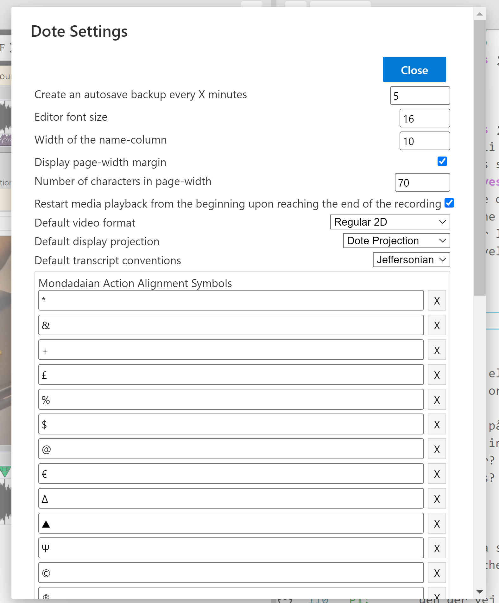
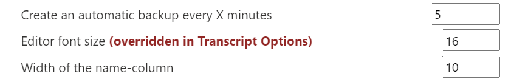
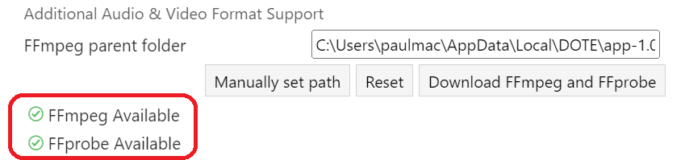
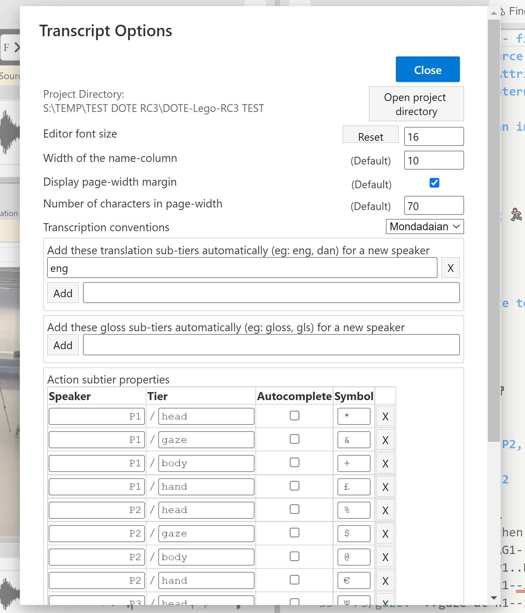
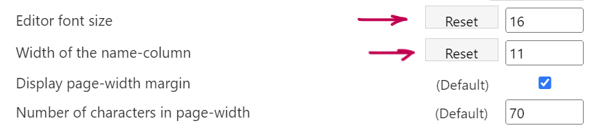

## Settings and Transcript Options

There are two main ways to change settings for the use of _DOTE_ in general and for the current Transcript.

Note that all changes to settings and options are done immediately and cannot be undone using a shortcut or by cancelling.

### Settings

`Settings` can be opened from the `File` menu, eg. `File ➔ Settings`.

There are several different types of settings that affect the operation of _DOTE_:

- Version control
- Editor
- Video
- Conventions
- Subtier
- Shortcuts
- External software

Some of these settings can be overridden in the current [Transcript Options](#options).
If so, then this is indicated in the `Settings`.

Some of the settings are only changed when the Settings dialog box is closed.

##### Version control

- [Autobackup](versioncontrol.md#autobackup) time interval default.

##### Editor

- Font size default.
- Width of name column default.
- Display page-width margin default.

##### Video

- Option to automatically restart media playback from the beginning when the end of the recording is reached.
- The default [video format](media.md#add).
- The default display projection for 360 videos.

##### Conventions

- The default [conventions](conventions.md) for every new Transcript.

##### Subtier

- The default [subtier alignment symbols](tiers.md#assign) can be defined and ordered by the user.
The default list includes some of the most commonly used symbols in the Mondadaian system.
Note that this list can be rearranged by selecting, dragging and dropping an item in the list.

##### Shortcuts

- A number of common [shortcuts](commands.md) can be redefined by the user.

##### Jump intervals

- The user can redefine the jump intervals for short jump forward/back and long jump forward/back.
The defaults are 1 second for the short jump and 4 seconds for the long.
The jumps can be activated using the [playback buttons or the playback shortcuts](play.md).
- Additionally, the user can define a universal frame rate (fps) that determines what happens when using the one frame forward/back buttons or shortcuts.
The default is 30fps.
If the video being played is encoded with a different frame rate than in Settings, then frame forward/back may either jump more than one frame or no frame occasionally.

##### External software

- Optional folder path to installed _FFmpeg_ software for waveform generation.
_DOTE_ does its best internally to create a waveform for every media file added with [Media Manager](media.md).
If this is not working for you, then you can automatically [install _FFmpeg_](install.md#ffmpeg) on your computer and link the file path to _DOTE_.
We cannot include the open source software package inside _DOTE_ because of software licensing restrictions.

### Transcript Options 

`Transcript Options` can be opened from the `Project` menu, eg. `Project ➔ Transcript Options`, or by clicking the `Options ⚙` button at the top left of the [Transcript Editor](editor.md).

There are several different types of options that affect how the Editor works.
Some of these are inherited from `Settings` and can be overridden on a transcript by transcript basis.
They can be "reset" to the Default if they vary from that in `Settings`.

Many of these options are only changed when the Transcript Options dialog box is closed.

- The path to the Project folder on your computer's file system is displayed.
Click the button and the folder will be opened in your file browser.
- Font size for the current Transcript in the [Editor](ui.md).
- Width of name column for the current Transcript in the Editor.
- Display page-width margin for the current Transcript in the Editor.
- The [conventions](conventions.md) used for this Transcript.
- The [translation and gloss subtiers](tiers.md) for this Transcript.
One or more than one of each can be added.
If such a subtier is added, then it will also be autocompleted after typing and autocompleting a new speaker in the Transcript Editor.
- The [named subtier types](tiers.md) for this Transcript.
Note that this list can be rearranged by selecting, dragging and dropping an item in the list.
It is up to the user to indicate whether or not each subtier will also be autocompleted after typing and autocompleting a new speaker in the Transcript Editor.

Note: Because some options are tracked by _DOTE_, they may be reset to a prior state if the user resets to an earlier Checkpoint or Autobackup.
For example, [named subtier types](tiers.md) may be altered because they were in a different state in an earlier version of the Transcript.
This is necessary because they need to match the prior state of the Transcript and its subtiers in order to preserve history.
