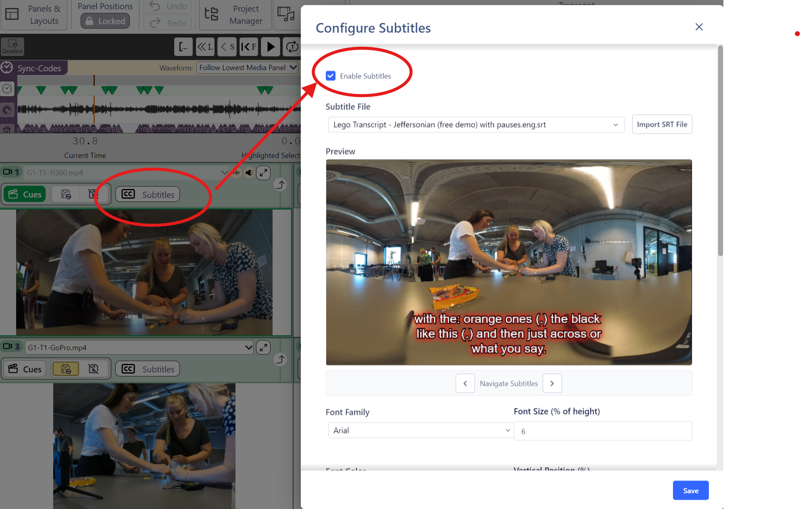

## Embedding subtitles in video playback in a Media Player Panel

A brand new feature in v2.0 is the ability to embed subtitles live in a Media Player Panel while playing the video.

### Using an already generated SRT file

This feature works by attaching a specific subtitle file, which has already been generated and matches the Project, to a specific Media Player.
With multiple Media Player Panels open, one can attach independent subtitles to each Media Player Panel, so that it is possible to have English in one, the native language in another, and comments in a third.

First one has to generate an SRT file.
Luckily, that is possible in _DOTE_ by [exporting your _DOTE_ transcript to SRT](exportSRT.md), provided the transcript does not have any major errors.

Give the generated SRT file a useful name.
Given that it is frozen image of the transcript when the export took place, it is recommended to add a useful name plus a date- and timestamp, eg. `subtitles-Lego Demo Transcript (Jeffersonian)-3.3.2026-12:45`
We use such examples in the [Lego Demo Project](demo.md) that you can try out.
They are stored in the Project folder that is created when you import the Demo Project.

It is best to store the generated subtitle file in the [Project](projects.md) folder, but you can store it anywhere as long as it is always available to _DOTE_ during playback.

### Loading an SRT file for use in a Media Player Panel

Subtitles contained in the plain text SRT file can be loaded into any Media Player panel.
They are specific to that Media Player.
These are the steps to load an SRT file.

1. Select a Media Player panel.
1. Click on the subtitles button at the top of the panel.
1. Click on `Enable Subtitles` in the dialog box that opens.
1. Click on `Import SRT file` and search for and select an SRT (`.srt`) file to import.
1. A preview should appear in the video window.
1. You can navigate the subtitles by clicking on the `<` or `>` buttons underneath the video preview.
1. Change the options as appropriate (see below).
1. Click on the Save button.

### Options for viewing subtitles

There are several options that one can tweak to find the best presentation:

- Font Family - select an appropriate serif or non serif font
- Font Size - select an appropriate font size
- Font Color - select an appropriate fill color for the characters
- Vertical Position (%) - adjust the vertical position in the Media Player panel
- Show Text Outline - add an outline for readability on all backgrounds
  - Outline Color - select an appropriate outline color
  - Outline Width (% of height) - adjust the width of the outline to make the characters pop
- Show Text Glow - add a glow to the text
  - Glow Color - select an appropriate glow color
  - Glow Blur (% of height) - adjust the width of the glow to make the characters pop
- Display Timing - for very brief subtitles, you can enforce that they remain on screen for a minimum period
- Allow subtitle overlap/stacking - allow subtitles with a dense timing to appear simultaneously

### Plans for generating live subtitles

We plan to allow DOTE to generate subtitles live for a specific transcript, so that every time a video is played subtitles will be displayed that draw upon the current state of the transcript, ie. edits will show up immediately in a Media Player panel during playback.
This functionality is not yet available.
