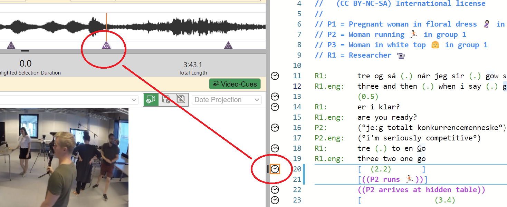
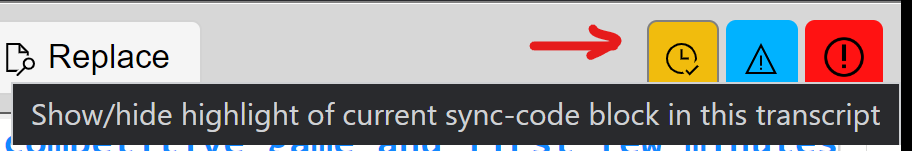

## Sync-codes

A _sync-code_ is a bookmark at a specific timestamp (or timecode) in the [timeline](timeline.md) that can be associated with a specific line in the [transcript](transcript.md).
Once sync-codes are manually added, this allows a user to quickly locate and playback specific lines in the transcript.

### Entering and modifying sync-codes

1. Play the video and pause at the point to be sync-coded.
Enter a sync-code by clicking on the clock that appears when you move the mouse cursor over the space before the line number on the line desired in the transcript panel.
Sync-codes can be added using the shortcut <kbd>CTRL</kbd>+<kbd>M</kbd> or <kbd>⌘</kbd>+<kbd>M</kbd> on the current line.
1. You can drag the sync-code in the transcript editor to a new line between adjacent sync-codes.
1. You can drag the sync-code in the timeline to a new position (timecode) between adjacent sync-codes.
1. A selected sync-code can be nudged on the timeline by a small increment using the shortcuts <kbd>CTRL</kbd>+<kbd>H</kbd> or <kbd>⌘</kbd>+<kbd>H</kbd> for a backwards nudge and <kbd>CTRL</kbd>+<kbd>L</kbd> or <kbd>⌘</kbd>+<kbd>L</kbd> for a forwards nudge.
1. Sync-codes can be deleted.
Select the sync-code, right click, and choose delete.

### Turning on CS Mode to synchronise the Transcript with the Media during playback 

Unless `CS Mode` (show highlight of current sync-code block) is turned on, the Transcript will not automatically synchronise with the timeline during playback.
You can turn on `CS Mode`  mode by clicking the button at the top right of the Editor to enable the current [sync-code](sync-code.md) block to be highlighted as you play the media.

### Notes

- If you delete whole lines that have sync-codes attached, then those sync-codes will also be deleted.
- Please note that edits to sync-codes are not tracked by the user interface in _DOTE_.
For instance, if you move a sync-code to a different line or to another position on the timeline, then you cannot undo those actions with the standard shortcuts.
However, sync-codes are tracked by Checkpoints and Autosaves, so if you revert to an earlier Checkpoint or Autosave, then the sync-codes will be restored as well.
- Also note that copying a line in the editor which has a sync-code and pasting the line does not copy the sync-code to the new location.
