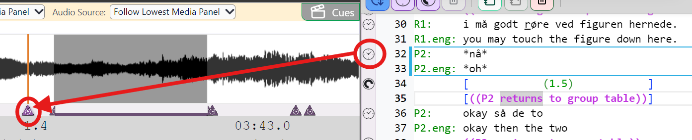
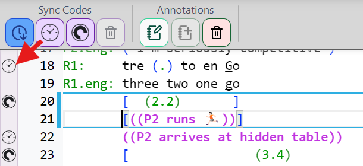
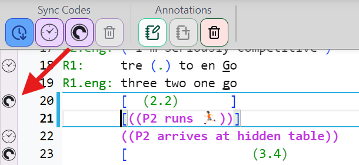
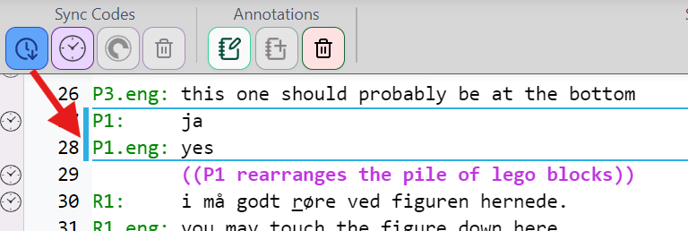

## Sync-codes

Watch [basic](https://www.youtube.com/watch?v=PLUGMdFsbu4) and [advanced](https://www.youtube.com/watch?v=kQK1JImIn9w) video tutorials on YouTube.

A _sync-code_ is a bookmark at a specific timestamp (or timecode) in the [timeline](timeline.md) that can be associated with a specific line in the [transcript](transcript.md).
Once sync-codes are manually added, this allows a user to quickly locate and playback specific lines in the transcript.

### Entering and modifying sync-codes

With v2.0, two types of sync-codes can be added to synchronise lines of the transcript to the chronological timeline: punctual and ranged sync-codes.

#### Punctual sync-codes

This type of sync-code synchronises a line to one timestamp.
It has no duration.
A punctual sync-code is indicated on the Timeline by a purple triangle (see above image).

1. Play the video and pause at the point to be sync-coded.
Enter a punctual sync-code by clicking on the clock that appears when you move the mouse cursor over the space before the line number on the line desired in the transcript panel.
Sync-codes can be added using the shortcut <kbd>CTRL</kbd>+<kbd>M</kbd> or <kbd>⌘</kbd>+<kbd>M</kbd> on the current line.
1. You can drag the sync-code in the transcript editor to a new line between adjacent sync-codes.
2. You can drag the sync-code in the timeline to a new position (timecode) between adjacent sync-codes.
3. A selected sync-code can be nudged on the timeline by a small increment using the shortcuts <kbd>CTRL</kbd>+<kbd>H</kbd> or <kbd>⌘</kbd>+<kbd>H</kbd> for a backwards nudge and <kbd>CTRL</kbd>+<kbd>L</kbd> or <kbd>⌘</kbd>+<kbd>L</kbd> for a forwards nudge.
4. Sync-codes can be deleted.
Select the sync-code, right click, and choose delete.
Or select the line which the sync-code links.
Press the delete sync-code button at the top left of the Transcript Editor or the left side of the Timeline (in purple).

#### Ranged sync-codes

This type of sync-code synchronises a line to start at one timestamp and end at another.
It has duration.
A ranged sync-code synchronises a line to a time segment with duration, ie. it has a start and an end point.
It is indicated in the Editor and the Timeline by a special icon (not a clock).
It shows the duration with a purple line between two anchor points at the bottom of the Timeline (if sync-code mode is toggled on).

1. Play the video and pause at the point to start the ranged sync-code.
2. Press <kbd>SHIFT</kbd> and drag along the Timeline to create a selection.
3. Click on a line in the Transcript Editor that is to be synced.
4. Enter a ranged sync-code by clicking on the ranged sync-code button at the top left of the Transcript Editor or the left of the Timeline panel.
Sync-codes can be added using the shortcut <kbd>CTRL</kbd>+<kbd>SHIFT</kbd>+<kbd>M</kbd> or <kbd>⌘</kbd>+<kbd>SHIFT</kbd>+<kbd>M</kbd> on the current line.
1. You can drag each ranged sync-code in the transcript editor to a new line between adjacent sync-codes.
2. You can drag each end of the ranged sync-code in the timeline to a new position (timecode) between adjacent sync-codes.
3. A selected ranged sync-code can be nudged on the timeline by a small increment using the shortcuts <kbd>CTRL</kbd>+<kbd>H</kbd> or <kbd>⌘</kbd>+<kbd>H</kbd> for a backwards nudge and <kbd>CTRL</kbd>+<kbd>L</kbd> or <kbd>⌘</kbd>+<kbd>L</kbd> for a forwards nudge.
4. Ranged sync-codes can be deleted.
Select the ranged sync-code, right click, and choose delete.
Or select the line which the sync-code links.
Press the delete sync-code button at the top left of the Transcript Editor or the left side of the Timeline (in purple).

### Turning on CS Mode to synchronise the Transcript with the Media during playback 

Unless `CS Mode` (show highlight of current sync-code block) is turned on, the Editor will not automatically highlight the currently relevant block of transcript lines during playback.
You can turn on `CS Mode`  mode by clicking the button at the top left of the Editor to enable the current [sync-code](sync-code.md) block to be highlighted as you play the media.

### Notes

- If you delete whole lines that have sync-codes attached, then those sync-codes will also be deleted.
- Please note that edits to sync-codes are tracked by _DOTE_.
For instance, if you move a sync-code to a different line or to another position on the timeline, then you can undo those actions with the [Undo/Redo](undo.md) function, but not with the standard shortcuts.
Moreover, sync-codes are tracked by [Checkpoints](versioncontrol.md) and [Autobackups](versioncontrol.md), so if you revert to an earlier Checkpoint or Autobackup, then the sync-codes will be restored as well.
- Also note that copying a line in the editor which has a sync-code and pasting the line does not copy the original sync-code to the new location.
