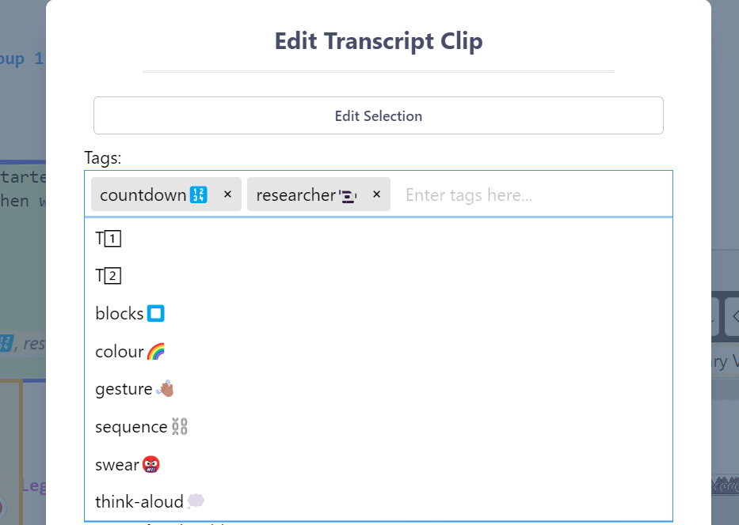
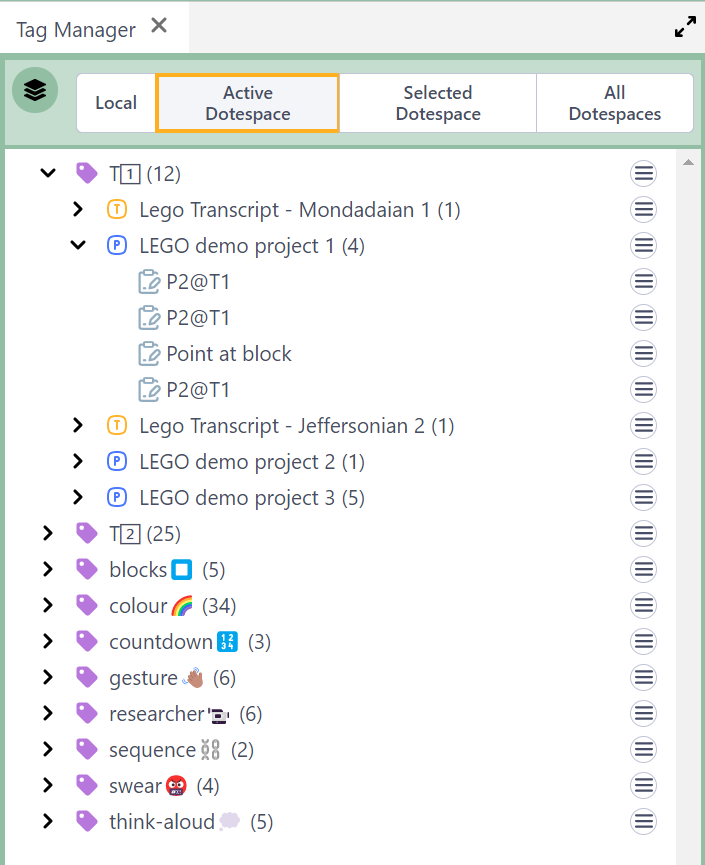

## How to Tag your Clips

Any [Transcript Clip](transcript-clip.md) can have multiple Tags assigned to it.

Watch [basic](https://www.youtube.com/watch?v=UMl8ocvjA2k) and [advanced](https://www.youtube.com/watch?v=XILneBfDqAs) video tutorials on YouTube.

Tags have the following properties:

- Tags can be entered when creating a Clip.
- Recent Tags in _DOTE_ are autocompletable, ie. all known Tags in the current Project are listed according to what Tags have already been added.
- Tags can be edited in currently existing Clips, eg. deleted.

### Tag Manager in _DOTEbase_

The [Tag manager](https://bigsoftvideo.github.io/DOTEbase/tags.html) in _DOTEbase_ enables the user to add, delete and rename Tags in and across multiple Projects and Transcripts.
It is not available in _DOTE_.

