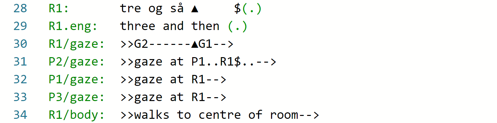
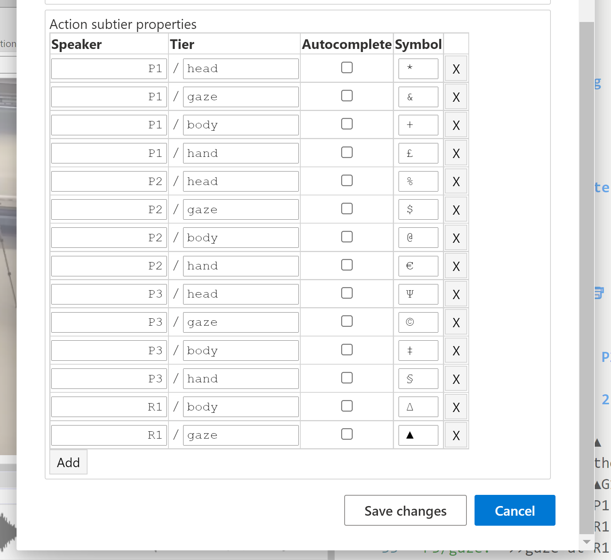

## Primary tier and subtier types

Subtiers are essential for multimodal transcription (eg. using the [Mondadaian conventions](mondada.md)).
With subtier types, _DOTE_ can provide much more help and spot those errors which are so easily introduced manually in complex transcripts and yet hard for humans to locate.
If we are honest, practically every published transcript using the Mondadaian system has at least one error.
Most of these errors can easily be avoided by using _DOTE_'s transcript heuristics to check the transcript.

Here are the basic tier and subtier types with specific examples:

- `J:`          A speaker tier with the current speaker-id, eg. `J`
- `J@gloss:`    Interlinear gloss subtier(s) for current speaker, eg. `J@gls`
- `J.language:` Translation subtier(s) for current speaker, eg. `J.eng`
- `J/action:`   Action subtier(s) for any participant, eg. `J/head`
- `#category:`  Category subtier(s), eg. `#fig` (this is the only one supported at present)

A set of tier(s) and associated subtier(s) form a _neighbourhood_, which has a single common temporality.
That is, the tier(s) set the timing for the _dependent_ subtiers to anchor to, e.g. a translation subtier maps onto the corresponding speaker tier and an action subtier aligns with the temporality of a primary tier (the [HEAD of the neighbourhood](mondada.md)).

[](images/tiers/neighbourhood.png)

### Using the new tiers and subtier types <a id='use'></a>

Although they might look like fixed codes (they are not), subtier types have several advantages:

- They are extensible.
- They are machine and human readable.
- They can resolve ambiguities on every line or subtier.
- They are amenable to parsing by software algorithms to guide the transcriber to spot errors.
- Software can provide autocomplete suggestions based on expected speaker-id/participant-id and type.
- Software can provide better support for known subtier types, eg. interlinear gloss.
- They are overspecified, but that means they can be easily converted into an underspecified system.
Note that underspecified systems cannot be converted back; information is lost in the first conversion.
- Software can use the over-specified types to [export](export.md) a more compressed and sparse formatting and layout style, eg. as seen in the Mondadaian conventions.

When using software such as _DOTE_, a unique symbol can be assigned to a specific named subtier type.
Moreover, named subtier types can be autocompleted and symbol-type-alignment checks can be instigated to help the transcriber spot errors.
Well worth the effort! 🏆

### How to name your tiers and subtiers <a id='naming'></a>

The main tier types are characterised in the following manner:

- `Speaker:`            A speaker tier contains a current speaker-id
- A timing tier         A timing tier contains pauses, e.g. `(x.y)`, interspersed with alignment symbols (Mondadaian system)
- A comment tier        A comment tier contains just a comment, e.g. `((...))`

The subtier types are characterised in the following manner:

- `Speaker@gloss:`      Interlinear gloss subtier(s) for current speaker-id
- `Speaker.language:`   Translation subtier(s) for current speaker-id
- `Participant/action:` Action subtier(s) for any speaker-id or participant-id
- `#category:`          Category subtier(s)

The named subtier types are based on the `speaker-id` or `participant-id`, except for the category type.

Specific interlinear gloss subtier(s) and translation subtier(s) can be set in [Transcript Options](settings.md#options) such that they will be autocompleted also when the main speaker tier is autocompleted, ie. if any speaker-id is recognised in the drop-down autocomplete list and selected by the user, then that speaker tier will be autocompleted followed by the interlinear gloss subtier(s) and/or translation subtier(s) on new lines in that order.

eg. if `S:` is selected in the list of suggestions, for instance, then the readymade neighbourhood will appear in the editor:
```
S:      
S.gls:  
S.eng:  
```

Naming specific subtier types is up to the user.
Names are only restricted by the use of the standard character set and the user-specified column width of the speaker-id + subtier name.
The following names are all valid:

```
S:
S/act:
S/gaze:
S/movement:
J:
John@gls:
John@gloss1:
John@gloss2:
Jennifer:
Jennifer.eng:
Jennifer.ENG:
Jennifer.english:
Jennifer.danish:
Customer1:
Customer1/head:
#fig:
```

Note that when a specific `speaker-id` or `participant-id` is used once in a tier or subtier, then _DOTE_ will provide autocomplete suggestions for that id based on already known cases and default cases.

- eg.  if the list above were used in a transcript, then if one types `j`, _DOTE_ will offer the following list of suggestions + some defaults:

```
J:
John@gls:
John@gloss1:
John@gloss2:
Jennifer:
Jennifer.eng:
Jennifer.ENG:
Jennifer.english:
Jennifer.danish:
```

If one types `jg`, then the list is narrowed down to:

```
John@gls:
John@gloss1:
John@gloss2:
Jennifer.eng:
Jennifer.ENG:
Jennifer.english:
```

### How to assign a unique alignment symbol for each named subtier type <a id='assign'></a>

Each named subtier type can have a unique alignment symbol associated with it.
In the [Transcript Options](settings.md#options), one can add named subtier types, each with a unique symbol assigned.
If subtier types are used in the transcript but are unnamed in [Transcript Options](settings.md#options), then _DOTE_ cannot give useful support.

[](images/tiers/subtier-types.png)

In [Settings](settings.md), one can add to and edit an ordered list of symbols that are available for assignment to any subtier type.

- A drop-down list of symbols will be suggested when a new named subtier is added in [Transcript Options](settings.md#options).
- The drop-down list is the same as the order set in the user-defined list in [Settings](settings.md).
- The order of the alignment symbols in the list can be altered: select an entry containing a symbol and then click and drag it to a new position in the list.
- Click `Close`.
- The new order will be reflected in the list of symbols suggested when entering a new named subtier.

Once used in the named subtier types in [Transcript Options](settings.md#options), a symbol is no longer available in the list for that transcript.
To replace the symbol assigned to a named subtier, delete the current symbol and use the drop-down list to select an alternative or type the symbol manually.
These subtier types and alignment symbols can be edited at any time.
Once a named subtier type has a symbol aligned, then when the cursor is place on that line in the transcript body, then <kbd>CTRL</kbd>+<kbd>ENTER</kbd> or <kbd>⌘</kbd>+<kbd>ENTER</kbd> will display the correct assigned symbol for autocompletion.
This is very useful when using lots of unique subtiers.

Moreover, one can toggle each named subtier type in the list to autocomplete when an identical speaker-id is autocompleted as a speaker tier in the editor, ie. if the user selects a specific speaker-id to autocomplete in the editor, then the ticked subtiers in the list will also autocomplete if the participant-id for the named subtier is the same as the speaker-id (in addition to any translation and interlinear gloss subtiers that are named in [Transcript Options](settings.md#options)).

Here is an example of one neighbourhood showing two speakers (primary `UN` and secondary `KT`), two translation subtiers (`UN.eng` and `KT.eng`) and three action subtiers (`KT/gaze`, `KT/body`, `KT/hand`):

```
1 UN:         °uh: o[h::°           ]
  UN.eng:     °uh oh::°
2 KT:               [irriterer §©det] #jer ‡(emma)§©‡
  KT.eng:            does it irritate  you  (emma)
  KT/gaze:                  -->§,,,,,,,,,,,,,,,,,,§
  KT/body:                   -->©turns away........©-->
  KT/hand:                                 ‡dropfoam‡
  #fig:                               #fig1
```

Note that there is also a `#fig` subtier for indicating image figure timing.

The three named subtier types will have been added to [Transcript Options](settings.md#options) for this transcript as follows:
- `KT/gaze` = `§`
- `KT/body` = `©`
- `KT/hand` = `‡`

If they are also selected for autocompletion, then when the user selects "KT" to be autocompleted in the editor, then the following readymade neighbourhood will appear (if no gloss or translation subtiers are specified):

```
KT:        
KT/gaze:   
KT/body:   
KT/hand:   
```

### How to realign alignment symbols across subtiers in a neighbourhood <a id='realign'></a>

With its transcript heuristics, _DOTE_ scans all subtiers for those subtier types and assigned symbols listed in the [Transcript Options](#assign).
If the correct symbols are present, but are misaligned, then _DOTE_ can do a pretty good job of realigning them.

- One can see if realignment is a possibility by placing the cursor in any tier or subtier of a neighbourhood and clicking the small lightbulb icon that appears.
- Alternatively, use the shortcut <kbd>CTRL</kbd>+<kbd>.</kbd> or <kbd>⌘</kbd>+<kbd>.</kbd>.
- A small dialog box will appear, and a suggested realignment can be performed.

### How to look for errors <a id='errors'></a>

With its transcript heuristics, _DOTE_ will try to [highlight errors](errors.md) in the use of named subtier types and alignment symbols in a transcript.
For example:

- An incorrect (unassigned or misplaced) symbol in a named subtier type.
- Too many or too few assigned symbols in a named subtier type relative to the HEAD.
- Continuation markers used incorrectly.
