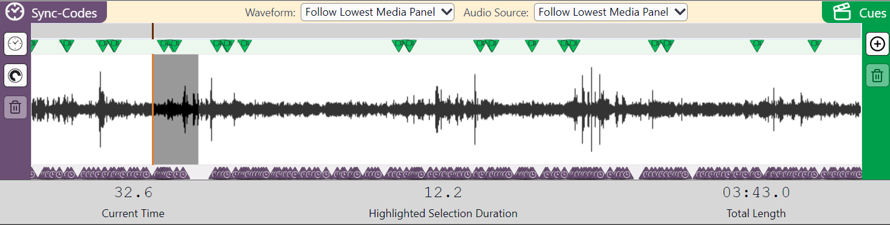
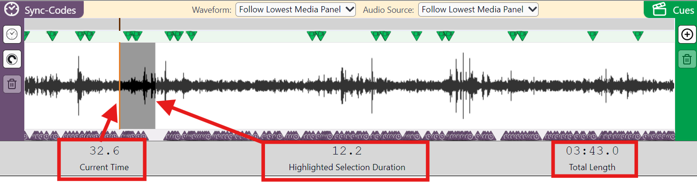
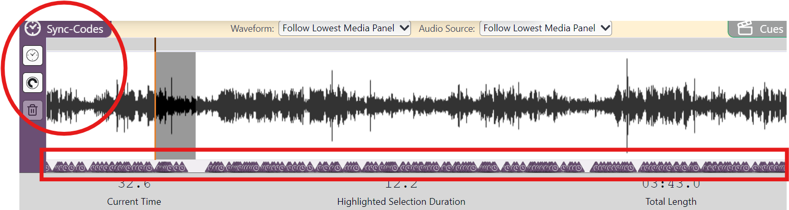
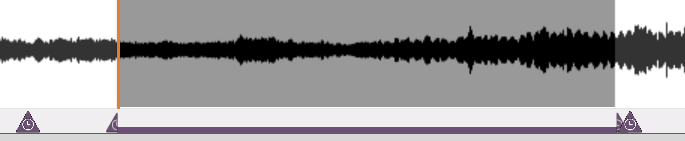
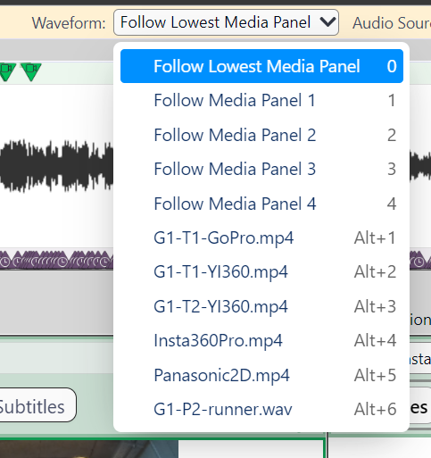
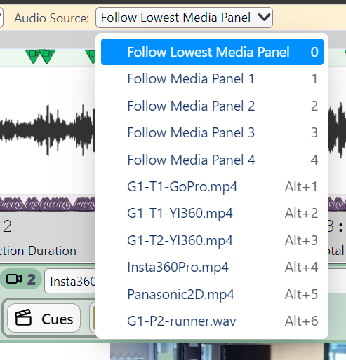
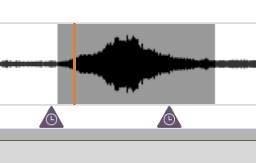
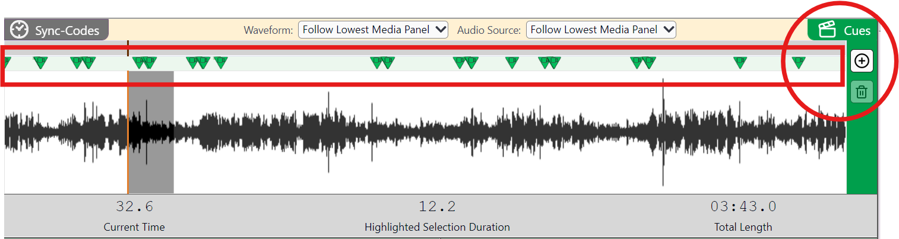
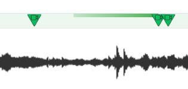

## Timelines and waveforms

Watch the [video tutorial](https://youtu.be/Oo8EaHRTtFQ) on YouTube.

A Timeline panel includes a waveform generated and cached when the video for the current project is first opened.
For some video and audio files, a waveform cannot be generated.
In that case, the waveform will be blank.
See [Tips & Tricks](tips.md) for ideas how to solve this.

A Timeline panel is also used for viewing managing [Sync-codes](sync-code.md) and [Video-cues](cues.md).

### Some tips for using the Timeline panel

- A Timeline panel with a waveform can be zoomed in and out using the mouse.
- A timeline segment can be dragged using the mouse.
- The current timeline segment can be adjusted using the drag-handles at each end of the segment.
- Timelines can be independently zoomed and scrolled, unless all timelines are locked in sync.
- During playback, the current time (playhead) on the timeline will always be visible.
- Inserted sync-codes and video-cues can be dragged to a new position on the timeline.
    - Sync-codes cannot be dragged over other sync-codes for obvious reasons.
- Timeline panels can display sync-code functionality and/or video-cue functionality, and they can both be hidden from view independently.

### Adding and focusing Timeline panels

More than one Timeline panel can be open at the same time.
This enables an ability to focus on different timescales simultaneously, as well as having one Timeline for sync-codes and another for video-cues.

### Time on the Timeline panel

A Timeline displays the current time at the position of the playhead, the highlighted selection interval (looping) and the total length of the audio or video source.

- The times are given to the nearest tenth-of-a-second (0.1s).

### Sync-codes on the Timeline

The Sync-codes are shown on the Timeline.
Display can be toggled on/off at the top left of the Timeline.

Note that ranged sync-codes with a duration are indicated by a continuous bar with an onset and offset on the Timeline.

#### Selecting and locking a specific waveform or audio source

If your Project has multiple media sources, and more than one is activated in your current Transcript via the [Media Manager](media-manager.md), then you can independently decide which waveform is displayed on the timeline and which audio track is played:

- `Waveform select`
    - Display the waveform of a specific video in the [Media Player panel](media-panel.md): 
    - `Follow lowest Media Panel`.
    - ...

- `Audio source`
    - Play the audio track of a specific video in the [Media Player panel](media-panel.md): 
    - `Follow lowest Media Player`.
    - ...

This is useful with complex multi-source projects in which you wish to view one video in the Media Player panel, while playing the audio track of another and displaying the waveform of a third media source (eg. an audio recording from a wireless mic).

#### Looping 

There are several ways to loop shorter segments of the timeline:

- A segment can be selected and looped using <kbd>SHIFT</kbd>+<kbd>Click and Drag</kbd> with the mouse along the timeline.
- Or a segment between any two [sync-codes](sync-code.md) can also be looped by selecting the first sync-code and then <kbd>SHIFT</kbd>+<kbd>Click</kbd> on the second sync-code.
- Segments can be adjusted by using the drag-handles at each end of the current segment on the timeline.
- Or use the shortcut <kbd>CTRL</kbd>+<kbd>ALT</kbd>+<kbd>SPACE</kbd> or <kbd>⌘</kbd>+<kbd>⌥</kbd>+<kbd>N</kbd> to set an A point at the current position of the playhead on the timeline, then use again to set a B point as the media plays, after which the loop between A and B will begin.
- To deselect a loop
    - Click the `Deselect` button or click outside the the loop segment on the timeline to cancel the loop.
    - Or use the shortcut <kbd>CTRL</kbd>+<kbd>ALT</kbd>+<kbd>SPACE</kbd> or <kbd>⌘</kbd>+<kbd>⌥</kbd>+<kbd>N</kbd>.

- With the `Loop Repeat` button at the top right of the main timeline panel, one can toggle between single play through of the selected segment or looping continuously.

### Video-cues on a Timeline  

[Video-cues](cues.md) can also be displayed on a Timeline panel.
The prime use of the Video-cue element is to manage [video-cues](cues.md) that control how the current active video is displayed in a [Media Player panel](media-panel.md).

Note that Video-cues that have a transition with a duration are indicated with a tail leading up to the apex of the transition.
You will have to zoom in on the Timeline to see this effect because they are usually of short duration, eg. 2-5 seconds.

A [complete list of commands and shortcuts](commands.md) is available.
