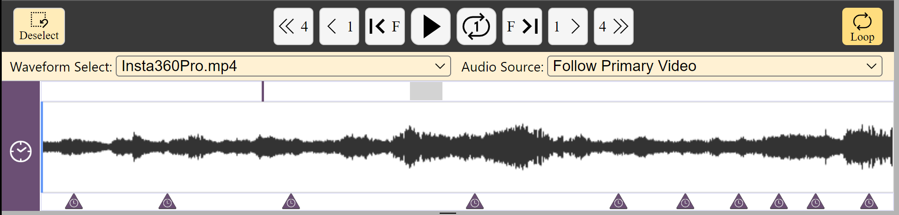

## Timelines and waveforms

The main timeline includes a waveform generated and cached when the video for the current project is first opened.
For some video and audio files, a waveform cannot be generated.
In that case, the waveform will be blank.
See [Tips & Tricks](tips.md) for ideas how to solve this.
The main timeline is also used for managing sync-codes.

To control volume and manage [video-cues](video.md), another independent [video-cue timeline/waveform](#media) associated with the media source in the [primary video panel](video.md) is available.

### Some tips for using all timelines

- The timeline + waveform can be zoomed in and out using the mouse.
- The timeline segment can be dragged using the mouse.
- Timelines can be independently zoomed and scrolled, unless all timelines are locked in sync.
- During playback, the current time (playhead) on the timeline will always be visible.
- Inserted sync-codes and video-cues can be dragged to a new position on the timeline.
    - Sync-codes cannot be dragged over other sync-codes for obvious reasons.

### Main timeline only

The main timeline displays the current time at the position of the playhead, the highlighted selection interval (looping) and the total length of the audio or video source.

- The times are given to the nearest tenth-of-a-second (0.1s).
- In _Show/hide highlight of current sync-code block_ (CS) mode, the current transcript segment in the editor between adjacent sync-codes will be highlighted as the video plays.
The transcript will be automatically scrolled to keep the current segment visible as the video plays.
    - The mode can be toggled on/off using the button at the top right of the Editor panel.

- Inserted sync-codes can be dragged to a new line in the transcript editor.
    - Sync-codes cannot be dragged over other sync-codes for obvious reasons.

#### Selecting and locking a specific waveform or audio source

If your Project has multiple media sources, and more than one is activated in your current Transcript via the [Media Manager](media.md), then you can independently decide which waveform is displayed on the timeline and which audio track is played:

- `Waveform select`
    - Display the waveform of the current video in the [primary video panel](video.md): `Follow Primary Video`.
    - Or always display the waveform of the selected video.

- `Audio source`
    - Play the audio track of the current video in the primary video panel: `Follow Primary Video`.
    - Or always play the audio track (solo) of the selected video.

This is useful with complex multi-source projects in which you wish to view one video in the video panel, while playing the audio track of another and displaying the waveform of a third media source (eg. an audio recording from a wireless mic).

#### Looping 

There are several ways to loop shorter segments of the timeline:

- A segment can be selected and looped using <kbd>SHIFT</kbd>+<kbd>Click and Drag</kbd> with the mouse along the timeline.
- Or a segment between any two [sync-codes](sync-code.md) can also be looped by selecting the first sync-code and then <kbd>SHIFT</kbd>+<kbd>Click</kbd> on the second sync-code.
- Or use the shortcut <kbd>CTRL</kbd>+<kbd>ALT</kbd>+<kbd>SPACE</kbd> or <kbd>⌘</kbd>+<kbd>⌥</kbd>+<kbd>N</kbd> to set an A point at the current position of the playhead on the timeline, then use again to set a B point as the media plays, after which the loop between A and B will begin.
- To deselect a loop
    - Click the `Deselect` button or click outside the the loop segment on the timeline to cancel the loop.
    - Or use the shortcut <kbd>CTRL</kbd>+<kbd>ALT</kbd>+<kbd>SPACE</kbd> or <kbd>⌘</kbd>+<kbd>⌥</kbd>+<kbd>N</kbd>.

- With the `Loop Repeat` button at the top right of the main timeline panel, one can toggle between single play through of the selected segment or looping continuously.

### Video-cue timeline only  

The waveform on this timeline is independently scrollable and zoomable, yet the playhead and selection will synchronise with the main timeline.
The video-cue timeline can be shrunk down by clicking on the arrow button.
The video-cue timeline controls the basic audio levels of media sources.
To mute and unmute the audio, press the `M` button.
To adjust the volume, press the speaker button and slide the volume up and down.

Furthermore, a prime use of the video-cue timeline is to manage [video-cues](cues.md) that control how the current active video is displayed in the [video panel](video.md).

A [complete list of commands and shortcuts](commands.md) is available.
