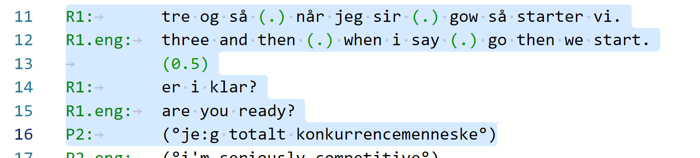

## Tips & Tricks

Here you will find ideas and solutions to specific tasks that you might wish to accomplish with _DOTE_.

- [What is a Project?](#tip27)
- [What do I call my Projects and my Transcripts?](#tip28)
- [How do I transcode a video or audio file if it does not import correctly or a waveform is not generated?](#tip1)
- [How do I format my Transcripts?](#tip2)
- [How do I save my Transcripts?](#tip26)
- [How do I use _DOTE_ to create a Transcript from scratch?](#tip3)
- [How do I play media and transcribe efficiently with _DOTE_?](#tip25)
- [How do I share a _DOTE_ Project or Transcript with someone else?](#tip4)
- [How do I realign overlaps and subtiers?](#tip30)
- [How do I manually make short excerpts of a transcript with consistent line numbering?](#tip6)
- [How do I manage a default set of alignment symbols for Mondadaian Transcripts?](#tip7)
- [How do I see all underlinings in a Transcript that has errors or warnings?](#tip8)
- [How do I reuse a Transcript with sync-codes to create a new Transcript?](#tip17)
- [How do I use _DOTE_ to comment and tag an audiovisual source before transcribing?](#tip9)
- [How do I see hidden characters in the Editor?](#tip23)
- [How to use proxy videos to share Projects with sensitive video clips?](#tip31)
- [How do I report an error or problem using the log files?](#tip5)
- [Why do I need more than one Timeline?](#tip24)
- [Why would I use the video 2nd view?](#tip18)
- [Why can I not copy/paste underlined text?](#tip19)
- [Why would I use Checkpoints?](#tip29)
- [Why would I use Video-cues?](#tip32)
- [What is the difference between saving and Autobackup?](#tip33)
- [What is the difference between `Replace` and `Change All Occurrences`?](#tip22)
- [What is the difference between zooming the UI and changing the font size?](#tip20)
- [What is the `Command Palette`?](#tip21)
- [Can I use non-alphabetic scripts in my Transcripts?](#tip34)
- [Can I add emojis 🗣 to my Transcripts?](#tip10)
- [Can I create Transcripts using other conventions?](#tip14)
- [Can I convert transcripts created with other software to use in _DOTE_?](#tip15)
- [Can I copy and paste transcripts from publications into _DOTE_?](#tip16)
- [Be cautious when editing sync-codes, video-cues and underlinings](#tip11)
- [Be patient with Waveform generation, Checkpoint peeking, Exporting and Importing Projects and transcript heuristics](#tip12)
- [Keep your _DOTE_ projects safe and secure](#tip13)

### What is a Project? 

A _DOTE_ [Project](project.md) is a container for one or more [media clips](media.md) and one or more Transcripts.
In practical terms, it is a folder on your computer's file system.
The guiding principle is that a Project _represents a single event_, which can be transcribed in different ways.
The single event may have been recorded with one device or many (cameras and/or microphones), but all the recordings are synchronised to match the duration of the event.
Note that a user can open the folder in which an existing Project resides by clicking the button in [Transcript Options](settings.md#options).

It is possible to add media clips of different durations, as well as clips that are recordings of different events, to a _single_ Project, but then that defeats the principle built into _DOTE_.
This practice will result in waveforms and timelines (as well as sync-codes and video-cues) that no longer align and match.
Furthermore, there may be spurious and unpredictable behavior since it is not a practice that we support.
We do not recommend stuffing a Project with lots of disparate media clips; instead make a new Project for each event and populate each Project with clips that are synchronised.

#### What do I call my Projects and my Transcripts? 

Given that Projects are containers for one or more media clips of a single event (see above), then it is a good idea to name a Project after the event in question, perhaps including important meta-data.
Given that one or more Transcripts can be created in a Project, then each could be named after the focus, phenomena and/or conventions of that specific Transcript.

### How do I transcode a video or audio file if it does not import correctly or a waveform is not generated? 

Sometimes a video or audio file cannot be opened by _DOTE_ or the waveform cannot be generated, neither with the inbuilt waveform generator nor using _FFmpeg_ (in [Settings](settings.md); see the [installation instructions](install.md)).
There are a variety of reasons for this.

If you haven't installed FFmpeg on your computer, then we recommend that you do this first, and manually add the file path in [Settings](settings.md#ffmpeg).
FFmpeg is a powerful open source video processor, which we cannot include inside DOTE for licensing reasons.
Restart _DOTE_ and create a new Project and import the media again or open [Media Manager](media.md) and regenerate the waveform using the button on the far right for the relevant media.

Another solution is to transcode the video into a format that _DOTE_ can understand and reimport it into the _DOTE_ project.

- The free, open-source software [_HANDBRAKE_](https://handbrake.fr) does the job.
With this software installed on Windows or macOS, you can import the source video quickly and easily transcode and export it into another format by selecting a preset such as `Web/Video Vimeo YouTube HQ` with the appropriate resolution.
Don't worry about all the other technical options.
Select a destination and click `Start Encode`.
The exported video will retain the same length and frame rate as the original.

If your video is greater than [4K resolution](https://en.wikipedia.org/wiki/4K_resolution), eg. more than `4096 x 2160`, then depending on the power of your computer, _DOTE_ may have problems playing and scrubbing through the video.
If so, then transcode in the same manner as above, making sure to downscale from 8K or 5K, for example, to 4K or less.
You could use this reduced version as a proxy in _DOTE_ for the purposes of transcription.

### How do I format my Transcripts? 

_DOTE_ has some golden rules to make your life easier:

1. _Always_ use a consistent speaker-id _followed by_ a colon <kbd>:</kbd> and _then_ a <kbd>TAB</kbd> at the start of a primary or secondary speaker tier.
_Never_ use <kbd>SPACE</kbd>s after that colon.
Use a colon even with the Mondadaian conventions; in _DOTE_ you can [export the transcript](export.md#mondada-rtf) in the recommended Mondadaian format (eg. without a colon) later.
1. Do the same when using subtiers, eg. participant-id + named subtier type followed by a colon and then a <kbd>TAB</kbd>.
_DOTE_ can [export the transcript](export.md#mondada-rtf) in the recommended Mondadaian format (eg. with reduced lowercase participant names) later.
1. _Never_ use <kbd>TAB</kbd>s in the transcript body.
Always use <kbd>SPACE</kbd>s, eg. to align overlaps on multiple lines.
1. Set the name column width in the [Settings](settings.md) so that there is plenty of room for all variants of the name + subtier.
For instance,`speaker.eng:` or `speaker@gloss:` require a minimum name column width, otherwise these lines will disrupt the tidy alignment and layout.
_DOTE_ will give you a friendly warning if you fill up and exceed your name column width allowance.

These rules help _DOTE_ give better assistance.
They avoid problems with skewed layout and messy vertical alignment of elements, such as overlaps and alignment symbols.
They also allow _DOTE_ to export in a variety of layouts (eg. document) with line numbering.

You are, of course, allowed to format your transcripts as you wish.
Just expect a lot of errors and warnings flagged by _DOTE_, as well as mashed up exported transcripts that are not word processor friendly.
If you do, then at least turn off error and warning messages to avoid colouring your transcript red.

### How do I _save_ my Transcripts? 

Transcripts are stored on your local computer's file system and are accessible when not online.
They are _not_ stored on the cloud, which would mean that they are only accessible while online.
Furthermore, _DOTE_ is not like _GoogleDocs_; it does not send your keystrokes to the cloud, leaving no trace on your local computer.
Anything you type in your Transcript is not saved until you decide to [save](projects.md#saving) it.
And when you save, the changes are stored on your local computer's file system.
If you create a new [Checkpoint](versioncontrol.md), then that does save the recent changes, but this is also manually triggered by the user.
However, [Autobackup](versioncontrol.md) just creates a backup of the new changes since the last save.
An autobackup does _not_ save the current changes; it just creates a backup copy at fixed time intervals.

### How do I use _DOTE_ to create a Transcript from scratch? 

We have created a [practical guide with recommended steps](howto.md) to use _DOTE_ to create a Jeffersonian or Mondadaian transcript from scratch.

### How do I play media and transcribe efficiently with _DOTE_? 

Everyone will develop their own way of working with _DOTE_.
From our personal experience, it can be dead efficient to use shortcuts to initiate looping one chunk ahead while typing the transcript.
When that chunk is completed, then move on to the next chunk.

1. Position the playhead at the start of the next chunk that you wish to transcribe (eg. an utterance or overlapping speech of roughly 5-10 seconds).
1. Use the shortcut <kbd>CTRL</kbd>+<kbd>ALT</kbd>+<kbd>SPACE</kbd> or <kbd>⌘</kbd>+<kbd>⌥</kbd>+<kbd>N</kbd> to set an A point at the current position of the playhead on the timeline, then use again to set a B point (eg. at the end of the chunk you wish to transcribe) as the media plays, after which the loop between A and B will begin.
1. Listen (and look) and type in your Transcript in the Editor.
You can use the Editor while the media is playing.
1. Pause if you need to using <kbd>CTRL</kbd>+<kbd>SPACE</kbd> or <kbd>⌘</kbd>+<kbd>N</kbd>.
Press <kbd>CTRL</kbd>+<kbd>SPACE</kbd> or <kbd>⌘</kbd>+<kbd>N</kbd> to start the loop again.
1. When the chunk is transcribed well enough, deselect the loop with the shortcut <kbd>CTRL</kbd>+<kbd>ALT</kbd>+<kbd>SPACE</kbd> or <kbd>⌘</kbd>+<kbd>⌥</kbd>+<kbd>N</kbd>.
You may have to use this shortcut twice: first to pause the loop; second to deselect.
1. Play to the end of the deselected chunk and pause.
1. Repeat from step 1.
    - You may wish to add [sync-codes](sync-code.md) regularly as you proceed.

In this fashion, you can work through the media source(s) incrementally without taking your hands off the keyboard. Try it. You might like it! 😻

### How do I share a _DOTE_ Project or Transcript with someone else? 

It is easy to [share a _DOTE_ Project with someone](import.md) using the export/import Project or Transcript functionality in _DOTE_.

### How do I realign overlaps and subtiers? 

_DOTE_ supports automatic realignment of some elements of a transcript within what we call a [neighbourhood](jefferson.md#neighbourhood), in which actions occuring during a single continuous stretch of time are transcribed.
This is useful, for example, when editing a transcript and adding/deleting characters in a tier or subtier that results in misalignment of the vertical elements of [overlaps](jefferson.md#overlap) or [subtier alignment symbols](tiers.md#assign).

- If one clicks inside the neighbourhood (but not on a whitespace character) that is misaligned, then a small lightbulb appears.
- Click it and select realign.
- Alternatively, use the shortcut <kbd>CTRL</kbd>+<kbd>.</kbd> or <kbd>⌘</kbd>+<kbd>.</kbd> to open the realignment dialog box.
- All considering, _DOTE_ does a pretty good job, but it may fail on very complex or non-standard cases.

### How do I report an error or problem using the log files? 

In order to give you better help, our developers may need to look at the associated log file.
There are [instructions](logfile.md) to help you locate the relevant log file.

### How do I manually make short excerpts of a Transcript with consistent line numbering? 

Some researchers wish to make small excerpts from a long source Transcript with line numbers such that the shorter excerpts retain the line numbering of the long Transcript.
We could implement this feature in _DOTE_, but as soon as a line is added to or deleted from the Transcript in the editor, then the line numbering would change through the rest of the source Transcript.
Thus, the line numbers of the short excerpts would no longer match the source exported from the new Transcript.
We feel that it is best to finalise a Transcript by exporting it in full, and then create excerpts manually from that hard-coded source.
- The best way to do this is to `Export to RTF` with the line numbering your prefer.
- Then import the `.RTF` file into a word processor.
- Copy and paste the relevant lines for each excerpt, including the hard-coded line numbers, into a new document.

### How do I manage a default set of alignment symbols for Mondadaian Transcripts? 

If you would like a specific ordered list of alignment symbols to be always available by default when you create your [subtier names and symbol assignments](tiers-md) in [Transcript Options](settings.md#options) for a specific Transcript, then they can be added and edited in the [Settings](settings.md).
The default list is ordered, so when adding an alignment symbol using the dropdown list in [Transcript Options](settings.md#options), all the available symbols will appear in a list in that order (if a symbol has already been used, it will not appear in that list).

### How do I see all underlinings in a Transcript that has errors or warnings? 

If there are [errors or warnings](errors.md) in your Transcript, then the red or blue line markings may overshadow the underlinings on the same line(s).
Using the buttons at the top right of the Transcript panel, you can temporarily toggle errors or warnings off in order to see the underlining underneath.

### How do I reuse a Transcript with sync-codes to create a new Transcript? 

When _DOTE_ [creates a new Transcript](project.md) in a Project that already has a Transcript with [sync-codes](sync-code.md), it starts afresh with a blank Transcript with no sync-codes (nor video-cues) in the editor.
This may be the desired consequence.
Nevertheless, there are cases in which it would be useful to keep the already marked sync-codes on separate lines from the existing Transcript, but work on a different focus, format or set of [conventions](conventions.md), eg. Mondadian and not Jeffersonian.
This can be done manually:

1. In your computer file system, in the relevant Project folder, manually duplicate the folder in which the original Transcript is stored and give it a new folder name.
1. Open that new Transcript (based on the folder name) in _DOTE_.'
The Transcript should be identical to the original.
1. Click just before the first character of the first line of the Transcript in the editor.
1. Scroll down to the end of the Transcript.
1. Press and hold <kbd>SHIFT</kbd>+<kbd>ALT</kbd> (see [Commands](commands.md)) and click just before the first character of the last line of the Transcript.
A multicursor has been created at the start of every line in the whole Transcript.
1. Press <kbd>SHIFT</kbd>+<kbd>END</kbd>.
All the lines will be selected (characters only).
Note this is _not_ the same as Select All or <kbd>CTRL</kbd>+<kbd>A</kbd>.
1. Press <kbd>Delete</kbd> or <kbd>CTRL</kbd>+<kbd>X</kbd>.
All the sync-codes and their lines remain, but the Transcript is blank.
1. Use the sync-codes to jump in the timeline.
Start transcribing.

### How do I use _DOTE_ to comment and tag an audiovisual source before transcribing? 

Because [sync-codes](sync-code.md) connect lines in the Transcript panel to timecodes in the audiovisual media source that is open, they can be used to comment and tag that media source, for example to note interesting phenomena.
Tags can be used instead of the speaker-id on each line.
Then, in the body of the transcript, notes can be added.
Each tagged line can be anchored to a timecode in the media source, so it is easy to jump to that position in the media and play.
In this way, a long audiovisual source can be marked up for possible further exploration without needing to transcribe everything.
If a shorter clip looks interesting enough to transcribe, then a [new Transcript](projects.md) can be created in the current Project and transcription can start at the timecode of interest marked by the tag/comment.
The tag/comment transcript can be reopened later to locate other interesting phenomena to be transcribed.

### How do I see hidden characters in the Editor? 

If you wish to see any hidden characters in the Editor (eg. `SPACE`, `TAB`, `RETURN`), then select the text of interest.
The hidden characters will be highlighted in light grey over a light blue background.
This can be useful for spotting unnecessary or spurious characters that have infiltrated the body of the Transcript.

### How to use proxy videos to share Projects with sensitive video clips? 

Sometimes you may wish to share a DOTE Project with someone, but they should _not_ have access to the original video clips because of privacy/consent issues, though the researcher doing the transcription does need access to the original data.
There are several ways to deal with this, assuming that the Transcript does not include any revealing information.

- First, one can simply [export the Project](import.md) without any media (nor active media) included.
In that case, those who receive and import the Project would only be able to see the Transcript(s).
Any sync-codes or video-cues that are present simply won't work because there is no media.
- Second, one can use the [Media Manager](media.md) to add an extra proxy media clip that is audio only, if that is acceptably anonymised.
Most video editing software allows the audio track to be stripped off and exported as a WAV or MP3 file.
When the Project is ready to export, use the [Media Manager](media.md) to turn off all active media, except for the audio only clip.
Then export the Project, including only active media.
Those who receive and import the Project will only have access to the audio only proxy media, and any sync-codes present will work, but video-cues will not.
- Third, one can use the [Media Manager](media.md) to add an extra proxy media clip that is an anonymised version of the video.
There are different solutions to anonymising video clips, which will not be elaborated on here.
And if there are more than one active video clips, one or more can be anonymised
When the Project is ready to export, use the [Media Manager](media.md) to turn off all active media, except for the anonymised video clip(s).
Then export the Project, including only active media.
Those who receive and import the Project will only have access to the anonymised proxy media, and any sync-codes and video-cues present will work.

### Why would I use the video 2nd view? 

For many use cases, one video view is adequate for transcribing.
However, there are other use cases in which it is very useful to have a [second independent, but synced view](video.md) on the same video clip.

- If the video clip is 2D, then it can be useful to open the `2nd view` and zoom in on a rectangular portion of the video screen, while at the same time viewing the zoomed out view of the whole video screen.
- If the video clip is 360, then it can be useful to set up a locked primary view using [video-cues](cues.md) to zoom in (and pan) around the spherical video.
The unlocked `2nd view` can focus in on a different angle and zoom of the 360 to simultaneously show an alternative view.

### Why do I need more than one Timeline? 

The primary [Timeline](timeline.md) is placed at the top above the primary video panel.
It is where most of the work happens, time intervals, looping, playback.
It is also where the [sync-codes](sync-code.md) are indicated.
The secondary Timeline(s) are placed below the video panel(s).
There is a secondary Timeline for each [media source](media.md) attached to a Transcript.
If you use them, these are where the [video-cues](cues.md) are indicated.
Moreover, if the Timelines are independent (and not synced), then one can focus each Timeline at different zoom levels, eg. the primary Timeline could be zoomed right in on an 8-second excerpt, while the secondary Timeline is zoomed out to give a macro-perspective on the whole clip.

### Why can I not copy/paste underlined text? 

Because of the way underlining works in the editor in _DOTE_, copy/pasting text that is underlined does not carry over the underlining, only the plain text.
The underlining has to be added again manually.

### Why would I use Checkpoints? 

By default, if there are unsaved changes since the last backup, _DOTE_ automatically makes a backup copy of the current Transcript at regular intervals of 5 minutes.
You can change this behaviour in [Settings](settings.md).
This is called [Autobackup](versioncontrol.md#autobackup).
This is useful, but other than the date/time stamp there is no easy way at a glance to know what changes were made that triggered a specific Autobackup.

_DOTE_ implements a second system called [Checkpoints](versioncontrol.md#checkpoint) that allows the user to write meaningful messages for each Checkpoint they make, which stores the changes made to the Transcript since the last Checkpoint.
Thus, the user can figure out at a glance what changes were made at each checkpoint in the reverse chronological list of Checkpoints.
It is advisable to write informative messages and make Checkpoints frequently.

NOTE that you will need to [install Git](versioncontrol.md#setup), an open source version control system, to be able to use Checkpoints.

### Why would I use Video-cues? 

Using the unique [Video-cue](cues.md) feature in _DOTE_, one can automatically playback the audio-visual media files in a Project in a _cinematic_ mode, eg. pan, zoom, jump cut.
This is incredibly useful when there is a lot of activity in a video source or the Project has several alternative camera angles and/or audio sources.
Often when transcribing a specific segment of some data, it is desirable to zoom in to see more closely what is happening in the video (eg. a hand gesture or shift of gaze direction) or to pan around in the 360 video to see what event just happened in the opposite direction (eg. a new speaker appears at the door) or to smoothly track the action (eg. someone walking around in the scene) as it moves around the 2D or 360 video.
These can be automated using Video-cues, so every time the segment is played through, the important stuff is accessible without any manual effort.
It may be the case that during the segment the action is only accessible from another camera angle, but with Video-cues one can automatically jump cut to the other camera view/video and then switch back again later.
By setting up different Video-cue combinations in alternative versions of the Transcript in a Project, one can present the same 'data' but with different analytical 'stories' or 'takes' on what visual and aural phenomena to focus on.

### What is the difference between saving and Autobackup? 

[Saving](projects.md#saving) is _not_ the same as [Autobackup](versioncontrol.md#autobackup).
Saving the current Transcript writes the Transcript data to disk, while Autobackup makes a new copy and writes that to disk so that previous state can be recovered.
Autobackup does _not_ save the current Transcript automatically; that is a manual decision by the user.
It just makes a series of backup copies at regular intervals, which can be viewed and restored in the future.

### What is the difference between `Replace` and `Change All Occurrences`? 

There are two ways to edit multiple instances of the same search string in the editor.
First, one can use [Find/Replace](find.md) to find every instance of a search string in the current Transcript.
`Replace` can replace each instance one-by-one or all in one go.
The search string can be generated by selecting text in the Editor and then selecting `Find`.
Second, one can select text in the Editor (other instances of the same string will be faintly highlighted in the editor and in the scroll bar minimap).
Then right click on the selection and choose `Change All Occurrences`.
A multicursor will be positioned at the end of the string in each instance, and thus every instance can be edited at the same time.

### What is the difference between zooming the UI and changing the font size? 

One can zoom in (<kbd>F10</kbd>) and out (<kbd>F9</kbd>) the whole UI or one can change the font size in the editor (see [Transcript Options](settings.md#options)).
Zooming the UI will change the scale and font size of every element of the UI.
Changing the font size in the editor will only change the size of the transcript text.

### What is the `Command Palette`? 

For advanced users, there is a `Command Palette` (<kbd>F1</kbd>) or right click in the editor) that lists all commands that can be executed in the editor, many of which do not have shortcuts.
The long list is searchable.
Be careful selecting some of the more esoteric commands because they may do something undesirable to your transcript.
Note: the list of commands included commands that do not work in _DOTE_ (yet).

### Can I use non-alphabetic scripts in my Transcripts? 

Yes, you can use any [_Unicode_ letters, characters and symbols](https://en.wikipedia.org/wiki/Unicode) in your [Transcript](transcript.md).
Because the display font has to be [monospaced](https://en.wikipedia.org/wiki/Monospaced_font) so that important vertical alignments can be parsed and realigned, _DOTE_ is restricted to only those letters and symbols in Unicode that are available in DOTE's standard monospaced font, eg. `Courier New`.
You can, of course, insert [emojis](#tip10) and other special symbols or characters, but then vertical alignment of overlaps and alignment symbols, as well as the general layout of the Transcript on the page and when [exported](export.md), cannot be guaranteed.
Moreover, there may be unforeseen consequences and false negatives/positives in warning and error reporting.
_DOTE_ assumes _left-to-right directionality_ in the Editor, so it is limited in relation to languages that have an alternative directionality, eg. right-to-left or top-to-bottom.

### Can I add emojis 🗣 to my Transcripts? 

Emojis can be easily added on Windows and macOS (see section in [Transcript](transcript.md)), but emojis are _not_ monospaced in the Editor.
Therefore, they can distort the auto-alignment across tiers and subtiers that _DOTE_ offers.
They can be used with caution, for example at the end of a subtier with no more alignment symbols.
They are not recommended as speaker-ids nor as [alignment symbols](tiers.md) in the [Mondadaian system](mondada.md).
On the other hand, unicode symbols are monospaced, so they can be used everywhere.

### Can I create Transcripts using other conventions? 

_DOTE_ fully supports two sets of [transcription conventions](conventions.md), namely [Jeffersonian](jefferson.md) and [Mondadaian](mondada.md).
If you would like to transcribe according to another set, such as GAT2 or your own system, then you can do so in the Editor, but _DOTE_ will not be able to assist you.
In fact, if you do not follow the basic formatting of a line that is expected by _DOTE_, then errors and warnings will be flagged.
You can, of course, just toggle off the errors and warnings so they are not displayed, but they are still present, and so they will affect [Export to RTF and Export to SRT](export.md), for example.

### Can I convert transcripts created with other software to use in _DOTE_? 

At present, _DOTE_ does not support importing formats derived from other software.
A simple solution is to just cut and paste the plain text transcript from the original into the Editor, but note that underlining will not be preserved.
Any special timecodes embedded in the original will not be recognised, so the [sync-codes](sync-code.md) will have to be re-entered in _DOTE_.
We may support importing at a later date with simple equivalence, but there are many features of _DOTE_ that are unique and cannot be mapped onto other formats or data structures.
If you would like to program a convertor, then the data structures required in _DOTE_ can be determined from the `.project.json` file in any [Project folder](projects.md) and the `.transcript.json` and `.media_meta.json` files in any Transcript folder.
The main things to look for are converting underlining and, if relevant, transcoding to sync-codes, as well as reformatting the transcript to match speaker-id + <kbd>COLON</kbd> + <kbd>TAB</kbd>.
If you do write a convertor, then please use Javascript/Typescript, port it to GitHub, and publish it to NPM.
Then we can build it into _DOTE_ for the next release.

### Can I copy and paste transcripts from publications into _DOTE_? 

Fragments of transcripts are often published digitally in articles and books.
The most perversive format is `PDF`, but there are also ebook formats, such as `epub`.
Unfortunately, these are often in a non-standard format (PDF), in a proportional font (not monospaced) with spurious hidden symbols.
If permitted (without DCMA and password protection), then plain text can be copied and pasted into the Editor after a new Transcript is created.
[Lots of work](howto.md#conform) is usually required to massage the Transcript to match the original but within the style preferred by _DOTE_.
For example, one may have to remove line numbers, reformat each line to match the _DOTE_ style, reformat to match the chosen conventions, realign overlaps (and subtiers), add underlines and replace spurious symbols with standard unicode.
Remember that the layout required in the _DOTE_ Editor may not look exactly the same, especially with the [Mondadaian layout](mondada.md), but the exported format ([Export to RTF](export.md)) will closely match the expected style and layout.
If there are mistakes or quirks in the original published transcript, then you will have to decide whether or not to correct them in the Editor.

### Be cautious when editing sync-codes, video-cues and underlined text 

Many editing operations in _DOTE_ can be undone and redone using the shortcut keys <kbd>CTRL</kbd>+<kbd>Z</kbd> and <kbd>CTRL</kbd>+<kbd>Y</kbd>.
However, some editing operations _cannot_ be undone (and redone):

- Editing [sync-codes](sync-code.md) _cannot_ be undone using the standard shortcut.
To undo the insertion of a sync-code, select the sync-code and `right click`.
Select `Delete`.
- Editing [video-cues](cues.md) _cannot_ be undone.
To undo the insertion of a video-cue, select the video-cue and press the video-cue edit button or `right click`. In the edit dialog box, you can select `Delete`.
- Adding an underline cannot be _undone_ using the standard shortcut.
To undo underlining, select the text that was underlined and press <kbd>CTRL</kbd>+<kbd>U</kbd>.

Also note that sync-codes, video-cues and underlining _cannot_ be copy/pasted into a new location in the transcript or into other programs.
[Sync-codes](sync-code.md) and underlines do _not_ follow the text or line that is cut or copied.
And video-cues are unique to _DOTE_.

### Be patient with Waveform generation, Checkpoint peeking, Exporting and Importing Projects and transcript heuristics 

Be aware that on underpowered laptops or with very long transcripts and/or a long history of [Checkpoints](versioncontrol.md), then _DOTE_ may slow down.
There are several reasons for this:

- You are using a slow hard disk or remote file storage for the software and your data.
- _DOTE_ is calculating the [visual waveform](projects.md#new-project) incrementally from the audio track after import.
- _DOTE_ is reparsing the whole transcript every time you make a small edit of the transcript.
- _DOTE_ is reparsing the whole transcript every time the [Export to RTF](export.md) preview updates when you change a setting.
- _DOTE_ is rebuilding the history of the transcript every time you peek at a [Checkpoint or Autobackup](versioncontrol.md).
- _DOTE_ is reading and writing large media files when [opening a transcript](projects.md) (with video) or [exporting and importing Projects](import.md) (with media).

Be patient.
A solution may be to upgrade your computer to a faster processor or to use a faster SSD storage drive for your videos and transcripts.

### Keep your _DOTE_ projects safe and secure 

_DOTE_ has [two in-built systems to be able to track changes](versioncontrol.md) over time when editing a Transcript, and to restore or reset the current Transcript to an earlier state.
However, if your computer crashes and is not recoverable, or if you permanently delete the Project or Transcript folder, then there is nothing that _DOTE_ can do to recover the Project and/or Transcripts because the files no longer exist.
Therefore, as for any valuable data, keep regular backups of your Projects and Transcripts in a safe location, eg. on another drive, an external drive or the cloud.
