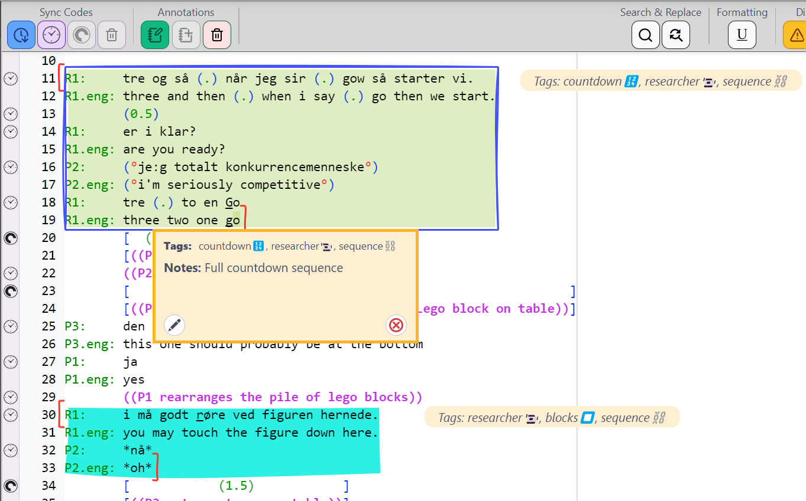
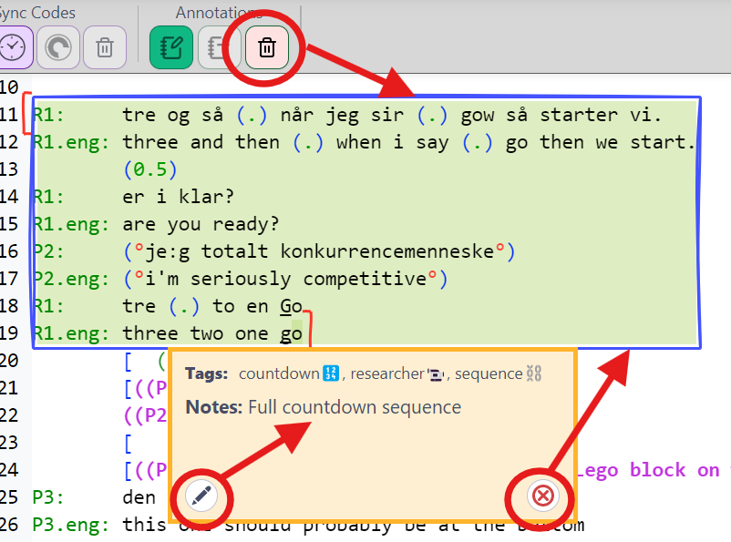
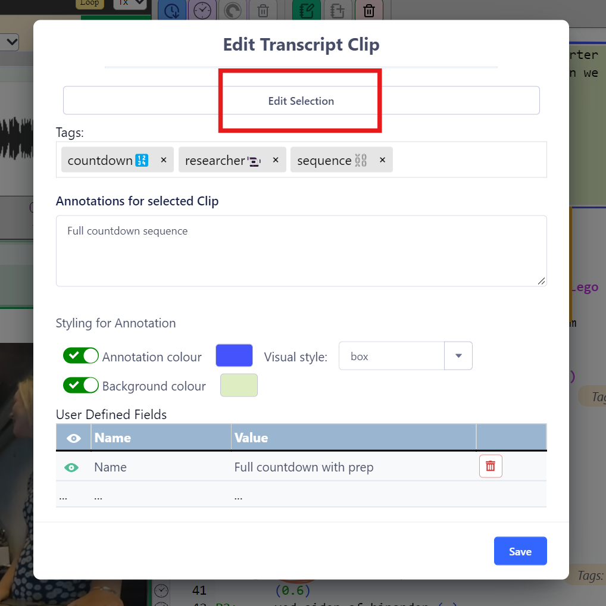

## How to make Transcript Clips

Watch the [video tutorial](https://www.youtube.com/watch?v=HPYFak345mo) on YouTube.

Transcript Clips (or T-clips) can be created and edited in _DOTE_ (and _DOTEbase_) provided you have purchased and activated the Pro or Pro Community Edition.

TODO: 

### Creating T-clips

1. The first step is to locate the relevant transcript that you wish to clip from.
1. Find the relevant lines to be clipped.
1. Select those lines using your mouse by dragging from the onset character/line to the offset character/line.
Clips do not have to start and terminate at the beginning or end of lines.
1. Then click the `Create a New Transcript Clip` button in the Transcript Editor panel.
1. There are several options to fill out or select when creating the clip:
    - Add [Tag(s)](tags.md)
    - Add a comment note
    - Choose the styling (background/foreground [colours](colour-manager.md)) and visual style for the clip
    - Add user-defined field names/values
1. Click CREATE and the clip will be inserted and displayed in the Transcript.
1. It will also be added to the list of clips in the current Project.

### Editing and deleting T-Clips

T-clips can be edited and deleted.

#### Method 1

- Hover over the clip and select the pencil edit or delete icon in the T-clip panel that opens.

#### Method 2

- Click uniquely inside the T-clip in a transcript panel.
Make sure that the cursor is inside only one clip.
- Right click and select `Delete Clip` or click the `Delete Clip at cursor` 🗑️ button in the `Annotations` section at the top left of the Transcript Editor.

### Changing the scope of an existing T-Clip

The scope of a T-Clip can be adjusted using the `Edit Selection` button at the top of the Edit T-Clip box.

- Scroll to find the original clip.
- Make a new selection for the scope of the T-clip by dragging the cursor from the onset to the offset character.
- Click `APPLY NEW SELECTION` button.

### Interchangeable Transcript Clips in _DOTE_ and _DOTEbase_

Transcript Clips created in _DOTE_ or _DOTEbase_ will appear in both when the Project/Transcript containing the Clip is opened (and display T-Clips is toggled on).

NOTE:

- If a Transcript is open in _DOTE_, then T-Clips in that Transcript cannot be edited in _DOTEbase_.
_DOTE_ locks the Transcript for editing.
- If _DOTE_ is closed or a different Transcript is opened, then the Transcript is released and can be edited again in _DOTEbase_.
