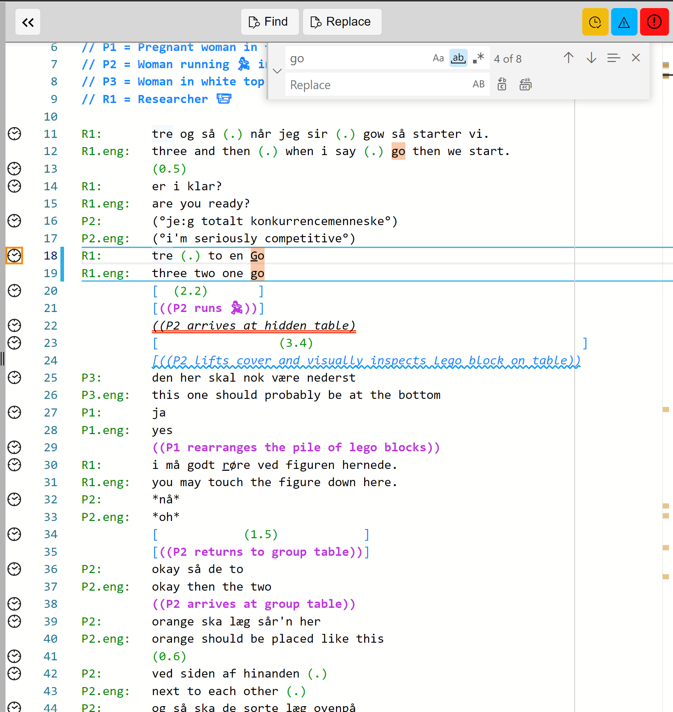

## Transcribing in the Editor

Once a Project with a Transcript is created or opened, with an [attached media file](media.md), then you can immediately type in the Transcript Editor.

### Some rules that _DOTE_ follows

DOTE instantiates a specific set of rules embodied in the two sets of [transcriptions conventions](conventions.md).
They have much in common, but there are key differences with respect to multimodality.

#### Transcript font 

A standard monospaced font is used in the Editor panel.
This cannot be changed.
It is required to enable vertical alignment across lines to be supported.
On [exporting to RTF](export.md), a monospaced font is also used in order to preserve layout.
The font can then be changed in a Word processor (to another monospaced font such as "Consolas").
The size of the transcript font in the editor can be changed by default in [Settings](settings.md) or changed locally for a Transcript in [Transcript Options](settings.md#options).
Note that emojis are not monospaced, so using them will disrupt vertical alignment.

#### Speaker-ids 

- Speaker-ids should appear at the beginning of the line followed by a colon <kbd>:</kbd> and then a single <kbd>TAB</kbd>.
Once one enters one or more speaker designations, then _DOTE_ will prompt you with a list as you type a new line.
If one types <kbd>CTRL</kbd>+<kbd>ENTER</kbd> or <kbd>⌘</kbd>+<kbd>ENTER</kbd> before typing, then a drop-down list of all known speakers + known and default named subtier types will appear.
This list can get quite long if you have many speakers and many subtier type instances.
- If a speaker-id is long, then the default id column width can be changed in [Settings](settings.md).
_DOTE_ will warn you when the speaker designation + named subtier type is too long for the designated column width.
The default is 8 characters, which is good for short speaker-ids, eg. "ART".

#### Language subtier type

- Language [sub-tier types](tiers.md) for translations can be set in [Transcript Options](settings.md#options).
Just add a three-letter code for each extra language sub-tier (eg. _eng_).
    - Although the usage of ISO 639-2 language codes is strongly advised, it is not enforced.
    See the [complete list of such language codes](https://www.loc.gov/standards/iso639-2/php/code_list.php).

#### TAB, SPACE and LINE BREAK

- After a speaker name, there should _always_ be a <kbd>TAB</kbd>, followed by the transcription text for that speaker.
- _Never_ use <kbd>TAB</kbd> in the body of the transcript.
Use <kbd>SPACE</kbd> instead to create whitespace in the body of the transcript; otherwise, the layout, auto-formatting and transcript heuristics will not work.
- There is no automatic line wrapping, so remember to break your lines.
A notional margin indicator can be set as a default in [Settings](settings.md) and for each transcript in [Transcript Options](settings.md#options).

#### Overlap alignment help 

- With its transcript heuristics, _DOTE_ offers help with overlaps, such as `[  ]` or `{  }`, and vertical syncing of overlaps across lines and sub-tiers.
    - _DOTE_ will show a light bulb adjacent to the current line if such help is available at the cursor's location.
    Clicking on that light bulb will provide an option to automatically align overlaps across multiple lines and sub-tiers.
    You can also use the shortcut <kbd>CTRL</kbd>+<kbd>.</kbd> or <kbd>⌘</kbd>+<kbd>.</kbd> to open up the fix menu.
    Note that in some more extreme, complex cases the alignment fix will be incorrect.
    This is a hard problem, so more development is necessary to solve all cases.
- To get context specific help, then use the shortcut <kbd>CTRL</kbd>+<kbd>ENTER</kbd> or <kbd>⌘</kbd>+<kbd>ENTER</kbd>.

#### Autocompletion 

- If your cursor is in the speaker name column, then a list of known and default speaker + named subtier types will appear in a drop-down list.
- If your cursor is in the body of the transcript, then a drop-down list of choices for autocompletion will appear.
These include a range of [single and paired symbols](jefferson.md).
You can also type the first letter (and second) in the transcript body and a list will appear with a selection matching the letter(s), eg. type <kbd>p</kbd> and a list of pitch related symbols will appear.
- Some types of paired transcription symbols are automatically completed and highlighted, eg. `(( ))` or `< >` or `{ }`.

There are two special cases of autocompletion that are non-standard:

1. Non-sequential simultaneous overlap `{...}`.
This indicates that two or more speakers are speaking at the same time, but they are not in the same conversation.
The simultaneous speech or sounds are marked just as with the more conventional usage of `[...]`.
1. 0.1 second symbol `◘`.
This symbol indicates the passing of 0.1 seconds, eg. `◘◘◘◘◘` = 0.5 seconds.
It is especially useful in the [Mondadaian system](mondada.md) for marking [timing interval tiers](mondada.md) instead of the more conventional non-proportional pause indications, eg. `(0.1)`.

#### Line numbers

- Line numbers appear automatically in _DOTE_, but they are not saved in the _transcript.txt_ file.
[Transcripts are exportable](export.md) with fixed line numbers in specific styles.
- If one selects text, then all instances of the same text are highlighted in the whole transcript.

#### Scroll bar and minimap

The scroll bar shows a _minimap_ of where the other instances of the currently selected text or [FIND](find.md) matches are located in the whole transcript. Neat! 😇

#### Margin indicator 

If you would like a gentle reminder of a specific right margin that the body of the transcript should not exceed, then turn on the margin indicator in [Transcript Options](settings.md#options).
A gray vertical line will appear in the Transcript editor panel.
A specific character width can be set.
The default is 70 characters, but that can be changed for all new Transcripts in [Settings](settings.md).
It can be turned off for all new Transcripts as well.
The margin indicator option for each Transcript overrides the default setting.
The indicator is just a guide; _DOTE_ does not enforce word wrapping.

### Where is the edited transcript stored?

- The raw transcript text is saved in the `transcript.txt` file under the [Project](projects.md) folder you created.
It can be opened or copied in a word processor and formatted accordingly. In this release, underlining is not present in the plain text file; in future, it will be exportable in an RTF version of the transcript.

### Other commands and shortcuts

There are more complex editing commands available that you can explore, such as multicursor, change all occurrences or search/replace.

A [complete list of commands and shortcuts](commands.md) is available.
